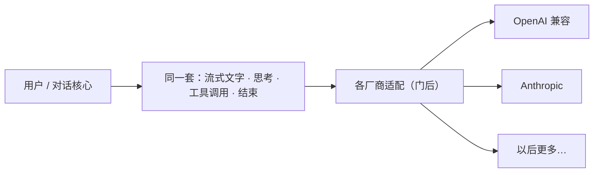

# 多厂商模型

> 用户/产品视角：换模型不应换一套界面语言。不写 HTTP / 适配器细节。
> 现状对齐：2026-07-11。

## 用户怎么碰到

用户在配置或命令行里选一个模型（或换一家兼容端点）。对话里仍是：流式文字、思考、工具调用、结束——**同一套体验**。

## 产品规则（MUST / 禁止）

1. **对外一种说话方式**：流式增量、工具请求、结束原因，对界面都一样。
2. **厂商差异关在门后**：某家 API 大改，优先在适配层消化；不要让界面学会「某厂商专用事件」。
3. **Pre-1.0 交付只两家**：OpenAI 兼容（Chat Completions）与 Anthropic（Messages）。用户自定义端点仅当声明为上述兼容 API 时接受。
4. **禁止**：OAuth、专属 attribution header、其它厂商专属逻辑作为 1.0 前交付；禁止「已经是统一模型再包一层」的双路径产品故事。

## 主线 vs 后置

| | 内容 |
|---|---|
| **主线** | OpenAI 兼容 + Anthropic；统一事件与工具调用体验 |
| **后置** | 更多厂商适配器；抽象上留位，不为未交付厂商堆产品概念 |

## 理想 vs 现状

| | 状态 |
|---|---|
| 业务只认统一模型口 | ✅ 已落地 |
| 两家交付路径 | ✅ 已落地 |
| 更多厂商 | 🔴 后置 |

实现路径指针：`src/AGENTS.md`（Provider 适配）· archive c505。

## 与其它文档

- [用户可见事件.md](./用户可见事件.md) — 为何不引入厂商专名事件
- [配置与档案.md](./配置与档案.md) — 模型 / profile 怎么选
- [产品分层总览.md](./产品分层总览.md)
