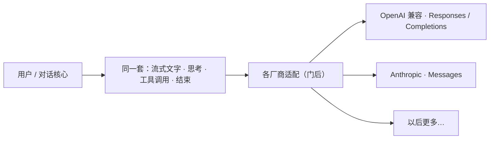

# 多厂商模型

> 用户/产品视角：换模型不应换一套界面语言。不写 HTTP / 适配器细节。
> 现状对齐：2026-08-08（`c1970`：thinking 档位按模型配置声明；未配置仅 `off`；换模默认列表末项。另见 `c1940` 三协议族 + 命名 `compat`）。

## 用户怎么碰到

用户在配置、命令行或 TUI `/model` 里选一个模型（或换一家兼容端点）。对话里仍是：流式文字、思考、工具调用、结束——**同一套体验**。agent 还在跑时换模 / thinking：**当前流不换**，下一句提交（下一 run）起用；见 [运行时即时设置.md](./运行时即时设置.md)。

OpenAI 兼容端点：**默认 `openai-responses`**（省略 `api`）；需要时显式 `openai-completions`（如 OpenCode Zen free）。Responses 状态策略为客户端持态：`store:false` + 完整 Item / thinkingSignature 回放；**暂不**支持 `previous_response_id` 服务端串链。配置真值用全称。

**第一语言 vs 方言**：厂商**自己的**原生 API 叫第一语言（L1：`openai-responses` / `openai-completions` / `anthropic-messages`）；他方实现该协议形状叫**方言**（L2：`compat`，如 `deepseek`）。方言形似 ≠ 官方语义。bridge 代码：`provider/native` = L1，`provider/dialect` = L2 增量调整。

## 产品规则（MUST / 禁止）

1. **对外一种说话方式**：流式增量、工具请求、结束原因，对界面都一样。
2. **厂商差异关在门后**：某家 API 大改，优先在适配层消化；不要让界面学会「某厂商专用事件」。
3. **交付**：OpenAI 兼容（Responses 默认 + 显式 Completions）与 Anthropic（Messages）；纳入更多协议族或 OAuth 是显式决策。用户自定义端点仅当声明为上述兼容 API 时接受。
4. **排障能看见协议族**：观测时间线能对照本次请求用的 `api`（及 `compat`）。勿把第一语言叫成「方言」。
5. **禁止**：OAuth、其它厂商专属逻辑作为 1.0 前交付；禁止「已经是统一模型再包一层」的双路径产品故事；禁止假设凡 `openai-responses` 端点 ≡ OpenAI 官方第一语言语义；禁止静默把 Completions 吞成 Responses。OpenCode Zen 的 `x-opencode-*` 会话归因（host=`opencode.ai`）属于网关 courtesy，允许。
6. **缓存身份**：前缀匹配型缓存跟的是发给模型的树干，不是会话书签。禁止把书签 UUID 写进稿首；后置的 `prompt_cache_key` / `previous_response_id` 一旦打开，禁止用新书签当键（分叉会变成假冷启动）。按 session header 路由的网关（如 Zen）与前缀匹配族必须分开叙事。
7. **别名命名**：YAML 键 = registry id = 显示名；多通道用**后缀**（`*-zen` / `*-anthropic`），不用 `zen-*` 前缀；上游 wire `model:` 可与别名不同。
8. **thinking 档位**：由模型条目 `thinking_levels` **显式声明**（如 DeepSeek 近端 `[off, low, high, max]`，与 `configs/example.yaml` 一致）；未声明可调列表 → 仅 `off`。换模默认取列表末项。resume 还原会话落盘字符串，不静默 clamp 写回。

## 主线 vs 后置

| | 内容 |
|---|---|
| **主线** | 三 `api` + 命名 `compat`；per-model `api_key`；Responses 客户端持态回放；DeepSeek / Zen 最小两模型轮廓 |
| **后置** | models.dev 作 YAML 作者原料（c1980/c2000 overlay/codegen **delayed**）；更多 compat 轮廓；`prompt_cache_key` / `previous_response_id` 产品化（打开时键必须跟树干，不得跟新书签） |

## 理想 vs 现状

| | 状态 |
|---|---|
| 同一套对话事件 | 已交付 |
| `api` × `compat` | 已交付（`generic` / `deepseek`） |
| 远程模型全表自动拉取 | delayed（c1980/c2000 parked；YAML 显式条目为主） |
