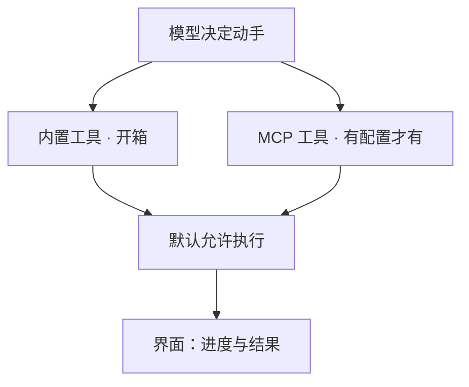

# 工具与权限

> 用户/产品视角：模型能动手做什么、要不要每次问你。不写工具 schema 与实现。
> 现状对齐：2026-07-11。

## 用户怎么碰到

开箱即可：模型在对话中调用内置工具读写仓库、搜索、列目录、跑终端命令。界面看到工具起止与结果，而不是权限弹窗风暴。

**内置工具（产品集合）**：读 / 写 / 改文件 · 终端命令 · 搜索（grep）· 查找（find）· 列目录（ls）。

可选：配置了 MCP 后，额外出现外部工具（见 [扩展能力-MCP.md](./扩展能力-MCP.md)）。

## 产品规则（MUST / 禁止）

| MUST | 禁止 |
|---|---|
| 工具侧开箱 **allow-all** | 默认做成「每个工具 popup 审批」平台 |
| 项目风险用 **Trust 闸项目本地资源** 管（见 [信任与项目闸.md](./信任与项目闸.md)） | 把 Trust 与工具 permission 混成同一交互 |
| 中止可停进行中的工具工作 | 中止后工具仍无限跑 |
| 配置层可有 allow/deny 列表作增强 | 把可选策略当成开箱必经 UX |

## 主线 vs 后置

| | 内容 |
|---|---|
| **主线** | 七类内置工具 · allow-all · 与一轮对话一体 |
| **后置 / 可选** | 更细的 GlobPolicy / 权限端口；MCP 安全 allowlist UI |

## 理想 vs 现状

| | 状态 |
|---|---|
| 内置工具 + allow-all | ✅ 已落地 |
| 可选权限增强 | 🟢 端口可有；非默认路径 |
| MCP 工具 | ✅ 配置启用；安全 UI 后置 |

指针：`src/AGENTS.md`（Trust / Permission / MCP）。

## 与其它文档

- [信任与项目闸.md](./信任与项目闸.md)
- [一轮对话.md](./一轮对话.md)
- [扩展能力-MCP.md](./扩展能力-MCP.md)
- [插话续跑与中止.md](./插话续跑与中止.md)
