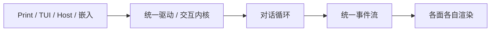

# 库与多客户端

> 用户/产品视角：同一内核如何被多种 client 与嵌入方共用。不写 API 签名与模块路径。
> 现状对齐：2026-08-21。

## 用户怎么碰到

- **TUI**：终端交互面（**CLI 默认入口**）。产品路径是四象限客户端，默认 attach 本机 Host；未在听失败。
- **Print**：本地一次性对话，开箱主路径之一；同进程，不占端口。
- **Host**：操作器（模型 / 会话 / MCP / 工作区 / trust）。显式 `xylitol serve` 才占用绑定。
- **嵌入库**：外部程序把 xylitol 当库，自建界面；同进程。

用户改道（插话 / 续跑 / 中止）只经统一的「驱动」入口，不直达对话循环内部。

## 一条主线（产品）

```text
装配 → 驱动（进程内或远程）→ 对话循环 → 统一事件流 → 该面渲染
```

**心智（命名不改代码）**：`XyDriver` 是 Print / TUI / Host / 嵌入共用的**统一交互内核**——整机遥控器：跑一轮、改道、会话与模型命令都经此入口，不直达对话循环内部。实现类型名继续叫 Driver；产品面角色不必强行 `Xy*App` 品牌化。



## Client 矩阵

| Client | 角色 | 今日状态 |
|---|---|---|
| **TUI** | 终端交互（默认） | ✅ attach 本机 Host；未在听失败 |
| **Print** | 本地一次性对话 | ✅ 同进程主线 |
| **Host** | 操作器 + 可选监听器 | ✅ 产品 TUI 依赖本机在听；print / 嵌入不占端口 |
| **嵌入库** | 外部自建面 | ✅ 公开装配缝 + 精选契约 |

## 两层对外契约（产品规则）

| 层 | 给谁 | 写什么 |
|---|---|---|
| **库契约（`Xy*`）** | 替换端口、跨面事件、**共享应用协议（`XyDriver`）**、配置元数据 | 精选稳定符号（见 `src/AGENTS.md` / crate 根 `pub use`） |
| **装配辅助** | 多 client / 嵌入方 | bootstrap、`BuildAgentOptions`、dispatch、（可选）线协议 |

需要新能力时扩 `XyDriver` / 事件 / 端口，不要伸手进内部实现。

**面本地**：键、画、TTY、剪贴板、折叠/展开等 chrome 动作由 TUI 自己做；Host 不管视口。未开闸面的同源约束只在 roadmaps，不在本文写成现行 MUST。

## 嵌入方产品规则

1. **优先**公开装配缝 + 精选库契约。
2. **不要**把内部实现类型当稳定 API。
3. 未配置的能力（如 MCP）必须 **zero-cost**。
4. 已知泄漏与非承诺项 → 一行见 `src/embed.rs` 文档注释；不在此展开。

## 理想 vs 现状

| | 状态 |
|---|---|
| Print / Host / 嵌入走统一驱动 | ✅ |
| TUI 消费同一事件流（会话、steer、slash、bang…） | ✅ attach 路径（现行唯一产品面拓扑） |
| CLI 默认进 TUI | ✅ 须本机 Host 在听 |
| 产品 TUI 是薄客户端、操作器在 Host | ✅ 默认 attach；print / 嵌入仍可同进程 |

## 与其它文档

- [产品分层总览.md](./产品分层总览.md)
- [一轮对话.md](./一轮对话.md)
- [用户可见事件.md](./用户可见事件.md)
- [插话续跑与中止.md](./插话续跑与中止.md)
- [远程体验与线协议.md](./远程体验与线协议.md)
- 代码边界 SSOT：`src/AGENTS.md`
