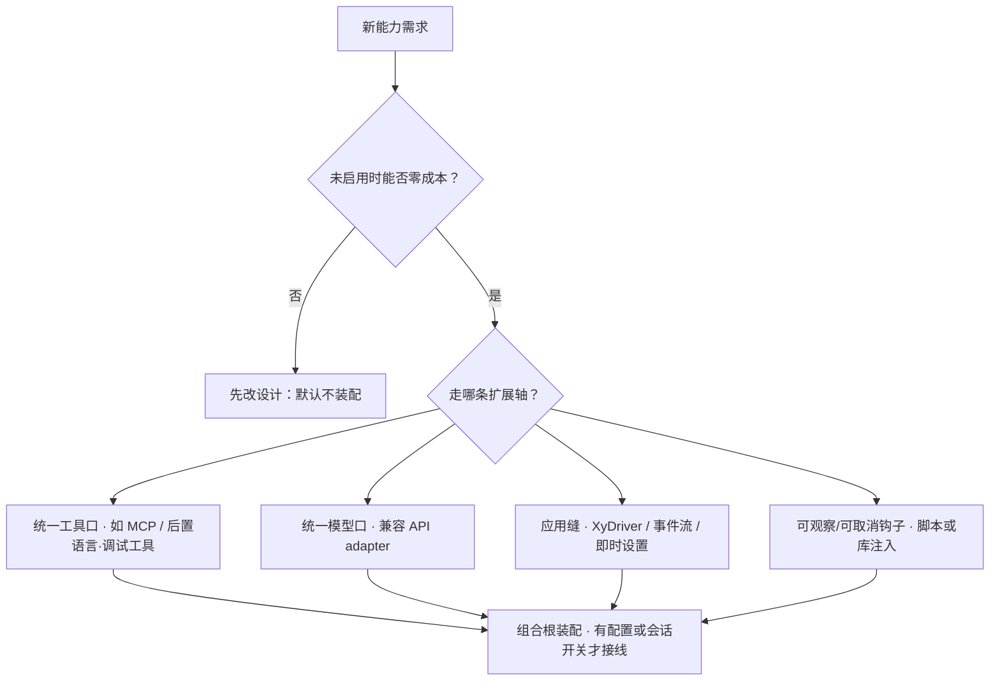

# 扩展与开闭

> 用户/产品视角：怎么扩展能力、什么叫「可插拔」，以及**明确不是**插件市场。
> 代码侧决策准则 SSOT：`src/AGENTS.md`「扩展开闭」。
> 现状对齐：2026-07-21。

## 产品心智（一句话）

**可替换端口 + 组合根装配 + 配置/会话启用** = 开闭扩展；**不是** Extension Host / 插件清单 / 第三方扩展市场。

## MUST / 禁止

| MUST | 禁止 |
|---|---|
| 开箱主线默认就能用；后置能力**有配置或会话启用才装配** | 未启用也背负常驻运行时成本 |
| 厂商 / 协议差异关在适配门后；界面只认统一事件与工具体验 | 界面学习某厂商 / 某插件私有事件 |
| 新能力优先接**已有**扩展轴（工具口、模型口、XyDriver 事件、hook） | 为「未来插件」先挖空 Extension API |
| 多 client / 嵌入方走公开装配缝与精选契约 | reach-in 内部实现当稳定 API |
| 扩展点只在有真实第二实现（或明确第三实现）时升格 | 单实现却堆 dyn / 注册表 / 插件清单 |

## 与「插件系统」的分界

| 我们要的 | 我们不要的 |
|---|---|
| 自己改代码 / 换实现时开闭 | 第三方热插拔市场 |
| 配置驱动、会话即时开关 | 进程内插件发现协议当产品 |
| 少量稳定端口与缝 | 为对称性复制第二套抽象 |
| MCP 等**配置启用**的外部工具 | 「一切皆插件」叙事 |

产品定调对照：[产品分层总览.md](./产品分层总览.md)。已落地范例：[扩展能力-MCP.md](./扩展能力-MCP.md)、[多厂商模型.md](./多厂商模型.md)、[库与多客户端.md](./库与多客户端.md)。

## 三要素怎么平衡（产品语言）

| 要素 | 默认取舍 |
|---|---|
| **开发复杂度** | 先复用统一工具口 / 模型口 / XyDriver；不先发明新平台 |
| **维护难度** | 稳定对外契约少而精；厂商与 SDK 关在门后；禁止双路径故事 |
| **性能** | 未启用 = 不装配（zero-cost）；热路径不为假想扩展多一层空转 |

## 后置方向怎么接（候选指针）

未兑现方向仍在 `docs/roadmaps/`；认领实现时**不要**新开插件平台，按下表挂既有轴：

| 候选 | 产品扩展轴 | 不要 |
|---|---|---|
| [运行时即时设置](./运行时即时设置.md)（模型/thinking） | run 绑定；选中即时反映；与 `/reload` 分清 | 假装已换模却当前轮已切、或当前轮被中途打断 |
| [运行时即时设置](../roadmaps/运行时即时设置.md)（能力覆盖盘） | 会话覆盖 → **下一波次**再装配；待生效 UI 呈现机制待定（原「下轮预告」已随 run 绑定退役，见 [TUI信息面与固定区词汇.md](./TUI信息面与固定区词汇.md)） | 假装覆盖已改却本波次偷偷换能力 |
| [LSP 会话集成](../roadmaps/LSP会话集成.md) | 零成本默认；启用后进**统一工具语境**；开关挂即时设置 | 启动常驻语言服务；LSP 私有事件进界面闭集 |
| [DAP 调试集成](../roadmaps/DAP调试集成.md) | 同上（平行模式）；进模型的是压缩摘要 | 倾倒原始 DAP JSON；无明示的后台调试会话 |
| [Sub-Agent 编排](../roadmaps/Sub-Agent编排.md) | 派生/回收可见；经统一生命周期事件与中止语义 | 静默分身；第二套编排总线绕过 XyDriver |

## 理想 vs 现状

| | 状态 |
|---|---|
| 端口 + 组合根 + 精选库契约 | ✅ |
| MCP / 模型适配开闭范例 | ✅ |
| 明确「非插件市场」产品文 | ✅（本文） |
| LSP / DAP / Sub-agent / **能力覆盖盘** | 🔴 仍候选；模型/thinking 即时设置 ✅ |

## 与其它文档

- [产品分层总览.md](./产品分层总览.md)
- [扩展能力-MCP.md](./扩展能力-MCP.md)
- [多厂商模型.md](./多厂商模型.md)
- [库与多客户端.md](./库与多客户端.md)
- [配置与档案.md](./配置与档案.md) — `/reload` vs 即时设置
- [运行时即时设置.md](./运行时即时设置.md) — 已落地换模心智
- 代码准则：`src/AGENTS.md`「扩展开闭」
