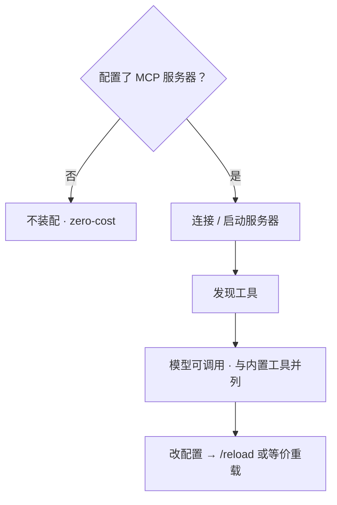

# 扩展能力 · MCP

> 用户/产品视角：外部工具怎么按需接入。不写传输种类与 SDK。
> 现状对齐：2026-07-18。

## 用户怎么碰到

默认**没有** MCP：不配就不装，不占运行时。

在配置里声明 MCP 服务器后：启动（或重载）时连接、发现工具，模型可像用内置工具一样调用它们；工具名对用户可区分来自哪个服务器。

改配置后应能**重载工具集**。产品上可通过 `/reload`（与 skills / 键位 / 主题等一并编排）热更新；不必把「重启整个进程」写成唯一产品手段。

## 产品规则（MUST / 禁止）

| MUST | 禁止 |
|---|---|
| **有配置才装配**；无 / 空配置 → 零成本 | 未配置也创建 client、注册空工具集 |
| 动态配置与重载是产品目标 | 把「必须重启进程」写成唯一合约 |
| 外部工具经统一工具口接入对话 | 让界面学习 MCP 厂商私有事件 |
| 内置工具在重载时保留 | 重载时误删开箱工具 |

## 主线 vs 后置

| | 内容 |
|---|---|
| **后置 / 配置启用** | MCP 整体（相对开箱主线） |
| **已落地能力** | 配置驱动装配 · 嵌入缝去泄漏 · `/reload` 重载路径 |
| **有意后置** | MCP 安全 allowlist 产品 UI；`/reload` 进行中锁输入等整包 UX（c1205） |
| **进行中** | 启动不挡 TTI + 并行连接 + loaded-resources 进度（c1200） |

## 理想 vs 现状

| | 状态 |
|---|---|
| zero-cost 未配置 | ✅ |
| 配置装配 + 重载 | ✅ |
| 嵌入方不碰内部 MCP 配置类型 | ✅ |
| 安全 allowlist UI | 🔴 后置 |

指针：`src/AGENTS.md`（MCP）。

## 与其它文档

- [产品分层总览.md](./产品分层总览.md)
- [工具与权限.md](./工具与权限.md)
- [配置与档案.md](./配置与档案.md)
- [库与多客户端.md](./库与多客户端.md)
- [信任与项目闸.md](./信任与项目闸.md)
