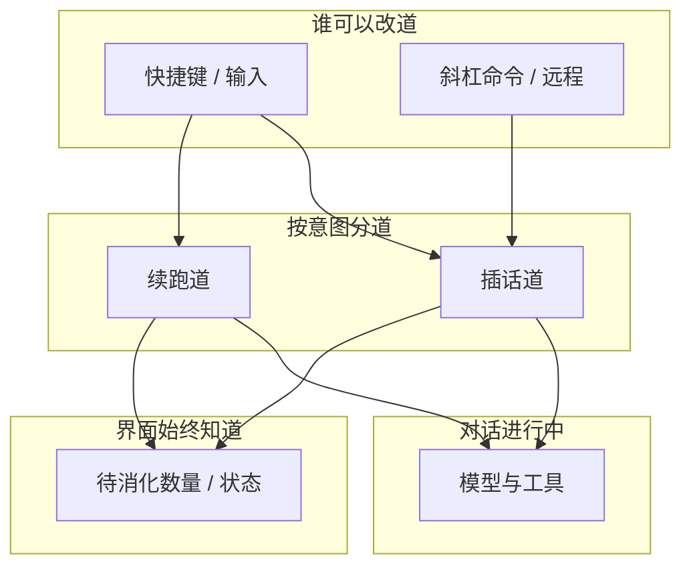

# 插话 · 续跑 · 中止

> 用户/产品视角：灵活改道、体验连贯、行为可预期。不写队列实现。
> 现状对齐：2026-07-16。

## 用户怎么碰到

| 场景 | 期望体验 |
|---|---|
| 模型还在跑，我想加一句 | **插话**进队；界面立刻能看到「还有待消化的插话」；当前工具尽量做完再听新话 |
| 这轮结束后还想追问 | **续跑**进队；本轮真正结束后自动开下一问 |
| 我后悔了 / 跑飞了 | **中止**：停手；未消化的插话丢掉；未发出的续跑回到输入框，方便改完再发 |
| 同时从快捷键和命令插话 | 都可以；顺序可预期；不要丢、不要卡死界面 |

## 产品规则（MUST / 禁止）

| MUST | 禁止 |
|---|---|
| 插话 / 续跑分道；消化时机固定（插话在下一拍前；续跑在本轮彻底结束后） | 把改道做成通用后台任务系统 |
| 改道后界面**马上**有反馈（与本轮进度同一条用户可见事件流） | 「队列变了」和「对话事件」走两条互不相通的通知路径 |
| 中止清插话、保留未发出续跑供输入框恢复 | 中止后丢掉用户已打好的续跑文案 |
| 本地与远程都能表达队列状态 | 远程静默丢队列更新 |

## 业务流



```mermaid
sequenceDiagram
  actor U as 用户
  participant UI as 界面
  participant Loop as 对话中
  participant Tools as 工具

  U->>UI: 插话
  UI-->>U: 立刻看到队列状态更新
  Note over Loop,Tools: 当前工具继续
  Loop->>Loop: 下一拍消化插话
  U->>UI: 中止
  UI->>Tools: 停手
  UI->>UI: 清插话 · 续跑文案回输入框
  UI-->>U: 状态复位，可再编辑
```

## 主线 vs 后置

- **主线**：插话 / 续跑 / 中止语义；队列状态进用户可见事件流。
- **克制（有意不做）**：用户级「多 agent 并行」产品；通用任务队列平台。

## 理想 vs 现状

| | 状态 |
|---|---|
| 进程内队列 + 事件流 | ✅ 已落地 |
| 远程队列状态上线 | ✅ 已落地 |
| TUI 完整消费队列徽章 | ✅ 已落地 |

实现选型指针：archive c525 / c461；代码边界见 `src/AGENTS.md`。

## 与其它文档

- [一轮对话.md](./一轮对话.md)
- [用户可见事件.md](./用户可见事件.md)
- [远程体验与线协议.md](./远程体验与线协议.md)
- [库与多客户端.md](./库与多客户端.md)
