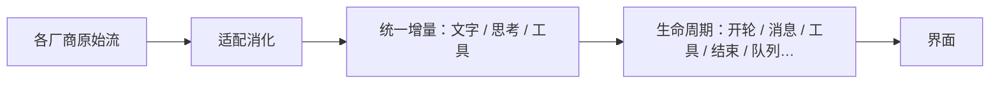
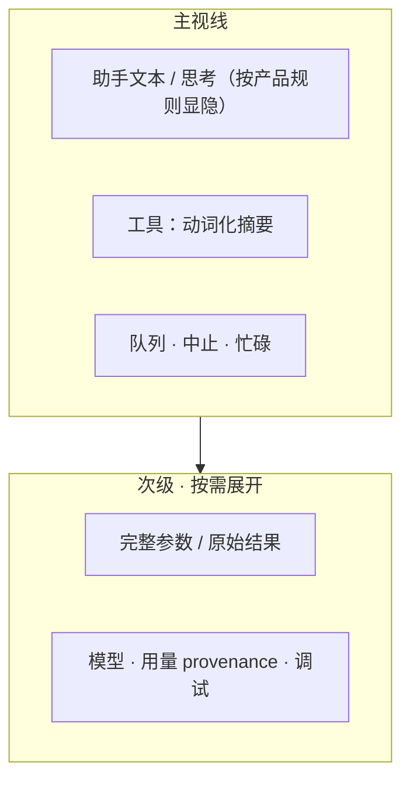

# 用户可见事件 · 信息层级

> 用户/产品视角：界面只依赖「对话生命周期」语言；重要信息显形、噪声可展开。不写枚举清单与传输编码。
> 现状对齐：2026-07-18。

## 用户怎么碰到

界面看到的是：开/停一轮、文字与思考增量、工具起止、压缩、队列状态、错误与结束——**跨 Print / TUI / 远程同一套词汇**。用户不应感到「换了厂商就换了一套事件名」。

在 TUI 主视线，用户真正要决策的通常是：助手在说什么、工具改了什么、队列/中止状态、用量是否可信。默认**不**需要整段 JSON 参数墙或内部关联 id。

## 产品规则（MUST / 禁止）

1. **生命周期是闭集**：只为**跨界面有意义**的事增加种类。
2. **厂商细节不进界面词汇**：某家多了一种 SSE，默认不出现新的「界面事件种类」。
3. **未知则降级**：实验性扩展，界面忽略并记日志，不崩。
4. **工具默认人类可读**：主视线显示意图化摘要（路径、命令短形等）；完整参数/结果可展开审计。
5. **用量诚实**：footer / 次级区标明 provenance，不把启发式伪装成官方用量。
6. **禁止**：为厂商专名堆宽表；把侧路生命周期总线当成多 client 的「本轮进度总线」；默认整段 JSON 倾倒抢视线。

## 主线 vs 后置

| | 内容 |
|---|---|
| **主线** | 文字 / 思考 / 工具 / 轮次 / 压缩 / 队列状态 / 错误与结束 · 工具人类可读 · provenance footer |
| **可降级（有意）** | 部分仅进程内有意义的开场/重试账本等，远程可不映射 |
| **后置** | 状态进一步减噪统一；主题与信息密度打磨；会话信息变更等细节的远程同构 |

## 理想 vs 现状

| | 状态 |
|---|---|
| 闭集 + 防宽表 | ✅ |
| 队列状态进活跃事件流 | ✅ |
| 远程映射与降级策略 | ✅；部分变体仍降级 |
| 工具主视线去 JSON 化 + 可展开 | ✅ |
| Footer 用量 provenance | ✅ |
| 状态减噪 / 主题密度 | 🟢 部分；见 roadmaps |

## 与其它文档

- [多厂商模型.md](./多厂商模型.md)
- [插话续跑与中止.md](./插话续跑与中止.md)
- [远程体验与线协议.md](./远程体验与线协议.md)
- [一轮对话.md](./一轮对话.md)
- [压缩与上下文.md](./压缩与上下文.md)
- 未兑现打磨：[../roadmaps/TUI视觉与信息表达.md](../roadmaps/TUI视觉与信息表达.md)
