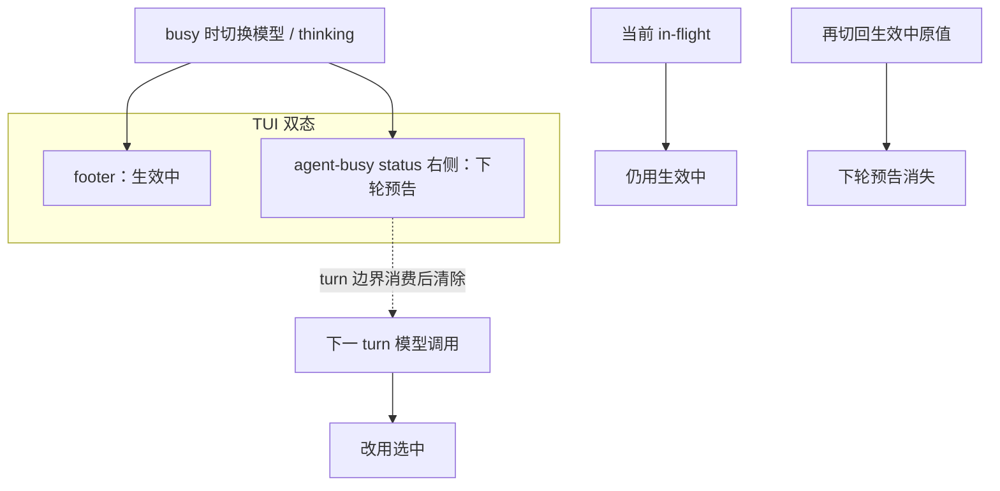

# 运行时即时设置

> 对话中调整模型 / thinking：**下一次模型调用边界（NextTurn）**才换，不必重启；UI 同时说清「此刻在用什么」与「下一拍将换成什么」。
> 与 `/reload`（磁盘资源热重载）分语义——见 [配置与档案.md](./配置与档案.md)。
> 词汇：下轮预告 / 待生效 / 滚动提示 → [TUI信息面与chrome词汇.md](./TUI信息面与chrome词汇.md)。
> 现状对齐：2026-07-30。能力覆盖盘（LSP/DAP/MCP…）仍候补，见 [../roadmaps/运行时即时设置.md](../roadmaps/运行时即时设置.md)。

## 用户怎么碰到

- agent 还在跑时换模型 / thinking：当前流不换；工具跑完后的**下一次模型调用**起用新值；
- footer（输入区下方）始终显示 **生效中**；若下一拍将不同，busy status **右侧** dim **下轮预告**；
- 成功路径 **不** 再刷 `model → …` / `theme → …` 一类 **滚动提示**；
- 切回原值 → 下轮预告消失，观感恢复如初；
- thinking **只**在 `/model` 列表里调（←→ / Shift+Tab）；没有全局 cycle。

## 关键词汇

| 词 | 含义 |
|---|---|
| **in-flight** | 已发出、尚未结束的那一次模型流 |
| **turn** | 一次「问模型 →（可选）工具 → …」中的**下一次模型调用**边界 |
| **run** | 从用户开跑到 agent idle 的整段（可含多 turn） |
| **生效中（active）** | 当前 in-flight / 本 turn 实际使用的模型与 thinking |
| **选中（selected）** | 会话当前选定；idle 且无 in-flight 时与 active 一致 |
| **待生效（pending）** | selected ≠ active；将在 NextTurn 起用；相同时不得再显示下轮预告 |
| **下轮预告（next-turn cue）** | agent-busy status 行右侧 dim 文案（常为 `Next turn: …`） |

## 生效点（已落地）

| 设置类 | 生效点 | in-flight | 说明 |
|---|---|---|---|
| **模型 / thinking** | **NextTurn** | **保持旧值** | 当前流不换；下一 turn 模型调用起用选中值 |
| **主题等纯 UI** | Immediate | n/a | 立刻变色板；成功也不刷滚动提示 |

## 产品规则（MUST / 禁止）

| MUST | 禁止 |
|---|---|
| busy 换模型 / thinking：当前流保持 active；下一 turn 用 selected | 只改 footer 成新模型，让用户以为当前句已换模 |
| 有 pending 时 footer = **active**；agent-busy status 右侧 dim = **下轮预告** | 用 selected 覆盖 footer 主字段 |
| pending == active（含切回原值）时 **清除**下轮预告 | 空的下轮预告或幽灵滚动提示墙 |
| 下轮预告文案互斥：模型 pending → `Next turn: {model}`；仅 thinking pending → `Next turn thinking: {level}` | `model · level` 拼接多项 |
| **仅 agent-busy** 画下轮预告；**仅 bang busy** 不画 | bang 旁路假装有 NextTurn 待生效 |
| idle 且无 in-flight：切换立刻 active=selected，无下轮预告；footer 直接更新 | 成功路径仍刷滚动提示确认行 |
| 失败 / 拒绝 / 多行诊断可用滚动提示 | 把待生效做成 scrollback 永久墙 |
| thinking **仅**经 `/model` picker（↑↓ 模型，←→ / Shift+Tab 档位） | 全局 Shift+Tab / 独立 cycle thinking |
| 选模默认：支持集**配置顺序末项**；不可调 → `off`；UI 展示该模型声明的档名 | 因 Settings 默认档覆盖换模末项策略；静默展开未配置的 STANDARD 五档 |

## `/model`（TUI）

| 输入 | 行为 |
|---|---|
| `/model` | 打开模型列表（含 thinking 档列） |
| `/model <精确 id>` | 直设模型；可调 → thinking=声明列表末项；不可调 → `off` |
| busy 时接受换模 | 写入选中；若与 active 不同则待生效 + 下轮预告；**禁止**把 `/model …` 当 steer 文本 |

## 主线 vs 后置

| | 内容 |
|---|---|
| **主线（已落地）** | 模型 / thinking NextTurn · active/pending 双态 chrome · `/model` 一体选档 |
| **后置** | 会话能力覆盖盘（LSP/DAP/MCP…）、覆盖可观察——未交付前见 roadmap，不在本文写成现行 MUST |

## 理想 vs 现状

| | 状态 |
|---|---|
| 模型 / thinking NextTurn + 双态 chrome | ✅ |
| 成功换模 / 换主题不刷滚动提示 | ✅ |
| thinking 仅 `/model`；默认声明列表末项 | ✅ |
| 能力覆盖盘 / 可观察覆盖集 | 🔴 未交付 |

## 与其它文档

- [TUI信息面与chrome词汇.md](./TUI信息面与chrome词汇.md) — 固定词
- [配置与档案.md](./配置与档案.md) — 磁盘配置与 `/reload`
- [多厂商模型.md](./多厂商模型.md) — 换模体验一致
- [一轮对话.md](./一轮对话.md) — turn 边界
- [扩展与开闭.md](./扩展与开闭.md) — 覆盖盘接缝心智
- 未兑现切片：[../roadmaps/运行时即时设置.md](../roadmaps/运行时即时设置.md)
