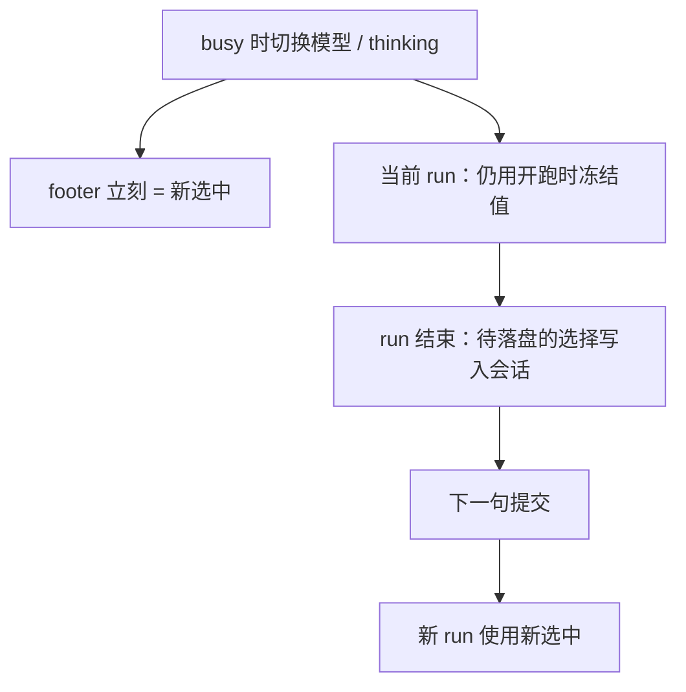

# 运行时即时设置

> 对话中调整模型 / thinking：**选中立刻反映到界面**；真正的模型调用按 **run 绑定**——每句提交开跑时冻结本次使用的模型，整段 run（含工具环）不变。busy 切换不打断当前轮，下一句提交才带新值。
> 与 `/reload`（磁盘资源热重载）分语义——见 [配置与档案.md](./配置与档案.md)。
> 词汇：滚动提示 / 壳层通告 → [TUI信息面与chrome词汇.md](./TUI信息面与chrome词汇.md)。
> 现状对齐：2026-08-21。能力覆盖盘（LSP/DAP/MCP…）仍候补，见 [../roadmaps/运行时即时设置.md](../roadmaps/运行时即时设置.md)。

## 用户怎么碰到

- **idle 时切换**：footer 立刻显示新 id；下一句提交即用新值；
- **busy 时切换**：footer 立刻变；当前轮继续用开跑那颗；生成结束后再发一句才真正换；
- 界面上**没有**「下一拍将换成什么」的待生效预告——看 footer 即是下次提交会用什么；
- 成功路径 **不** 刷 `model → …` / `theme → …` 一类 **滚动提示**；
- thinking **只**在 `/model` 列表里调（←→ / Shift+Tab）；没有全局 cycle。

## 关键词汇

| 词 | 含义 |
|---|---|
| **in-flight** | 已发出、尚未结束的那一次模型流 |
| **turn** | 一次「问模型 →（可选）工具 → …」中的**下一次模型调用**边界 |
| **run** | 从用户开跑到 agent idle 的整段（可含多 turn） |
| **生效中（active）** | 本 run 开跑时冻结、当前正在使用的模型与 thinking |
| **选中（selected）** | 用户此刻选定的值；idle 且无 in-flight 时即下一次提交将用的值 |
| **run 绑定** | 每句提交开跑时把 selected 冻结为本 run 的 active；run 内不换模 |

## 生效点（已落地）

| 设置类 | 生效点 | in-flight | 说明 |
|---|---|---|---|
| **模型 / thinking** | **下一句提交（run 开跑）** | **保持开跑值** | busy 切换先记为待落盘；本轮结束后才写入会话的模型状态 |
| **主题等纯 UI** | Immediate | n/a | 立刻变色板；成功也不刷滚动提示 |

## 产品规则（MUST / 禁止）

| MUST | 禁止 |
|---|---|
| busy 换模型 / thinking：footer 立刻反映新选中；当前 run 保持开跑值 | 当前轮中途换模，或让用户以为当前句已换模 |
| 每句提交把**当时选中**交给会话；Host 以本次提交的选择开跑 | 靠「上一次切换」的隐式状态决定这一枪用哪颗 |
| run 结束后才把忙时切换落入会话模型状态 | 忙时直接改在飞 run 的模型 |
| idle 且无 in-flight：切换立刻生效，footer 直接更新 | 成功路径仍刷滚动提示确认行 |
| 失败 / 拒绝 / 多行诊断可用滚动提示 | 把设置确认做成 scrollback 永久墙 |
| thinking **仅**经 `/model` picker（↑↓ 模型，←→ / Shift+Tab 档位） | 全局 Shift+Tab / 独立 cycle thinking |
| 选模默认：支持集**配置顺序末项**；不可调 → `off`；UI 展示该模型声明的档名 | 因 Settings 默认档覆盖换模末项策略；静默展开未配置的 STANDARD 五档 |
| `/model …` 不当 steer 文本 | 把斜杠命令灌进对话队列 |

## `/model`（TUI）

| 输入 | 行为 |
|---|---|
| `/model` | 打开模型列表（含 thinking 档列） |
| `/model <精确 id>` | 直设模型；可调 → thinking=声明列表末项；不可调 → `off` |
| busy 时接受换模 | 更新选中与 footer；当前轮不换；下一句提交才用新值 |

## 主线 vs 后置

| | 内容 |
|---|---|
| **主线（已落地）** | 模型 / thinking run 绑定 · 选中即时反映 · `/model` 一体选档 |
| **后置** | 会话能力覆盖盘（LSP/DAP/MCP…）、覆盖可观察——未交付前见 roadmap，不在本文写成现行 MUST |

## 理想 vs 现状

| | 状态 |
|---|---|
| 模型 / thinking run 绑定 + 选中即时反映 | ✅ |
| 成功换模 / 换主题不刷滚动提示 | ✅ |
| thinking 仅 `/model`；默认声明列表末项 | ✅ |
| 能力覆盖盘 / 可观察覆盖集 | 🔴 未交付 |

## 与其它文档

- [TUI信息面与chrome词汇.md](./TUI信息面与chrome词汇.md) — 固定词
- [配置与档案.md](./配置与档案.md) — 磁盘配置与 `/reload`
- [多厂商模型.md](./多厂商模型.md) — 换模体验一致
- [一轮对话.md](./一轮对话.md) — turn 边界
- [扩展与开闭.md](./扩展与开闭.md) — 覆盖盘接缝心智
- 未兑现切片：[../roadmaps/运行时即时设置.md](../roadmaps/运行时即时设置.md)
