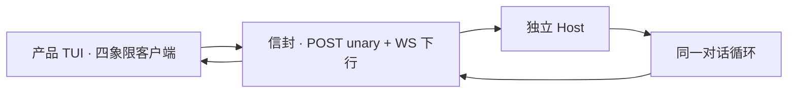

# 远程体验与线协议

> 用户/产品视角：连上 Host 时，该和本机操作器一样能聊、能改道、能看见进度。不写 REST/WS 字段表。
> 现状对齐：2026-08-21。

## 用户怎么碰到

理想上，客户端连上托管同一内核的 Host 后，应能：

- 开一轮对话、看流式文字与工具进度；
- 插话 / 续跑 / 中止，并立刻看到队列状态；
- 切换模型、会话、触发压缩等与本地同构的命令面能力。

用户不应感到「远程是另一套产品」。

**今日事实**：产品信封是四象限（POST unary + WebSocket 下行）。Command/Event 是载荷。产品 TUI 默认 attach `http://127.0.0.1:18790`；未在听失败。MCP 头卡、队列条、mux 常驻已在 attach 路径兑现。长会话冷恢复仍可能把实况磁带当历史播，对拍未收口。调试面：监听器提供 `GET /openapi.json`（unary 调试文档，条目从方法表生成）与 `GET /docs`（Scalar 调试 UI，唯一调试 UI）；仅作人手调试参考，不是客户端生成真源。

## 产品规则（MUST / 禁止）

| MUST | 禁止 |
|---|---|
| 远程事件映射遵守**闭集**：只映射跨面有意义的生命周期 | 为远程单独引入厂商专名事件宽表 |
| 队列状态**必须**能到达远程 UI（**队列条**依赖） | 远程静默丢插话/续跑反馈 |
| 未知事件可降级（忽略 + 日志），不崩 | 未映射就让远程客户端崩溃 |
| 命令面与 Host 驱动能力对齐（跑 / 中止 / 队列 / 模型 / 会话 / 压缩等） | 用「信封已通」代替可观察对拍 |

## 主线 vs 后置

| | 内容 |
|---|---|
| **已落地** | 四象限信封 · salvo Host 监听器 · 产品 TUI attach 默认 · 写者租约 · MCP 头卡 / 队列条 / mux 常驻 |
| **未收口** | 长会话冷恢复（禁止把 journal 当实况回放）；其余旧 TUI 能力与 attach 的对拍 |

## 理想 vs 现状

| | 状态 |
|---|---|
| 产品 TUI attach | ✅ 默认路径；未在听失败 |
| 队列更新上线 | ✅ |
| 命令经统一分发 | ✅ |
| 全量生命周期 1:1 | 🟢 闭集内对齐；冷恢复等对拍仍在收口 |

事件闭集见 [用户可见事件.md](./用户可见事件.md)。

## 与其它文档

- [库与多客户端.md](./库与多客户端.md)
- [用户可见事件.md](./用户可见事件.md)
- [插话续跑与中止.md](./插话续跑与中止.md)
- [一轮对话.md](./一轮对话.md)
- [会话与持久化.md](./会话与持久化.md)
