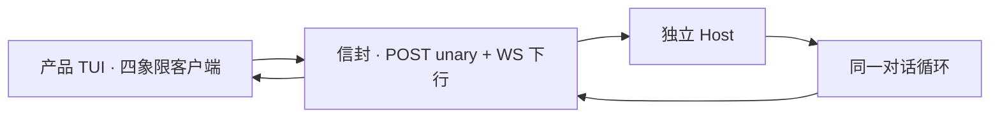

# 远程体验与线协议

> 用户/产品视角：连上 Server 时，该和本地一样能聊、能改道、能看见进度。不写 REST/WS 字段表。
> 现状对齐：2026-07-18。

## 用户怎么碰到

理想上，远程客户端连上托管同一内核的 Server 后，应能：

- 开一轮对话、看流式文字与工具进度；
- 插话 / 续跑 / 中止，并立刻看到队列状态；
- 切换模型、会话、触发压缩等与本地同构的命令面能力。

用户不应感到「远程是另一套产品」。

**今日事实**：产品信封是四象限（POST unary + WebSocket 下行）。Command/Event 是载荷。产品 TUI 默认 attach `http://127.0.0.1:18790`；未在听失败。独立 Web 薄端后置。

## 产品规则（MUST / 禁止）

| MUST | 禁止 |
|---|---|
| 远程事件映射遵守**闭集**：只映射跨面有意义的生命周期 | 为远程单独引入厂商专名事件宽表 |
| 队列状态**必须**能到达远程 UI（**队列条**依赖） | 远程静默丢插话/续跑反馈 |
| 未知事件可降级（忽略 + 日志），不崩 | 未映射就让远程客户端崩溃 |
| 命令面与本地驱动能力对齐（跑 / 中止 / 队列 / 模型 / 会话 / 压缩等） | 把「协议已通」说成「薄端应用已交付」 |

## 主线 vs 后置

| | 内容 |
|---|---|
| **已落地** | 四象限信封为产品真源 · 产品 TUI attach 默认 |
| **后置** | salvo 监听器换栈（c2302）；薄 TS / Web UI；方案 A loopback |

## 理想 vs 现状

| | 状态 |
|---|---|
| Server-on-XyDriver | ✅ |
| 队列更新上线 | ✅ |
| 命令经统一分发 | ✅ |
| 全量生命周期 1:1 | 🟢 闭集内对齐；部分有意降级 |
| 独立远程薄端应用 | 🔴 未接线 |

事件闭集见 [用户可见事件.md](./用户可见事件.md)。

## 与其它文档

- [库与多客户端.md](./库与多客户端.md)
- [用户可见事件.md](./用户可见事件.md)
- [插话续跑与中止.md](./插话续跑与中止.md)
- [一轮对话.md](./一轮对话.md)
- [会话与持久化.md](./会话与持久化.md)
