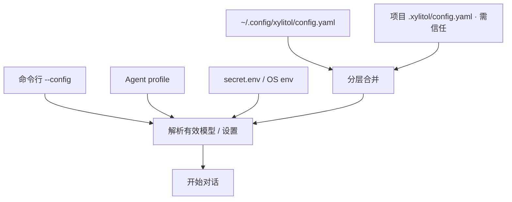

# 配置与档案

> 用户/产品视角：怎么配模型、密钥、项目覆盖。不写 YAML 字段百科。
> 现状对齐：2026-08-08（三协议族；`openai-completions` 一等显式 `api`；命名 `compat` / per-model `api_key`）。

## 用户怎么碰到

- **零配置可启动**：没有项目目录也能用全局配置；缺模型时应得到**可行动的错误**（告诉怎么配），而不是含糊崩溃。
- **两文件心智**：
    - **`config.yaml`**：可分享的非密钥（模型、tokenizer、agents、行为）— 项目侧可进 git
    - **`secret.env`**：API key 等密钥；YAML 用 `{{ secret.KEY }}` — 不进 git
    - **路径插值**：可分享配置里需要用户 home 时用 `{{ vars.home }}`（仅此键；勿写死 `/home/…`）。
    - **分层覆盖**：全局 `~/.config/xylitol/config.yaml` → 项目 `.xylitol/config.yaml` → `--config`；同路径 `secret.env` 为 global ← project（不覆盖已有 OS env）。
- **选模型**：命令行覆盖、agent profile、执行配置、默认模型——按优先级解析出一个有效模型。
- **项目侧配置**：受 Trust 门禁约束——未信任则不加载项目本地资源（见 [信任与项目门禁.md](./信任与项目门禁.md)）。
- **API 类型**：OpenAI 兼容默认为 **`openai-responses`**；显式可识别另含 **`openai-completions`**；Anthropic 为 `anthropic-messages`。配置真值用全称。命名 `models.*.compat`（`generic` / `deepseek`）选 wire/thinking 轮廓；自由形式 `extra_policy` **不**进 YAML。per-model `api_key`（可 `{{ secret.* }}`）优先于 kind 级 env。`thinking_levels` 为该模型用户侧档位 SSOT（未声明 → 仅 `off`）；例 DeepSeek `[off, low, high, max]`（见 `configs/example.yaml`）。
- **数据目录**：`~/.xylitol/` 放 sessions / tokenizers / logs 等，**不是** AppConfig 主战场（全局 AppConfig SSOT = `~/.config/xylitol/`）。

## 产品规则（MUST / 禁止）

| MUST | 禁止 |
|---|---|
| 可分享项进 `config.yaml`，密钥进 `secret.env` | 再提供或文档化 `config.local.yaml` 覆盖层 |
| 全局 → 项目 → `--config` 深合并 | 把本机专用模型 ID 写死进代码当默认 |
| 未配置模型时给出清晰配置指引 | 静默猜一个环境相关的本地模型 |
| 交付范围只接受 OpenAI 兼容与 Anthropic；OpenAI 兼容**默认 Responses**，Completions 为一等显式 `api`；命名 `compat` 可选 | 为未交付厂商堆配置产品概念；把 Completions 当开箱默认或「遗留将删」；静默吞 Completions |
| 项目本地配置服从 Trust | 未信任仍加载项目 prompts/settings |

## 主线 vs 后置

| | 内容 |
|---|---|
| **主线** | `config.yaml` + `secret.env` · 模型解析 · 与开箱一体 |
| **后置 / 配置启用** | MCP 服务器列表；更多厂商；会话**能力覆盖盘**（≠ `/reload`；模型/thinking 即时见 [运行时即时设置.md](./运行时即时设置.md)） |

## 理想 vs 现状

| | 状态 |
|---|---|
| 分层配置与模型解析 | ✅ 已落地 |
| Schema / 校验 / 模板插值 | ✅ 合约存在 |
| IDE 补全用 schema | ✅ 生成物存在（细节见配置规格，不在此列字段） |
| 资源热重载 `/reload` | ✅（skills / MCP / 键位 / 主题等）；**不是**会话能力覆盖盘 |
| 模型 / thinking run 绑定（下一句提交生效）+ 选中即时反映 | ✅ 见 [运行时即时设置.md](./运行时即时设置.md) |
| 会话能力覆盖盘 | 🔴 候选（roadmap） |

行为合约指针：`llmanspec/specs/runtime-config/`；勿在本文件维护字段表。

## 与其它文档

- [信任与项目门禁.md](./信任与项目门禁.md)
- [多厂商模型.md](./多厂商模型.md)
- [运行时即时设置.md](./运行时即时设置.md) — 会话内换模 / thinking（≠ `/reload`）
- [扩展能力-MCP.md](./扩展能力-MCP.md)
- [压缩与上下文.md](./压缩与上下文.md)
- 能力覆盖盘候选：[../roadmaps/运行时即时设置.md](../roadmaps/运行时即时设置.md)
