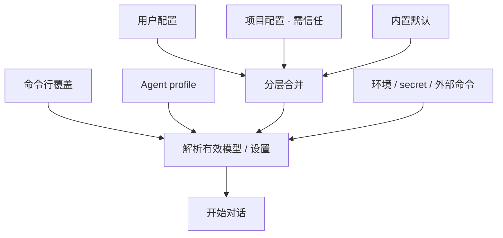

# 配置与档案

> 用户/产品视角：怎么配模型、密钥、项目覆盖。不写 YAML 字段百科。
> 现状对齐：2026-07-11。

## 用户怎么碰到

- **零配置可启动**：没有项目目录也能用全局/用户配置；缺模型时应得到**可行动的错误**（告诉怎么配），而不是含糊崩溃。
- **分层覆盖**：用户配置 > 项目配置 > 内置默认；同层可有 local 覆盖文件。
- **选模型**：命令行覆盖、agent profile、执行配置、默认模型——按优先级解析出一个有效模型。
- **密钥**：环境变量、secret 文件、外部命令解析等；密钥不进会话正文。
- **项目侧配置**：受 Trust 闸门约束——未信任则不加载项目本地资源（见 [信任与项目闸.md](./信任与项目闸.md)）。

## 产品规则（MUST / 禁止）

| MUST | 禁止 |
|---|---|
| 三层合并，后者覆盖前者（用户优先于项目优先于默认） | 把本机专用模型 ID 写死进代码当默认 |
| 未配置模型时给出清晰配置指引 | 静默猜一个环境相关的本地模型 |
| Pre-1.0 只接受 OpenAI 兼容与 Anthropic 两类 API 声明 | 为未交付厂商堆配置产品概念 |
| 项目本地配置服从 Trust | 未信任仍加载项目 prompts/settings |

## 主线 vs 后置

| | 内容 |
|---|---|
| **主线** | 分层配置 · 模型解析 · 密钥插值 · 与 Print 开箱一体 |
| **后置 / 配置启用** | MCP 服务器列表；更多厂商；导出等周边开关 |

## 理想 vs 现状

| | 状态 |
|---|---|
| 分层配置与模型解析 | ✅ 已落地 |
| Schema / 校验 / 模板插值 | ✅ 合约存在 |
| IDE 补全用 schema | ✅ 生成物存在（细节见配置规格，不在此列字段） |

行为合约指针：`llmanspec/specs/runtime-config/`；勿在本文件维护字段表。

## 与其它文档

- [信任与项目闸.md](./信任与项目闸.md)
- [多厂商模型.md](./多厂商模型.md)
- [扩展能力-MCP.md](./扩展能力-MCP.md)
- [压缩与上下文.md](./压缩与上下文.md)
