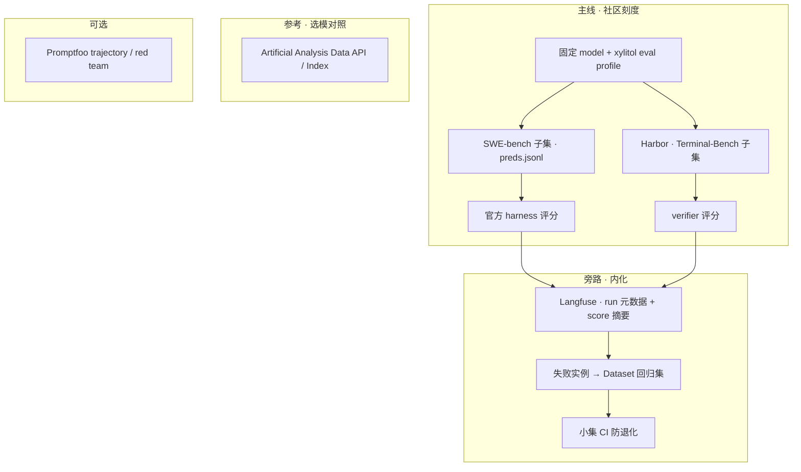

# Coding Agent Benchmark Eval 调研（2025–2026）

> **主线**：用**同一模型**在主流 agent eval benchmark 上跑分，作为 xylitol 能力刻度与版本对比基准。
> **形态**：Docker / sandbox 容器化 harness 驱动 agent 自主多轮，产出确定性分数（测试闸 / verifier）。
> **旁路**：Langfuse Dataset/Experiment 回归、Promptfoo 安全断言——从 benchmark 失败样本或日常 trace 抽样，**不替代**社区 leaderboard 主线。
> **参考**：Artificial Analysis Data API / Intelligence Index — 选模与同模型公开基线；**不是** xylitol 评测入口。
> 一手来源：各框架官方 docs / GitHub README / harness 源码（2025–2026 活跃项）。

## 1. 一句话结论

**主线 = 社区 benchmark harness（Harbor + Terminal-Bench、SWE-bench Verified harness）+ xylitol Print 非交互自主多轮 adapter；分数 = harness 官方 grader（测试通过 / verifier reward），不是 Langfuse judge。Langfuse 用于记录 run 元数据、对比 commit/配置、从失败实例钉回归集。Artificial Analysis = 选模与同模型公开基线对照（Data API 只读），不是 xylitol 评测入口。**

与上一版调研的差异：

| 维度 | 上一版（偏回归） | 本版（偏 benchmark） |
|------|------------------|----------------------|
| 主拼图 | Langfuse Dataset/Experiment | Harbor (TB) / SWE-bench 官方 harness |
| 分数来源 | 代码闸 + 可选 LLM judge | harness 确定性 grader（社区可比） |
| Docker | M3 周期性对标 | **默认 eval 形态** |
| xylitol 驱动面 | Print harness | Print + **eval 专用停止条件 / 产物协议** |
| Langfuse | SSOT | 旁路：run 归档 + 失败 → Dataset |
| Artificial Analysis | 未纳入 | 参考：选模 / 同模型公开基线（只读） |

---

## 2. 为什么 benchmark 主线，而非「自研回归集」

1. **可比性**：SWE-bench Verified、Terminal-Bench 等有公开 leaderboard；同模型换 scaffold 可差 5–20 分，但仍是社区对话语言。
2. **确定性**：评**产出**（patch 过测、环境终态过 verifier），不评工具路径——与 Anthropic agent eval 指南一致。
3. **xylitol 产品形态**：个人 coding harness，开箱 **allow-all 工具 + 自主 ReAct**；benchmark 测的正是「无人值守多轮修代码/跑终端」，与 TUI 交互面正交。
4. **自研回归**：仍需要，但从 benchmark 失败实例 / 生产 trace **抽样钉集**，不是 eval 的主刻度。

---

## 3. 主流 benchmark 对比（coding agent 向）

| Benchmark | 测什么 | 规模 | Harness | Agent 接入模式 | 评分 | 多轮 / 停止 | Docker |
|-----------|--------|------|---------|----------------|------|-------------|--------|
| **SWE-bench Verified** | 真实 GitHub issue → patch | 500 | [SWE-bench](https://github.com/SWE-bench/SWE-bench) | **两阶段**：容器内 agent 推理 → `preds.jsonl` → `run_evaluation` | F2P + P2P 测试全过 = resolved | mini: `step_limit` 250 / cost $3；SWE-agent: cost + autosubmit | 每实例镜像；~120GB 盘 |
| **Terminal-Bench 2.x** | 长程终端任务（编译、训练、排障…） | 89 (2.1) | [Harbor](https://github.com/harbor-framework/harbor) 官方 | **单阶段**：`harbor run -d … -a <agent> -m <model>` | `tests/test.sh` verifier | `task.toml` `agent.timeout_sec`（墙钟）；agent 内 ReAct 直到超时/完成 | 每任务 Dockerfile |
| **SWE-bench Lite** | Verified 子集 | 300 | 同上 | 同上 | 同上 | 同上 | 同上；**冒烟首选** |
| **SWE-bench Multimodal** | issue 含截图/图 | ~617 | 同上 + sb-cli 私有 test | 同上；需多模态输入 | 同上 | 同上 | 同上 |
| **SWE-bench Pro** | 企业级多文件长任务 | 1865 | [SWE-bench_Pro-os](https://github.com/scaleapi/SWE-bench_Pro-os) | SWE-agent scaffold → patch 收集 | Pass@1 resolve | 小时级 | 高并行 Docker |
| **Aider Polyglot** | Exercism 小练习多语言编辑 | 225×6 语言 | [aider benchmark](https://github.com/Aider-AI/aider/blob/main/benchmark/README.md) | `benchmark.py --model`；Harbor 有 adapter | 语言原生单测 | 通常 1–2 轮（失败重试） | 推荐 |
| **SWE-bench Multilingual** | 9 语言 repo 修复 | 300 | SWE-bench harness | 同上 | 同上 | 同上 | 同上 |
| **DevBench** | FIM 代码补全 | 1800 | [microsoft/devbench](https://github.com/microsoft/devbench) | 单轮 completion | Pass@1 + judge | **非 agent** | 轻 |
| **LiveCodeBench** | 竞赛题生成 | 滚动 | 独立 runner | 单轮 codegen | 单测 | 非 agent | 轻 |
| **GAIA** | 通用助手（浏览/bash） | 466 | Inspect Evals / OpenHands | agent_bridge | 精确匹配 + 辅助 judge | 多步 | Docker |
| **AgentBench** | 8 环境通用 agent | 多子集 | [THUDM/AgentBench](https://github.com/THUDM/AgentBench/) | 容器化 FC | 环境特定 | 多轮 | 重 |

**xylitol 优先级建议**（双主线，按叙事选先手）：

| 优先级 | Benchmark | 理由 |
|--------|-----------|------|
| **P0a** | Terminal-Bench 2.1 **10–20 任务子集**（Harbor） | 长程终端多轮；与 bash 工具链直接相关；**进入 AA Intelligence Index（16%）**，便于与公开模型刻度对照 |
| **P0b** | SWE-bench Lite 或 Verified **50 实例子集** | 修真实 GitHub issue 的金标准；两阶段成熟；对标 mini-SWE-agent（**不在** AA Index 主权重） |
| **P1** | Aider Polyglot **Rust 子集** | 快速 edit 质量信号 |
| **Defer** | DevBench、LiveCodeBench、τ-bench 全量、GDPval 自跑、全量 leaderboard | 非 coding harness、成本过高、或 AA 闭源流水线 |

先手选择：**要对齐 AA / 公开智能叙事 → 先 P0a（TB）**；**要证明 repo 修复能力 → 先 P0b（SWE）**。M0 冒烟可任选其一（或各跑极小子集）。

---

## 4. Artificial Analysis（参考刻度，非 xylitol 评测入口）

> 一手：[artificialanalysis.ai](https://artificialanalysis.ai/) · [Data API](https://artificialanalysis.ai/data-api) · [Intelligence Index v4.1](https://artificialanalysis.ai/articles/artificial-analysis-intelligence-index-v4-1) · [Stirrup](https://github.com/ArtificialAnalysis/Stirrup)

### 4.1 一句话

**AA 评的是「模型在 AA 固定 scaffold 下」的公开刻度；Data API 只读已发布分数；不能把 xylitol 提交进 AA leaderboard。** 与 xylitol 主线（自跑 Harbor / SWE harness）正交：AA = 选模与对照；自家 harness = 评 xylitol+model。

### 4.2 产品与边界

| 产品 | 是什么 | 对 xylitol |
|------|--------|------------|
| **Intelligence Index v4.1** | 合成分（Agents / Coding / Scientific / General） | 选模型、读「同模型在社区口径大概多强」 |
| **Data API** | `GET /api/v2/language/models`（指数、单项、价格、延迟）；Free 100 req/day | **只读**元数据 / 内部 dashboard；**不能**提交 xylitol run |
| **Stirrup** | AA 开源轻量 agent（Docker/E2B、MCP、`max_turns`、finish tool） | 他们跑 GDPval-AA 等用的 scaffold；可参考多轮设计，**不是** xylitol 评测 harness |
| **Leaderboard / Cost·Time per Task** | 模型排行与单位任务成本 | 外部对照；不可挂 xylitol 官方行 |

**明确不是**：可插自定义 agent 的评测平台；不是 SWE/Harbor 式 runner；不是第二观测栈候选。

### 4.3 Index 与 coding agent 相关权重（v4.1）

| 权重 | 评测 | 与 xylitol 关系 |
|------|------|-----------------|
| 20% | GDPval-AA v2（Stirrup + shell/web，Elo pairwise） | 偏知识工作 agent；脚本未开源（[Stirrup#8](https://github.com/ArtificialAnalysis/Stirrup/issues/8)）→ **Defer 自跑** |
| 16% | **Terminal-Bench 2.1** | **与 P0a 同任务族**；自家 Harbor 分可对照 AA 上同模型 TB 基线（scaffold 不同须诚实标注） |
| 14% | τ³-Bench Banking | 双控 agent–user；非 coding harness → Defer |
| 其余 | SciCode / HLE / GPQA / AA-* 等 | 模型能力；非 repo/终端 agent 主刻度 |

**注意**：Index **未**把 SWE-bench 放进主权重。对外若谈「对齐 AA」，TB 应优先；若谈「修 issue」，仍以 SWE 为准。

### 4.4 拼图落点

```text
主线（出分）     Harbor TB / SWE-bench  ← 评 xylitol+model
旁路（回归）     Langfuse Dataset
参考（选模/对照） Artificial Analysis Data API + Index  ← 评「模型在 AA scaffold 下」
参考（实现）     Stirrup 多轮/沙箱设计（勿当主产品）
```

实用报告写法：固定 model 跑 xylitol@Harbor TB 子集 → 查 AA 同模型 Terminal-Bench / Coding Index → 并排写「AA 基线 vs xylitol scaffold」，解释差而非假装自家分 = Intelligence Index。

---

## 5. Agent 多轮 / 无人值守：社区怎么处理

Benchmark harness **从不**在环内等人；差异在 agent 侧如何保证 loop 不挂起、超限如何交卷。

```
┌──────────────┐   instruction    ┌─────────────────┐
│ Harness      │ ───────────────► │ xylitol print   │
│ (Harbor /    │ ◄── tool results │ ReAct 自主多轮   │
│  SWE docker) │                  └────────┬────────┘
└──────┬───────┘                           │
       │ 无 stdin 人工输入                    │ 直到 stop / timeout
       ▼                                   ▼
┌──────────────┐                  ┌─────────────────┐
│ Verifier     │                  │ 产物：patch /    │
│ 测试闸       │ ◄────────────────│ 终态文件         │
└──────────────┘                  └─────────────────┘
```

| 框架 / agent | 多轮机制 | 停止条件 | 超限行为 | 模拟用户 |
|--------------|----------|----------|----------|----------|
| **mini-SWE-agent** | Bash-only ReAct，每步一个命令 | `step_limit: 250`, `cost_limit: $3`, `wall_time_limit_seconds` | `echo COMPLETE_TASK_AND_SUBMIT_FINAL_OUTPUT && cat patch.txt` 强制交卷 | 无 |
| **SWE-agent** | ACI（bash/edit/search） | `per_instance_cost_limit` 为主 | autosubmit 当前 patch | 无 |
| **OpenHands** | CodeActAgent | `max_iterations` CLI | `fake_user_response_fn`: *"Please continue. NEVER ASK FOR HUMAN HELP"* | **有**——agent 发 MessageAction 时注入 |
| **Harbor agents** | 各 agent 自带 loop | `task.toml` `[agent] timeout_sec` | 超时 → 任务 fail；agent 可写部分产物 | 无 |
| **Inspect sandbox_agent_bridge** | 容器内 agent 调 API | Inspect `Limits` | bridge 截断 | 无 |

**Anthropic 指南**（[Demystifying evals](https://www.anthropic.com/engineering/demystifying-evals-for-ai-agents)）：评产出不评路径；capability set（低通过率探索）vs regression set（近满分防退化）分开维护。

### xylitol 现状与缺口

| 能力 | 现状 | Benchmark 需要 |
|------|------|----------------|
| 非交互驱动 | `xylitol print <prompt>` → `XyDriver::run` 全 ReAct 流 | ✅ 主线入口 |
| 自主多轮 | ReAct loop 直到模型停 / 无 tool call | ✅ |
| `max_turns` / cost limit | `example.yaml` 注释 `# max_turns: 200`，**未实现** | ⚠️ 需 eval profile |
| 超限 autosubmit | 无 | ⚠️ SWE-bench 需交 patch；TB 需留可验证终态 |
| 模拟用户 | TUI 有 steer/follow-up；print 无 stdin | ⚠️ 若模型「问用户」会挂起——需 eval 模式禁止或 fake 回复 |
| 产物协议 | 无 `COMPLETE_TASK…` 约定 | ⚠️ SWE 适配需 `git diff` 收集 |
| 会话隔离 | 每 `run` 新 session_id | ✅ 每 benchmark instance 独立 |
| 权限 / trust | 项目 trust 闸 | eval 容器应 `--trust` 或预置 trust |

---

## 6. 集成模式：如何把 xylitol 接进 harness

### 6.1 SWE-bench 两阶段（推荐 P0b）

**不**需要 Harbor agent 槽；仿 [mini-SWE-agent](https://mini-swe-agent.com/latest/usage/swebench/)：

```text
for instance in dataset:
  container = start_swebench_container(instance)   # 官方 per-instance 镜像
  prompt = format_issue(instance.problem_statement)
  run_in_container(["xylitol", "print", prompt, "--trust", "--config", "/eval.yaml"])
  patch = git_diff_in_testbed(source_files)
  preds.append({instance_id, model_patch: patch})

python -m swebench.harness.run_evaluation \
  --dataset_name princeton-nlp/SWE-bench_Verified \
  --predictions_path preds.jsonl --run_id xylitol-<model>-<git-sha>
```

- **评分**：官方 harness，与 leaderboard 同口径。
- **参考实现**：[mini-swe-agent swebench 批跑](https://github.com/SWE-agent/mini-swe-agent)、[sb-cli](https://github.com/swe-bench/sb-cli) 云提交。

### 6.2 Harbor `BaseInstalledAgent`（推荐 P0a，Terminal-Bench）

将 xylitol 二进制装进任务容器，headless 执行：

```python
# 概念 sketch — 见 Harbor docs/agents
class XylitolAgent(BaseInstalledAgent):
    async def install(self, env):
        await self.exec_as_agent(env, "install /opt/xylitol …")

    @with_prompt_template
    async def run(self, instruction, env, ctx):
        await self.exec_as_agent(
            env,
            f"xylitol print {shlex.quote(instruction)} --trust --config /agent/eval.yaml",
            timeout_sec=ctx.agent_timeout_sec,
        )
```

```bash
harbor run -d terminal-bench/terminal-bench-2-1 \
  --agent path.to:XylitolAgent \
  -m anthropic/claude-sonnet-4-5-20250929 -n 4
```

- **评分**：Harbor job `reward` = `tests/test.sh` 结果。
- **文档**：[Harbor agents](https://www.harborframework.com/docs/agents) · [TB 2.1](https://github.com/harbor-framework/terminal-bench-2-1)

### 6.3 OpenHands 模式（参考，非首选）

`run_controller(..., fake_user_response_fn=...)` 在 agent 试图问用户时注入「继续，不要求助」。xylitol 若 eval 模式保证从不 emit 用户询问，可省略。

### 6.4 Inspect `sandbox_agent_bridge`（可选）

容器内 xylitol 经 OpenAI-compat proxy 走统一 model routing；适合要 Inspect Evals 任务定义 + `.eval` 日志，但 SWE/TB 官方 harness 更直接。

---

## 7. 推荐 eval 栈拼图



| 层 | 选型 | 角色 |
|---|---|---|
| **主 harness** | Harbor (TB) + SWE-bench harness | 社区可比分数 |
| **xylitol 入口** | `print` + eval YAML profile | 自主多轮，非 TUI |
| **编排** | `harbor run` 或 Python 薄脚本 | 并行 Docker / 云 sandbox |
| **分数 SSOT** | harness 输出（resolved %、reward） | leaderboard 同口径 |
| **旁路** | Langfuse | 实验对比、失败钉集、可选 CI 小回归 |
| **参考** | Artificial Analysis Data API | 选模、同模型 AA 基线对照；**不**当 xylitol 分 |
| **可选** | Promptfoo | 安全 / trajectory 夜间 job |
| **不主用** | Braintrust 主栈、Inspect View、OpenAI Evals Platform、Stirrup 当主产品 | 第二观测栈 / 关停风险 / 换栈评测 |

---

## 8. xylitol eval profile 设计要点（待实现）

为 benchmark 准备的配置/CLI 切片，与日常 TUI 分离：

| 项 | 建议 | 参考 |
|---|---|---|
| `max_turns` | 200–250（与 mini-SWE-agent 对齐） | `swebench.yaml` |
| `cost_limit` / `wall_time` | 按 benchmark 预算设 | mini / SWE-agent |
| 超限行为 | autosubmit：`git diff` 或写标记文件 | mini `COMPLETE_TASK…` |
|  stdin | 禁用交互；可选 fake_user 单行策略 | OpenHands |
| trust | `--trust` 或 eval 默认信任 `/testbed` | 容器内无人工确认 |
| 输出 | stdout 答案；stderr 工具日志（已有 print 行为） | harness 解析 log 可选 |
| 模型锁定 | `--model` / profile 固定，报告时写明 scaffold 版本 | 诚实对比 |
| 会话 | 每 instance 新 session；eval 不写用户盘状态 | roadmap「Eval 固定覆盖」 |

**报告规范**：写明 `xylitol <version>` + eval profile + model id + harness 版本；**不**混入 best-of-N、test-aware 浏览等 leaderboard 技巧，除非显式标注。

---

## 9. 分阶段（benchmark 主线）

| 阶段 | 目标 | 交付 |
|------|------|------|
| **M0 — 冒烟管线** | 证明能跑通并出分 | Docker；**TB 少量任务**（`harbor run` + xylitol adapter）**或** SWE Lite **5 实例**；文档化 `just eval-*-smoke` |
| **M1 — eval profile** | 多轮与社区对齐 | `max_turns` / timeout / autosubmit；`--trust`；eval YAML 模板 |
| **M2 — 子集刻度** | 可重复版本对比 | TB 10–20 + Verified 50；JSON 报告；可选对照 AA 同模型 TB 基线 |
| **M3 — 回归旁路** | 失败不丢 | 失败 instance → Langfuse Dataset；小集 CI |
| **M4 — 周期全量** | 社区对标 | 周期性全量 / 云并行（sb-cli、Harbor `--env daytona`） |

---

## 10. 风险与反模式

| 风险 | 说明 |
|------|------|
| **把 Langfuse 当分数 SSOT** | 社区对话看 harness resolved %，不是 Langfuse judge |
| **把 AA Index 当 xylitol 分** | AA 评模型+固定 scaffold；Data API 不可提交自定义 agent |
| **用 Stirrup 替代 xylitol 评测** | 变成评另一套 agent，偏离产品目标 |
| **TUI 驱动 benchmark** | 不可自动化；必须 print / headless |
| **无停止条件跑全量** | 单实例可烧尽 context / 预算；必须先子集 |
| **模型与 scaffold 混报** | 同模型不同 harness 差 5–20 分；报告须带 xylitol 版本 + profile |
| **评路径不评产出** | 违反社区与 Anthropic 共识 |
| **每 PR 全量 SWE-bench** | 120GB+ 与小时级；M2 子集可以，全量仅 M4 |
| **忽略「问用户」挂起** | print 模式无 fake_user 时，部分模型会 stall |

---

## 11. 参考索引

- SWE-bench：[GitHub](https://github.com/SWE-bench/SWE-bench) · [Verified](https://www.swebench.com/verified) · [Harness](https://www.swebench.com/SWE-bench/reference/harness/) · [sb-cli](https://github.com/swe-bench/sb-cli)
- mini-SWE-agent：[GitHub](https://github.com/SWE-agent/mini-swe-agent) · [SWE-bench 用法](https://mini-swe-agent.com/latest/usage/swebench/)
- SWE-agent：[GitHub](https://github.com/SWE-agent/SWE-agent) · [Docs](https://swe-agent.com/latest/)
- Harbor：[GitHub](https://github.com/harbor-framework/harbor) · [Agents](https://www.harborframework.com/docs/agents) · [Adapters](https://www.harborframework.com/docs/datasets/adapters)
- Terminal-Bench：[tbench.ai](https://www.tbench.ai/) · [TB 2.1](https://github.com/harbor-framework/terminal-bench-2-1)
- Artificial Analysis：[Site](https://artificialanalysis.ai/) · [Data API](https://artificialanalysis.ai/data-api) · [Index v4.1](https://artificialanalysis.ai/articles/artificial-analysis-intelligence-index-v4-1) · [Methodology](https://artificialanalysis.ai/methodology/intelligence-benchmarking) · [Stirrup](https://github.com/ArtificialAnalysis/Stirrup) · [Stirrup docs](https://stirrup.artificialanalysis.ai/)
- OpenHands eval：[benchmarks](https://github.com/OpenHands/benchmarks) · [harness 文档](https://docs.openhands.dev/openhands/usage/developers/evaluation-harness)
- Inspect：[Agent Bridge](https://inspect.aisi.org.uk/agent-bridge.html) · [Inspect Evals](https://www.aisi.gov.uk/blog/inspect-evals)
- Anthropic：[Demystifying evals for AI agents](https://www.anthropic.com/engineering/demystifying-evals-for-ai-agents)
- Aider Polyglot：[Leaderboard](https://aider.chat/docs/leaderboards/)
- Langfuse（旁路）：[Experiments](https://langfuse.com/docs/evaluation/experiments/experiments-via-sdk) · [OTEL](https://langfuse.com/integrations/native/opentelemetry)
