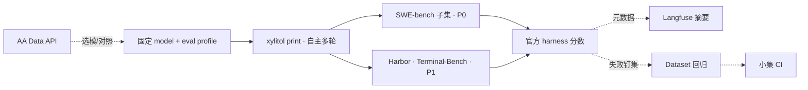

# Agent Eval 与回归基准

> **主线**：用**同一模型**在主流 agent eval benchmark 上跑分——**先 SWE-bench，再 Terminal-Bench 2.x**；Docker/sandbox 驱动 xylitol 自主多轮，分数来自 harness 官方 grader。
> **驱动面硬约束**：只经 `print` / headless（`XyDriver::run`）；**不做**自动驱动产品 TUI 作为 eval 主路径或前置（TUI 回归走既有 `test-tui-harness`，与社区刻度正交）。
> **旁路**：从 benchmark 失败或 Langfuse trace 钉回归集，做小集 CI 防退化——**不替代**社区刻度。
> **参考**：[Artificial Analysis](https://artificialanalysis.ai/) Data API / Intelligence Index — 选模与同模型公开基线对照；**不是** xylitol 评测入口。
> 现状对齐：2026-07-28。**开发者 / CI 后置**，非开箱默认体验。
> 调研底稿：[../research/agent-eval-frameworks-2026.md](../research/agent-eval-frameworks-2026.md)。

## 用户怎么碰到

- 换模型、改系统提示或工具策略后，想知道 **xylitol 在 SWE-bench（及随后 Terminal-Bench）子集上是否进步**；
- 需要与 mini-SWE-agent、Harbor 内置 agent **同口径**的 resolved % / reward，而不是自说自话；
- 选模型时对照 AA 公开指数，并诚实区分「模型在 AA scaffold」与「模型在 xylitol scaffold」；
- 偶尔把 benchmark 失败实例钉成回归集，防止同一 bug 再犯；
- **不**强迫开 TUI 才算跑过 eval。

## 产品目标

| 要 | 不要 |
|---|---|
| 主流 benchmark harness 出分（社区可比） | 只靠自研小集或 Langfuse judge 当主刻度 |
| Docker/sandbox 无人值守多轮 | TUI 人工点选或自动按键驱动评测 |
| `print` + eval profile 固定模型与停止条件 | 日常盘状态污染实验；以「自动 TUI API」为 eval 前置 |
| 子集可重复、版本可对比 | 每 PR 全量 leaderboard |
| 失败实例可钉成 Langfuse Dataset 回归 | Langfuse 当第二 leaderboard |
| AA 作选模/对照（只读 API） | 把 AA Index 或 Stirrup 当 xylitol 分 / 主栈 |
| 诚实报告 scaffold（xylitol 版本 + eval profile） | 混入 best-of-N 等未标注技巧 |

## 领域语言

| 概念 | 含义 |
|---|---|
| **Benchmark harness** | 社区官方评分管线（Harbor verifier、SWE-bench `run_evaluation`） |
| **Eval profile** | 专用于 benchmark 的配置：max_turns、timeout、trust、autosubmit |
| **单阶段（TB）** | Harbor 在任务容器内驱动 agent 直至 verifier |
| **两阶段（SWE）** | 容器内 agent 推理 → `preds.jsonl` → 官方 harness 评 patch |
| **Resolved / reward** | harness 确定性分数；主线 SSOT |
| **AA 基线** | 同模型在 Artificial Analysis 固定 scaffold 下的公开分（对照用） |
| **回归集** | 从失败 benchmark 实例或 trace 抽样的 Langfuse Dataset |
| **能力集 vs 回归集** | 探索性低通过率 vs 近满分防退化 |

## 推荐拼图

| 层 | 选型 | 角色 |
|---|---|---|
| **主 harness** | SWE-bench（先）+ Harbor Terminal-Bench（后） | 社区刻度 |
| **xylitol 面** | `print` + `--trust` + eval YAML | headless ReAct |
| **编排** | Python 薄脚本（SWE）→ `harbor run`（TB） | Docker 并行 |
| **旁路** | Langfuse Experiments / Dataset | 失败钉集、commit 对比 |
| **参考** | Artificial Analysis Data API | 选模、同模型公开基线；**不**提交 xylitol |
| **可选** | Promptfoo red team | 安全夜间 job |
| **明确不主用** | Langfuse judge 作主分、Braintrust 主栈、Inspect View、Stirrup 当主产品 | 偏离社区口径 / 第二观测栈 / 换栈评测 |

## 优先级（已定序）

| 顺序 | Benchmark | M0 / 后续 |
|---|---|---|
| **P0 SWE-bench** | 厂商最常引用；修真实 GitHub issue | M0: Lite/Verified 5 实例 → `preds.jsonl`；M2: ~50 |
| **P1 Terminal-Bench 2.x** | 终端长程；AA Index 对照 | SWE 管线通后；Harbor adapter；10–20 任务 |

AA Index 权重含 TB、不含 SWE；先做 SWE 不妨碍日后用 AA 对照 TB 分。

## xylitol 适配要点（多轮）

| 社区做法 | xylitol 对应 / 缺口 |
|---|---|
| mini-SWE-agent `step_limit` 250；Stirrup `max_turns` | `max_turns` 待实现（`example.yaml` 已预留注释） |
| 超限 autosubmit patch | 待实现 eval 交卷协议 |
| OpenHands `fake_user_response` | print 无 stdin；eval 模式应禁止「问用户」或注入继续 |
| Harbor `agent.timeout_sec` | 墙钟超时由 harness 管；agent 内须可被取消 |
| 每 instance 隔离 session | `run` 已新 session_id；eval 须锁定配置覆盖 |

## BDD 意图示例

**场景：SWE 子集出分（P0）**
Given 固定 model 与 eval profile
When 在 SWE-bench Lite 5 实例 Docker 环境跑 `xylitol print`
Then 产出 `preds.jsonl` 且官方 harness 返回 resolved 计数

**场景：Terminal-Bench 自主多轮出分（P1）**
Given Harbor 任务容器与 instruction
When xylitol agent adapter 在超时内完成 ReAct
Then verifier `tests/test.sh` 判定 pass/fail

**场景：与 AA 基线对照（非等同，偏 TB）**
Given 同一 model 的 xylitol@TB 子集分与 AA 公开 TB/Coding 分
When 写版本报告
Then 并排标注 scaffold 差异，不声称 Intelligence Index

**场景：版本可对比**
Given 同一子集、同一 model、两次 xylitol commit
When 各跑一遍 harness
Then resolved % 或 reward 可并排比较

**场景：失败钉回归**
Given 某 benchmark 实例 resolved=false
When 开发者纳入 Langfuse Dataset
Then 小集 CI 可在改 prompt/工具后快速复现

**场景：评产出不评死路径**
Given 多种合法工具顺序可完成任务
When harness 评判
Then 以测试/verifier 为准

## 分阶段

| 阶段 | 用户可感知结果 |
|---|---|
| **M0 冒烟** | Docker + SWE 5 实例跑通出分；`just eval-swe-smoke` |
| **M1 eval profile** | max_turns / timeout / autosubmit / trust；与社区停止条件对齐 |
| **M2 SWE 子集** | Verified ~50；JSON 报告 |
| **M3 Terminal-Bench** | Harbor adapter；TB 10–20；可选 AA 同模型对照 |
| **M4 回归旁路** | 失败 → Dataset；小集 CI |
| **M5 周期全量** | 云并行全量 / leaderboard 提交（sb-cli、Harbor cloud） |

## 依赖

| 关系 | 说明 |
|---|---|
| [../architecture/进程内观测.md](../architecture/进程内观测.md) | Langfuse 旁路记 run，不替代 harness 分 |
| [OTEL与Langfuse观测.md](./OTEL与Langfuse观测.md) | trace 对照排障 |
| [运行时即时设置.md](./运行时即时设置.md) | eval 须锁定覆盖，避免本地状态污染 |
| [预设Providers.md](./预设Providers.md) | 固定 model 档案与网关；可选 AA 辅助选模 |
| [上下文缓存与极致压缩.md](./上下文缓存与极致压缩.md) | 压缩策略变更应以 benchmark 子集验证 |

## 支线与方向

| 支线 | 意向 |
|---|---|
| **Aider Polyglot Rust 子集** | 快速 edit 质量信号 |
| **Promptfoo 安全** | 注入/越权工具；独立夜间 job |
| **多模型矩阵** | 同一子集扫 provider 档案（可叠 AA 价格/延迟字段） |
| **Sub-agent 指标** | 子任务成功率（依赖 Sub-Agent 主线） |

## 反模式（产品级）

- 把 Langfuse Experiments 当主 leaderboard；
- 把 AA Index / Data API 当作 xylitol 已出分；
- 用 Stirrup 替换 xylitol 做「自家评测」；
- 用 TUI 交互或自动按键/PTY 跑 benchmark（应用 `print`）；
- 无 max_turns/timeout 直接全量；
- 竞赛题 benchmark（LiveCodeBench）替代 repo/终端 agent eval；
- 开箱默认 eval 流程。

## Print 完备度（相对 eval）

社区 harness 吃的是 **ReAct + 工具改沙箱**，不是 TUI 渲染。当前 `print` 已走同一套 `XyDriver::run`；TUI 近期迭代多数不阻塞「能否被 Harbor/SWE 驱动」。

| 已够用 | 仍要迭代才稳跑子集 |
|---|---|
| `print` → 全 ReAct 事件流 | `max_turns` / 墙钟 / cost 停止（现仅注释预留） |
| 工具 bash/读写（allow-all） | 超限 autosubmit（SWE 交 patch） |
| `--trust` / 非交互 bootstrap | 稳定 exit code（harness 判失败） |
| 每 run 新 session | eval YAML 锁定覆盖，防本地状态污染 |
| | 「问用户」挂起时的 fake/禁用策略 |

**判断**：不必等 TUI「做完」；M0 冒烟可在现有 print 上试 1–几任务。子集刻度（M2）前建议先做完停止条件 + trust/exit 切片（约 1–2 个小闭环），与 TUI 并行即可。

## 相关

- 调研：[../research/agent-eval-frameworks-2026.md](../research/agent-eval-frameworks-2026.md)（含 §4 Artificial Analysis）
- Anthropic 方法论：[Demystifying evals for AI agents](https://www.anthropic.com/engineering/demystifying-evals-for-ai-agents)
- 总索引：[README.md](./README.md)
