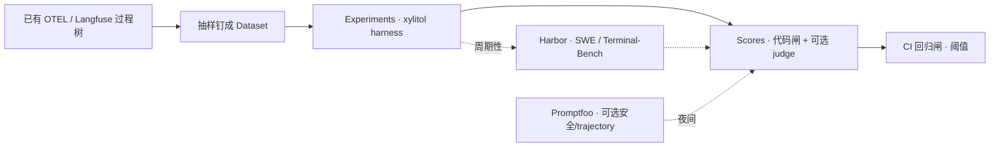

# Agent Eval 与回归基准

> 把「每次迭代是进步还是退步」做成可重复基准：复用已有 OTEL → Langfuse 过程树，不自研第二套检视台。
> 现状对齐：2026-07-27。**开发者 / CI 后置**，非开箱默认体验。
> 调研底稿：[../research/agent-eval-frameworks-2026.md](../research/agent-eval-frameworks-2026.md)。

## 用户怎么碰到

- 改了系统提示、工具策略、模型档案或压缩行为后，想知道**同一批真实任务**是否变差；
- 排障时已有 Langfuse 过程树，希望把失败案例**钉成回归集**，而不是口口相传；
- 偶发对照社区刻度（SWE-bench / 终端长任务），但**不**把全量 Docker leaderboard 当成每次 PR 默认闸。

## 产品目标

| 要 | 不要 |
|---|---|
| 回归集版本化；实验可对比（模型 / 提示 / 代码变更） | 只靠感觉或单次手工试跑 |
| Scores 挂回同一条 Langfuse 时间线 | Braintrust / Inspect View / 自研 UI 当第二观测栈 |
| 代码闸（测试通过、产物检查）为主；LLM-as-judge 为辅 | 只评「工具调用路径是否长得像」 |
| CI 可跑小回归集；外部对标周期性 | 每 PR 全量 SWE-bench / Terminal-Bench |
| Print / 非交互 harness 可驱动评测 | 强迫 TUI 交互才算「跑过 eval」 |

## 领域语言

| 概念 | 含义 |
|---|---|
| **回归集（Dataset）** | 版本化的任务样本：输入、期望闸、元数据（模型档 / commit） |
| **实验（Experiment）** | 对某一回归集跑一遍 xylitol harness，并写出 Scores |
| **代码闸** | 确定性评判（测试绿、文件存在、diff 约束） |
| **主观闸** | LLM-as-judge / 人工分；须与代码闸混用并校准 |
| **能力集 vs 回归集** | 探索性低通过率 vs 近满分防退化（Anthropic 方法论） |
| **外部刻度** | Harbor / SWE-bench 等社区 harness 的周期性对标 |

## 推荐拼图（集成路径）

| 层 | 选型 | 角色 |
|---|---|---|
| **主拼图** | Langfuse Datasets / Experiments / Scores | 日常回归 SSOT；吃现有 traces |
| **本地断言薄层** | DeepEval（pytest）可选 | 读 OTEL / 断言后 `score` 回 Langfuse |
| **安全旁路** | Promptfoo red team / trajectory | 夜间或专项；**不**替代 Langfuse |
| **外部刻度** | Harbor + SWE-bench Verified 子集 / Terminal-Bench | M3 周期性；摘要写回 experiment |
| **明确不主用** | Braintrust 主栈、Inspect View、OpenAI Evals Platform（关停风险） | 避免第二观测/关停依赖 |

## BDD 意图示例

**场景：失败钉成回归项**
Given 一次真实会话在 Langfuse 中失败或行为异常
When 开发者将其纳入回归 Dataset
Then 该项可复跑，且新实验能对比是否仍失败

**场景：实验可对比**
Given 同一 Dataset 上两次 Experiment（例如改压缩策略前后）
When 查看 Scores 汇总
Then 能判断关键指标进步或退步，而不是只看单条聊天

**场景：CI 防静默退化**
Given PR 触及 agent 行为相关变更
When 跑配置的小回归集
Then 低于约定阈值时失败；全量外部 benchmark 不作为默认门禁

**场景：评产出不评死路径**
Given 任务可用多种合法工具顺序完成
When grader 评判
Then 以测试/产物闸为准，不以固定 tool 序列为唯一成功条件

## 分阶段

| 阶段 | 用户可感知结果 |
|---|---|
| **M0 回归种子** | 从现有 traces 抽样 → Dataset；字段含任务、期望闸、元数据；人工/代码 Score「是否解决」 |
| **M1 开发者实验** | 文档化后置流程：Experiments 调 Print/非交互 harness；UI/报告可对比 run |
| **M2 CI 回归闸** | 小 Dataset 进 CI（如 `langfuse/experiment-action`）；阈值失败；可选 Promptfoo 夜间安全 job |
| **M3 外部刻度** | Harbor 周期性子集对标；摘要 Score 回写；区分能力集与回归集 |

## 依赖

| 关系 | 说明 |
|---|---|
| [../architecture/进程内观测.md](../architecture/进程内观测.md) | 已有过程树是 Dataset 种子前提 |
| [OTEL与Langfuse观测.md](./OTEL与Langfuse观测.md) | 子进程出站完善有助于工具侧排障对照，不阻塞 M0–M2 |
| [上下文缓存与极致压缩.md](./上下文缓存与极致压缩.md) | 压缩/缓存策略变更应以本篇回归集验证 |
| [预设Providers.md](./预设Providers.md) | 网关预设变更可挂同一 Dataset 做兼容回归 |

## 支线与方向

| 支线 | 意向 |
|---|---|
| **轨迹安全专项** | Promptfoo red team 独立 Dataset（注入、越权工具）；不并进日常能力回归 |
| **多模型对照实验** | 同一任务矩阵扫 OpenAI-compat / Anthropic 档案，产出「哪档更稳」报告 |
| **压缩策略 A/B** | Dataset 固定长会话；对比 cache hit、token、任务成功率（挂缓存 roadmap） |
| **Sub-agent 回归** | 子任务委托成功/回收噪声作为独立指标（依赖 Sub-Agent 主线就绪） |
| **金丝雀生产分** | 线上抽样在线评分（后置；隐私与默认关闭须钉清） |

## 反模式（产品级）

- 为 eval 再做一个 Web Inspect 主路径；
- 把竞赛题（LiveCodeBench 等）当成 coding harness 端到端回归；
- 开箱默认在 TUI 里跑 eval；
- 只上 LLM judge、没有可重复代码闸。

## 相关

- 调研：[../research/agent-eval-frameworks-2026.md](../research/agent-eval-frameworks-2026.md)
- Anthropic 方法论（一手）：[Demystifying evals for AI agents](https://www.anthropic.com/engineering/demystifying-evals-for-ai-agents)
- 总索引：[README.md](./README.md)
