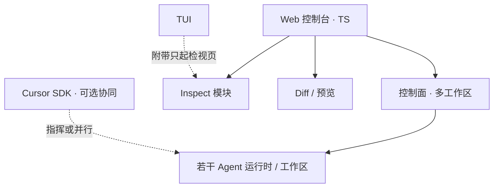

# Cloud Agent 与 Web 控制台

> CS 架构的 self-host 分布式 cloud agent 类似物 + TypeScript 生态 Web 应用：一个前端管控多工作区，并预留与 Cursor Agent 模式协同。
> 现状对齐：2026-07-20。
> Inspect：**独立检视页可先于**本篇全日用控制台；见 [出口流量检视.md](./出口流量检视.md)。

## 用户怎么碰到

| 场景 | 痛点 | Web 控制台要给的 |
|---|---|---|
| 多仓库 / 多机器 | TUI 通常一会话主绑一工作区 | **一窗多工作区**切换与总览 |
| 远程干活 | 需要与本地同构的跑/改道/进度 | 薄端 + 同一驱动语义 |
| Review | 终端里看 diff 吃力 | **高效 diff / 代码简易预览** |
| 排障 | 流量与映射问题 | 内嵌 [出口流量检视.md](./出口流量检视.md) 模块 |
| 与 Cursor 协同 | 有人已在 Cursor Agent 模式 | 可集成 Cursor SDK；**可选**让其指挥 xylitol，二者可并存 |

## 产品骨架

## 领域划分

| 子域 | 职责 |
|---|---|
| **控制面** | 工作区注册、会话列表、权限与信任呈现、总览 |
| **执行面** | 每工作区仍走 xylitol 同一对话主线（可远程托管） |
| **审阅面** | diff、文件简易预览、评论/采纳流（产品后可加细） |
| **检视面** | Logging / Inspect；可全日用或独立页 |
| **协同面** | Cursor SDK 等外部 agent；与 xylitol **无关也可用**，有配置时再协作 |

## 与 TUI 的关系

| | TUI | Web |
|---|---|---|
| 主工作区模型 | 一会话主绑一区，深终端交互 | 一窗多区，管控与审阅 |
| 检视 | 可参数附带**只起检视模块页** | 控制台内模块 + 可独立托管 |
| 语义 | 同一驱动 / 事件闭集 | 同左；表现不同 |

## BDD 意图示例

**场景：一窗看多工作区**
Given 用户绑定了至少两个工作区
When 打开 Web 控制台
Then 可切换并查看各自会话状态，而不必开多个互不相关的终端叙事

**场景：Review diff**
Given 某工作区本轮产生了文件变更
When 用户在 Web 打开审阅
Then 可浏览 diff 与简易代码预览，并回到对话上下文

**场景：Cursor 协同（可选）**
Given 用户配置了 Cursor SDK 协同
When 在 Cursor Agent 模式发出任务
Then 可按配置调度到 xylitol 工作区或并行；未配置时互不影响

**场景：检视模块可独立**
Given 仅需排障出口流量
When 以「只起检视」方式打开
Then 进入 Inspect 模块页，不必加载完整多工作区壳

## 分阶段

| 阶段 | 用户可感知结果 |
|---|---|
| M1 控制面骨架 | 多工作区列表 + 连上已有 Server/驱动语义 |
| M2 对话 parity | 跑 / 流式 / 改道 / 中止与本地心智同构 |
| M3 审阅 | diff + 简易预览 |
| M4 Inspect 模块 | 见 [出口流量检视.md](./出口流量检视.md)；底座见 [../architecture/进程内观测.md](../architecture/进程内观测.md) |
| M5 Cursor SDK 协同 | 可选集成；默认零打扰 |
| M6 分布式强化 | 更完整的 cloud agent 编排（队列、隔离、资源） |
| M7 可选标准导出 | 与出口流量检视 M6 对齐：显式开启才导出标准时间线 |

## 技术生态（产品约束级）

- Web **用 TS 生态**书写（便于 Cursor SDK 与现代审阅 UI）。
- 内核与对话语义仍在 xylitol；Web 是控制与呈现面，避免再实现第二套 ReAct 故事。

## 依赖

| 依赖 | 说明 |
|---|---|
| 远程体验 parity | [../architecture/远程体验与线协议.md](../architecture/远程体验与线协议.md) |
| [Web与TUI同源.md](./Web与TUI同源.md) | 跨面语义约束 |
| Inspect | 模块融入本应用；可独立页供 TUI 附带；底座见 [../architecture/进程内观测.md](../architecture/进程内观测.md) |
| 可并行 | TUI 视觉优化（不同面） |

## 相关

- [出口流量检视.md](./出口流量检视.md)
- [运行时即时设置.md](./运行时即时设置.md) / [Sub-Agent编排.md](./Sub-Agent编排.md) / [Loop管理与触发可视化.md](./Loop管理与触发可视化.md)
- [预设Providers.md](./预设Providers.md)（Cursor SDK 亦出现在厂商/协同清单）
- 总索引：[README.md](./README.md)
