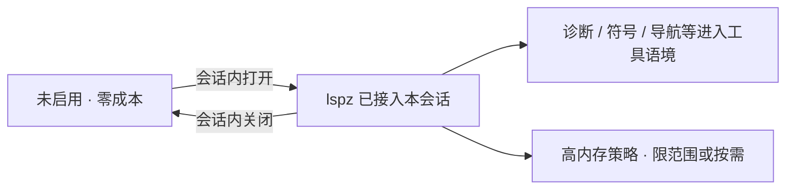

# LSP 会话集成

> 深度集成姊妹能力 lspz：在**会话中随时启用**；不启用则零成本；高内存项目要有优化策略。
> 现状对齐：2026-07-17。

## 用户怎么碰到

- 写代码时希望补全、跳转、诊断进入 agent 工具语境；
- 有的仓库 LSP 极吃内存，不能「开了 xylitol 就默认拉起一整套语言服务」；
- 需要今天开、明天关，不必改全球配置才能呼吸。

## 产品规则

| MUST | 禁止 |
|---|---|
| 默认不装配 LSP / lspz（零成本） | 启动即常驻重语言服务 |
| 会话内可启用、可停用 | 只能通过重装或改系统服务开关 |
| 启用范围可感知（本会话 / 本工作区） | 静默污染无关会话 |
| 对高内存项目有降级或隔离策略说明 | 假装「都很快」导致机器打满 |

## 能力心智

## BDD 意图示例

**场景：默认无感**
Given 用户未在本会话启用 LSP
When 正常对话与改代码
Then 无 lspz 常驻成本，行为与今日主线一致

**场景：会话中启用**
Given 用户在会话内打开 LSP 集成
When 询问符号或修复诊断相关问题
Then agent 能使用约定好的 LSP 能力（在启用成功的前提下）

**场景：高内存项目**
Given 工作区被识别为重型 LSP 场景或用户选择保守档
When 启用集成
Then 产品采用限制范围/按需/隔离等策略之一，并让用户知道当前档位

## 分阶段

| 阶段 | 用户可感知结果 |
|---|---|
| M1 会话开关 | 启用/停用闭环；默认关 |
| M2 工具语境 | 诊断与符号类能力进入对话 |
| M3 重型优化 | 高内存策略可选、可观察 |
| M4 深度集成 | 与编辑/检视工作流更顺（不强迫 Web） |

## 依赖与并行

- **可并行**于 Web / 视觉 / Tokenizer；与 [DAP调试集成.md](./DAP调试集成.md) 平行（同为零成本、会话启停）。
- 开闭叙事挂 [运行时即时设置.md](./运行时即时设置.md)。
- 对齐后置零成本心智：[可扩展架构心智.md](./可扩展架构心智.md)、[../architecture/扩展能力-MCP.md](../architecture/扩展能力-MCP.md)。

## 相关

- 姊妹项目：`../lspz`
- 总索引：[README.md](./README.md)
