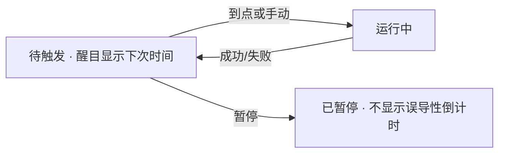

# Loop 管理与触发可视化

> 管理可重复触发的 loop（定时 / 条件 / 手动再入）：**触发时间与下次开火要醒目**，避免「不知何时又跑起来」。
> 现状对齐：2026-07-17。

## 用户怎么碰到

- 设置了周期性或条件触发的 agent loop（巡检、再试、待命任务）；
- 需要一眼看到：下一次何时触发、是否暂停、上次结果如何；
- 跑起来时要有存在感，但不能把主对话刷成噪音。

## 产品目标

| 要 | 不要 |
|---|---|
| Loop 列表可管理（建 / 暂停 / 删 / 手动触发） | 只能改配置文件且无运行时反馈 |
| **下次触发时间醒目**（倒计时或绝对时间） | 触发时刻藏在日志里 |
| 开火时有清晰状态跃迁（待触发 → 运行中 → 完成/失败） | 静默在后台改仓库 |
| TUI 与 Web 同源展示关键状态 | 只有一面能看见 loop |

## 信息表达（与视觉主线协同）

主视线：短徽章或固定区域显示「最近一个 / 下一个 loop」；详情进面板或 Web。

## BDD 意图示例

**场景：下次触发醒目**
Given 用户有一个每 N 分钟触发的 loop
When 处于待触发状态
Then 界面显著展示下次触发时间（或倒计时），无需翻日志

**场景：暂停后不再开火**
Given loop 被暂停
When 原计划触发点到达
Then 不启动新一轮；UI 显示暂停而非「即将触发」

**场景：开火可中止**
Given loop 已进入运行中
When 用户中止
Then 按统一中止语义停止，并回到可管理状态

## 分阶段

| 阶段 | 用户可感知结果 |
|---|---|
| M1 状态模型 | 待触发 / 运行中 / 暂停 / 失败 可区分 |
| M2 醒目触发 | 下次时间可视化；开火动效或徽章 |
| M3 管理面 | 创建与编辑的基本闭环（TUI 或 Web 先一方） |
| M4 同源 | 两面同一 loop 事实源 |

## 依赖

| 关系 | 说明 |
|---|---|
| [TUI视觉与信息表达.md](./TUI视觉与信息表达.md) | 醒目但不刷屏 |
| [Web与TUI同源.md](./Web与TUI同源.md) | 状态同构 |
| [运行时即时设置.md](./运行时即时设置.md) | 可临时禁用全部 loop |
| [Sub-Agent编排.md](./Sub-Agent编排.md) | loop 是否允许派生子 agent 的策略交叉 |
| [OTEL与Langfuse观测.md](./OTEL与Langfuse观测.md) | 开火轮次与出站对照可关联（排障）；不要求 Loop UI 内嵌完整检视台 |

## 支线与方向

| 支线 | 意向 |
|---|---|
| **安静时段 / 勿扰** | 夜间或专注模式自动暂停全部 loop |
| **失败退避策略** | 连续失败后拉长间隔并醒目告警 |
| **Loop → Eval 金丝雀** | 周期性跑小回归集（挂 [Agent-Eval与回归基准.md](./Agent-Eval与回归基准.md)） |
| **条件触发 DSL 轻量集** | 文件变更 / git 钩子类条件（产品边界先钉，防变成工作流引擎） |
| **开火摘要折叠** | 主对话只留一行结果徽章，详情进面板 |

## 相关

- 插话/中止现行心智：[../architecture/插话续跑与中止.md](../architecture/插话续跑与中止.md)
- [Agent-Eval与回归基准.md](./Agent-Eval与回归基准.md)
- 总索引：[README.md](./README.md)
