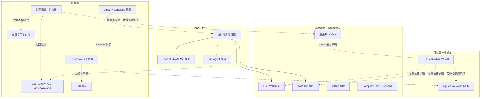

# 产品路线图（与 pi 分道后的候选方向）

> **只写尚未兑现的高维产品方向。** 已兑现心智只在 [`docs/architecture/`](../architecture/README.md)。
> **闭环规则** → [`docs/AGENTS.md`](../AGENTS.md)。本目录是**统一优先级的候选板**，不是进度表。
> 某篇全部兑现后：**删除该文件**并更新本索引，不留占位。

现状对齐：2026-09-12。追溯归档 change：`llman sdd archive freeze --list`；产品文尽量不钉 change id。

## 闭环

```text
docs/roadmaps/  →  llmanspec/changes  →  docs/architecture/
     ↑                                    │
     └──── 兑现后删除/收缩本文档 ←─────────┘
```

## 怎么用

| 写 | 不写 |
|---|---|
| 未兑现的用户可感知方向、依赖、BDD 意图 | 已落地 MUST（那是 architecture） |
| 可并行主线、**分阶段切片**、支线意向 | 进度勾选、状态列、「已迁入」对照表 |

认领时：读各篇「分阶段」表，一次只提案**一个可交付切片**（通常 Mn）；有 MUST/SHALL → SDD；纯主题/文案 → quick。
支线表 = 头脑风暴候选，**不**等于已排期。

## 候选一览



> **观测**：本地 fastrace JSONL + OTLP/Langfuse、分叉身份与并发快照、obs.lane（llm）属性与 Collector 示例配置已落地（见 [architecture](../architecture/进程内观测.md)）；候选为 infra lane span / 实际分流 / 采样 / 子进程出站（见 [OTEL与Langfuse观测.md](./OTEL与Langfuse观测.md)）。**不**自研 Inspect 检视台。
> **压缩**：会话 auto-compact + provenance 已落地（见 [architecture](../architecture/压缩与上下文.md)）；缓存/动态压缩见新篇。
> **Eval 调研底稿**：[../research/agent-eval-frameworks-2026.md](../research/agent-eval-frameworks-2026.md)。
> **键位学习 UI 调研**：[../research/keybinding-keyboard-visualizer-2026.md](../research/keybinding-keyboard-visualizer-2026.md)（挂 [键位与命令发现.md](./键位与命令发现.md) M4）。
> **TUI 重制**：景观 [../research/coding-agent-tui-design-landscape-2026.md](../research/coding-agent-tui-design-landscape-2026.md)；引擎缺口 [../research/xylitol-tui-capability-hooks-vs-landscape-2026.md](../research/xylitol-tui-capability-hooks-vs-landscape-2026.md)。

| 文档 | 候选方向 |
|---|---|
| [跨面同源.md](./跨面同源.md) | 跨面语义约束板（含 activity 折叠栈意向）；第二面是 gpui 桌面，不交付面壳本身 |
| [Gpui桌面客户端.md](./Gpui桌面客户端.md) | 第二产品面：gpui 桌面（Linux/Wayland）attach 同一 Host；与 TUI 双 Rust 面 |
| [TUI视觉与信息表达.md](./TUI视觉与信息表达.md) | 状态减噪、主题密度；与调用活动折叠衔接 |
| [TUI重制.md](./TUI重制.md) | 悬停高亮语义区块（主条目呈现主体已兑现：rail / 旁注 / 复制出口见 DESIGN 与 architecture） |
| [键位与命令发现.md](./键位与命令发现.md) | `/hotkeys` 支线延后；可视化键盘挂 GUI 面（gpui） |
| [OTEL与Langfuse观测.md](./OTEL与Langfuse观测.md) | infra lane span / Collector 实际分流 / 采样 / 子进程出站 |
| [Agent-Eval与回归基准.md](./Agent-Eval与回归基准.md) | SWE 先、TB 后；Docker 出分；AA 选模对照；Langfuse 回归旁路 |
| [上下文缓存与极致压缩.md](./上下文缓存与极致压缩.md) | prompt cache、动态压缩、工具结果分级压缩 |
| [Cloud-Agent与Web控制台.md](./Cloud-Agent与Web控制台.md) | **搁置（2026-08-22）**：多工作区 CS + Web；复活需显式重立项 |
| [运行时即时设置.md](./运行时即时设置.md) | 能力覆盖盘 / 可观察覆盖集 / 跨面同源（模型/thinking 即时设置已迁 [architecture](../architecture/运行时即时设置.md)） |
| [Loop管理与触发可视化.md](./Loop管理与触发可视化.md) | Loop 管理与触发醒目 |
| [Sub-Agent编排.md](./Sub-Agent编排.md) | 子 agent 派生/回收/可见 |
| [LSP会话集成.md](./LSP会话集成.md) | lspz；会话启停；零成本 |
| [DAP调试集成.md](./DAP调试集成.md) | dapz；调试集成；零成本 |
| [多模态理解.md](./多模态理解.md) | 音频 / 视频 + 模型档案模态声明 |
| [Computer-Use与Hyprland.md](./Computer-Use与Hyprland.md) | Linux/Hyprland computer use |
| [预设Providers.md](./预设Providers.md) | 命名预设厂商档案 |
