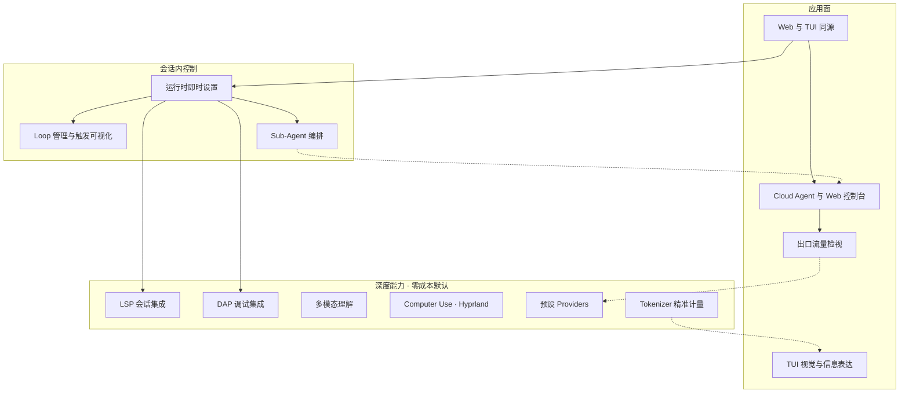

# 产品路线图（与 pi 分道后的候补方向）

> **只写尚未兑现的高维产品方向。** 已兑现心智只在 [`docs/architecture/`](../architecture/README.md)。
> **闭环规则** → [`docs/AGENTS.md`](../AGENTS.md)。本目录是**统一优先级的候补板**，不是进度表。
> 某篇全部兑现后：**删除该文件**并更新本索引，不留占位。

现状对齐：2026-07-18。追溯归档 change：`llman sdd archive freeze --list`；产品文尽量不钉 change id。

## 闭环

```text
docs/roadmaps/  →  llmanspec/changes  →  docs/architecture/
     ↑                                    │
     └──── 兑现后删除/收缩本文档 ←─────────┘
```

## 怎么用

| 写 | 不写 |
|---|---|
| 未兑现的用户可感知方向、依赖、BDD 意图 | 已落地 MUST（那是 architecture） |
| 可并行主线 | 进度勾选、状态列、「已迁入」对照表 |

## 候补一览



| 文档 | 候补方向 |
|---|---|
| [Web与TUI同源.md](./Web与TUI同源.md) | Web 面、即时设置/检视/编排跨面同源 |
| [TUI视觉与信息表达.md](./TUI视觉与信息表达.md) | 状态减噪、主题密度 |
| [Tokenizer精准计量.md](./Tokenizer精准计量.md) | 词表下载同意流 / CLI·Web 管理 |
| [出口流量检视.md](./出口流量检视.md) | Web Inspect、只起页、子进程、agent API |
| [Cloud-Agent与Web控制台.md](./Cloud-Agent与Web控制台.md) | 多工作区 CS + Web |
| [运行时即时设置.md](./运行时即时设置.md) | 会话覆盖、下一波次生效（≠ `/reload`） |
| [Loop管理与触发可视化.md](./Loop管理与触发可视化.md) | Loop 管理与触发醒目 |
| [Sub-Agent编排.md](./Sub-Agent编排.md) | 子 agent 派生/回收/可见 |
| [LSP会话集成.md](./LSP会话集成.md) | lspz；会话启停；零成本 |
| [DAP调试集成.md](./DAP调试集成.md) | dapz；调试集成；零成本 |
| [多模态理解.md](./多模态理解.md) | 音频 / 视频 + 模型档案模态声明 |
| [Computer-Use与Hyprland.md](./Computer-Use与Hyprland.md) | Linux/Hyprland computer use |
| [预设Providers.md](./预设Providers.md) | 命名预设厂商档案 |
