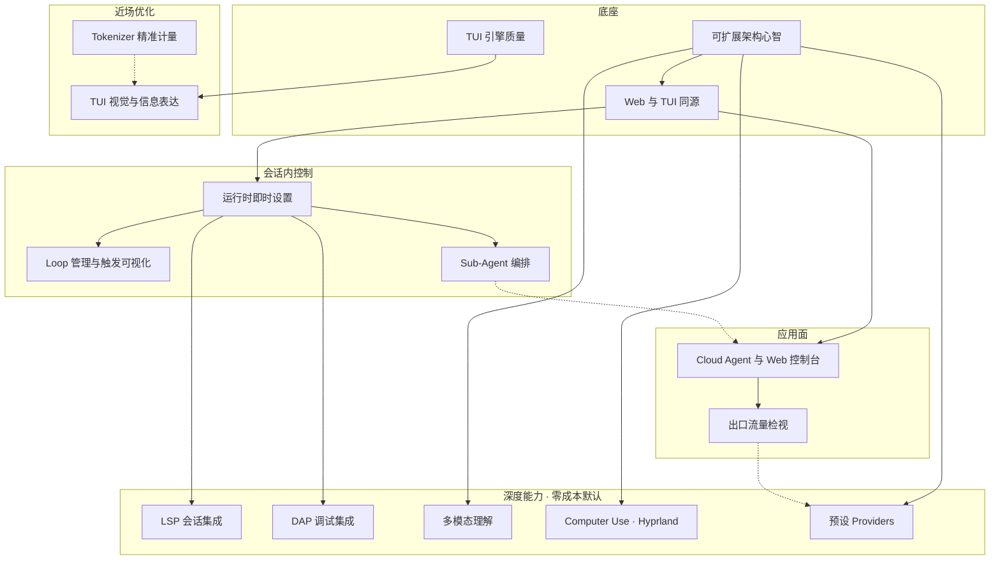

# 产品路线图（与 pi 分道后的主线记忆）

> **只写高维产品方向、边界与依赖。** 不写易腐实现细节。
> 现行产品心智 → [`docs/architecture/`](../architecture/README.md)。
> **docs 维护与闭环规则** → [`docs/AGENTS.md`](../AGENTS.md)。
> 行为合约 → `llmanspec/`。本目录是**方向板**，不是 change 工件。

现状对齐：2026-07-17。

## 闭环（无进行中 change 时可认领）

```text
docs/roadmaps/  →  llmanspec/changes（实现侧 BDD）  →  docs/architecture/
     ↑                      落地后迁移固定 MUST/禁止                │
     └────────────── 收敛已兑现 roadmap 叙事 ←─────────────────────┘
```

细则与 MUST：[docs/AGENTS.md](../AGENTS.md)。

## 怎么用本目录

| 写 | 不写 |
|---|---|
| 用户能碰到什么、开箱 vs 后置、主线依赖 | 类型名、模块路径、crate 选型 |
| 可并行的方向、先后依赖 | 进度勾选、行数、commit 列表 |
| BDD 口吻的场景意图（Given/When/Then 级） | 可执行 `.feature` / spec 正文（那是 llmanspec） |
| 领域语言（DDD） | 「先改哪个文件」 |

能力**落地后**须迁入 `architecture/` 并收敛本文档，禁止与 architecture 长期双份正文。

## 主线一览



| 文档 | 方向 | 与其它主线 |
|---|---|---|
| [可扩展架构心智.md](./可扩展架构心智.md) | 分道后可扩展心智 | 所有主线共用 |
| [Web与TUI同源.md](./Web与TUI同源.md) | 跨面语义同源、表现可异 | 约束 Web / 即时设置 / 检视 / 编排 |
| [TUI视觉与信息表达.md](./TUI视觉与信息表达.md) | 重要信息显形、工具可读 | 软依赖引擎质量 |
| [Tokenizer精准计量.md](./Tokenizer精准计量.md) | 精准计数 + 知情同意 | 可并行 |
| [TUI引擎质量.md](./TUI引擎质量.md) | 迁移后包层质量 | 视觉底座 |
| [出口流量检视.md](./出口流量检视.md) | 自研 Inspect；Web 模块；TUI 可只起检视页 | 融入 Web；非 MITM |
| [Cloud-Agent与Web控制台.md](./Cloud-Agent与Web控制台.md) | 多工作区 CS + TS Web + Cursor 协同 | Inspect / 同源 |
| [运行时即时设置.md](./运行时即时设置.md) | 下一波次生效的会话覆盖开关盘 | LSP/DAP/Sub/Loop… |
| [Loop管理与触发可视化.md](./Loop管理与触发可视化.md) | Loop 管理；触发时间醒目 | 同源、即时设置 |
| [Sub-Agent编排.md](./Sub-Agent编排.md) | 子 agent 派生/回收/可见 | 同源、Web 总览 |
| [LSP会话集成.md](./LSP会话集成.md) | lspz；会话启停；零成本 | 即时设置 |
| [DAP调试集成.md](./DAP调试集成.md) | dapz；调试集成；零成本 | 即时设置；平行于 LSP |
| [多模态理解.md](./多模态理解.md) | 图/音/视频；可配置模型 | 可并行 |
| [Computer-Use与Hyprland.md](./Computer-Use与Hyprland.md) | Linux/Hyprland computer use | 可并行 |
| [预设Providers.md](./预设Providers.md) | ZModel/GLM、OpenCode Zen、ClinePass、CommandCode、Cursor SDK… | 开闭扩展 |

## 并行与依赖（产品）

| 可并行 | 有依赖 |
|---|---|
| 引擎质量 ∥ Tokenizer ∥ 多模态 ∥ Computer Use ∥ 预设厂商 | 视觉 ← 引擎质量（软） |
| LSP ∥ DAP（平行集成模式） | 两者开关叙事 ← 即时设置 |
| Sub-agent 提案 ∥ Loop 模型设计 | 跨面可见 ← Web/TUI 同源 |
| TUI 壳优化 ∥ Web 骨架 | Inspect ← Web 模块；只起页 ← 同源检视源 |

## 近场建议顺序（非强制）

1. 写清 **同源** + **即时设置** 心智（后续能力开关都挂这里）
2. **TUI 引擎质量** / **视觉信息表达**
3. **Web 骨架** + **Inspect**
4. LSP / DAP / Sub-agent / Loop / 多模态 / Computer Use / 预设厂商按需求插队
5. 每条切片落地 → **迁入 architecture**（见 docs/AGENTS.md）

## 与 architecture / llmanspec 的分工

```text
docs/architecture/   → 今天产品是什么、MUST/禁止（已兑现）
docs/roadmaps/       → 明天往哪走（未兑现）
llmanspec/           → 实现侧可验证合约（BDD）
docs/AGENTS.md       → 三者如何闭环、落地如何迁移
```
