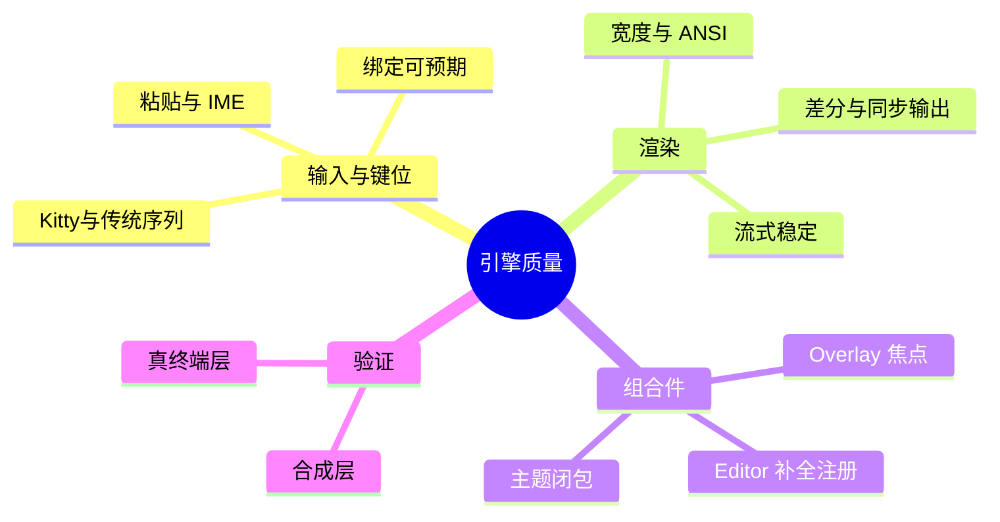

# TUI 引擎质量

> `xylitol-tui` 自 pi 迁移后的质量与可维护性主线。产品感受到的是「稳、顺、可预期」，不是库内部结构。
> 现状对齐：2026-07-17。

## 用户怎么碰到

用户不会说「引擎有质量债」。他们会说：

- 输入法/粘贴/快捷键偶发怪；
- 流式输出时闪烁或错位；
- 某些终端里选中、滚动、补全不符合预期；
- 升级后旧习惯被静默改掉。

本主线服务的是：**终端交互底座可信**，让产品壳（app TUI）敢做视觉与信息优化。

## 产品目标

| 要 | 不要 |
|---|---|
| 差分渲染与输入在主流终端可预期 | 为对齐上游而回退已作的刻意差异 |
| 组件行为有自动验证护栏（键序列、快照、真终端） | 只靠手工点一点 |
| 缺能力时先补通用引擎再接线产品壳 | 把准通用逻辑堆进产品面 |
| 分道后独立演进，台账记录刻意差异 | 无台账的「顺手改键位/语义」 |

## 质量主题（领域）

## BDD 意图示例

**场景：流式不闪坏编辑器**
Given 助手正在流式输出
When 用户同时看着输入区
Then 编辑器光标与布局保持可用，不出现持续整屏闪烁

**场景：刻意差异不被静默回退**
Given 产品已决议某键位或渲染行为与上游不同
When 合并或吸收上游修复
Then 该决议仍在；若改变须显式产品决策

**场景：真终端护栏**
Given 关键交互路径有自动化场景
When 改引擎输入或渲染
Then 对应验证能挡住回归后再进产品壳打磨

## 分阶段

| 阶段 | 用户可感知结果 |
|---|---|
| M1 分诊 | 已知「怪」按：真缺陷 / 终端差异 / 产品决议 分类 |
| M2 高痛修复 | 输入、粘贴、滚动、补全等高频路径稳定 |
| M3 验证加厚 | 易碎路径有合成 + 真终端护栏 |
| M4 持续卫生 | 与视觉主线解耦的定期还债，不挡功能波次 |

## 依赖

- **被依赖**：[TUI视觉与信息表达.md](./TUI视觉与信息表达.md) 软依赖本主线。
- **可并行**：Tokenizer、LSP、Web 骨架等。
- **边界**：产品 slash/会话树等仍在 app 面；本主线不吞业务状态机。

## 相关

- 总索引：[README.md](./README.md)
