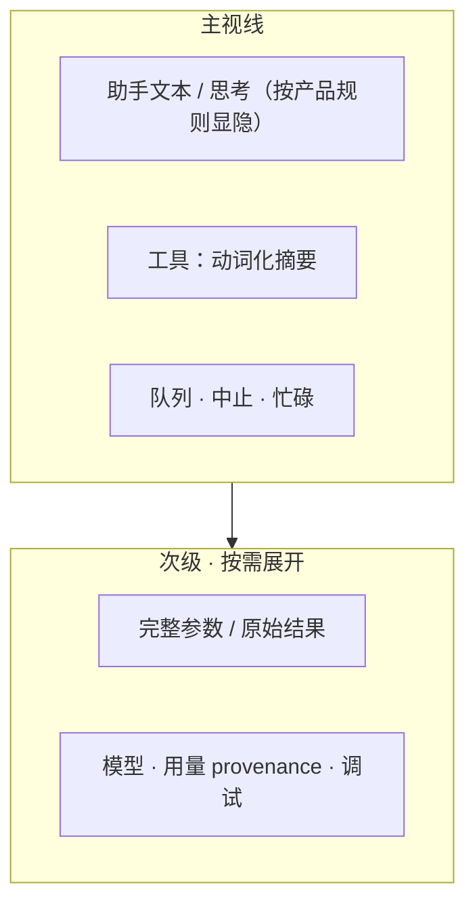

# TUI 视觉与信息表达

> 核心功能收束后的偏优化：让重要信息显形，让噪声退下。纯产品视角。
> 现状对齐：2026-07-17。

## 用户怎么碰到

用户在终端里盯着一轮对话时，真正要决策的通常是：

- 模型在说什么、卡在哪；
- 工具改了什么、成败如何；
- 队列/中止/插话现在处在什么状态；
- 用量与模型是否「可信地」显示。

他们**不**需要默认看见：冗长 JSON 参数墙、内部关联 id、与决策无关的元数据。

## 产品目标

| 要 | 不要 |
|---|---|
| 一眼可读的工具调用（意图 + 关键参数 + 结果摘要） | 默认整段 JSON 倾倒 |
| 状态与错误用人类语句 + 稳定视觉层级 | 调试字段与产品文案混排 |
| 重要进度（流式、队列、中止）有存在感 | 每条内部事件都抢视线 |
| 与 DESIGN 心智一致的信息密度 | 为「信息全」牺牲可扫读 |

## 信息架构（领域）

## BDD 意图示例

**场景：工具调用默认人类可读**
Given 模型发起一次写文件或终端命令
When 用户未展开详情
Then 主视线显示意图化摘要（如路径、命令短形），而非完整 JSON

**场景：需要时仍可审计**
Given 用户对某次工具调用存疑
When 显式展开或进入检视相关入口
Then 可看到足以复核的完整参数与结果（与 [出口流量检视.md](./出口流量检视.md) 协同，不重复造两套真值故事）

**场景：噪声默认折叠**
Given 一轮中产生大量内部进度
When 用户只看主滚动区
Then 不因次级元数据刷屏而丢掉助手结论与工具结果

## 分阶段（产品里程碑）

| 阶段 | 用户可感知结果 |
|---|---|
| M1 工具可读化 | 内置工具主视线去 JSON 化；详情可展开 |
| M2 状态减噪 | 忙碌/队列/中止表达统一；弱化重复徽章 |
| M3 用量与模型 | provenance 诚实（精确 / 约 / 未知）；不吓人 |
| M4 主题与密度 | 在 DESIGN 下做信息层级与对比度一轮打磨 |

## 依赖

| 关系 | 说明 |
|---|---|
| 软依赖 [TUI引擎质量.md](./TUI引擎质量.md) | 组件/引擎不稳时，视觉债会反复回流 |
| 协同 Tokenizer / Inspect | 计量文案与排障入口；主视线仍保持克制 |
| 不阻塞 Web | Web 可有自己的信息密度，但**语义**同构 |

## 主线 vs 后置

| | 内容 |
|---|---|
| **本波主线** | 工具摘要、状态减噪、诚实用量 |
| **后置** | 高度可定制主题市场、Transcript 重型浏览（明确不做的对照见 app TUI 产品决议） |

## 相关

- 今日事件心智：[../architecture/用户可见事件.md](../architecture/用户可见事件.md)
- 总索引：[README.md](./README.md)
