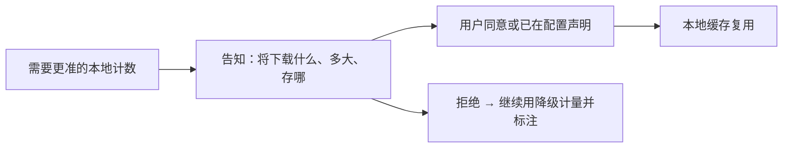

# Tokenizer 精准计量

> 对开源/本地友好模型给出更准的本地计数，且**用户知情、可拒绝、可配置才下载**。
> 现状对齐：2026-07-20。
> 用量 provenance 呈现已在 architecture；本文只留下载同意与管理面。

## 产品规则

| MUST | 禁止 |
|---|---|
| 下载词表仅在用户配置或显式同意后 | 静默联网拉大文件 |
| CLI 有快捷路径：同意 / 下载 / 清理 / 状态 | 只藏在深处配置、无反馈 |
| 交互面（先 TUI，后 Web）有确认：将下什么、多大、存哪 | 首次用模型就强塞下载阻断且无说明 |
| 拒绝或未就绪时产品仍可用，并诚实标降级计量 | 无词表就崩溃或把启发式标成官方用量 |

## 分阶段（可认领切片）

| 阶段 | 用户可感知结果 | 备注 |
|---|---|---|
| **M1 CLI 同意流** | 同意 / 下载 / 清理 / 状态可闭环；默认不静默拉 | **优先切片**；不依赖 Web |
| **M2 TUI 确认** | 需要精准计数时知情确认或跳过；跳过仍可聊 | 与 M1 共用缓存与状态语义 |
| **M3 Web 管理** | 控制台可看缓存 / 清理（若 Web 面已开） | **后置**；不阻塞 M1/M2 |

## 依赖与并行

- **不阻塞** [TUI视觉与信息表达.md](./TUI视觉与信息表达.md)：footer「约 / 精确」叙事已在 architecture；本文只补下载同意。
- **可并行**于即时设置、多模态、检视（事实源无关）。
- Web 管理挂 [Cloud-Agent与Web控制台.md](./Cloud-Agent与Web控制台.md) / [Web与TUI同源.md](./Web与TUI同源.md)，但不反向阻塞 CLI/TUI。

## 开放问题（提案前钉清）

- 哪些模型档案默认提供「可下载词表」条目（按档案声明，不按厂商猜）？
- 同意是「本机一次」还是「每模型一次」？清理是否可按模型粒度？

## BDD 意图示例

**场景：知情同意后精准**
Given 用户通过 CLI 或 UI 同意下载该模型词表
When 词表就绪后再次对话
Then 本地计数可用且 UI 按规则不再提示「约」类启发式

**场景：拒绝仍可用**
Given 用户拒绝下载
When 继续使用该模型
Then 产品可用；仅计量精度降级

## 相关

- 现行用量心智：[../architecture/压缩与上下文.md](../architecture/压缩与上下文.md)
- 总索引：[README.md](./README.md)
