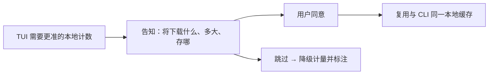

# Tokenizer 精准计量

> 对开源/本地友好模型给出更准的本地计数，且**用户知情、可拒绝、可配置才下载**。
> 现状对齐：2026-07-20。
> **M1 CLI 同意流已兑现** → 现行心智见 [../architecture/压缩与上下文.md](../architecture/压缩与上下文.md)。本文只留 **TUI / Web** 未兑现切片。

## 产品规则（仍候补面）

| MUST | 禁止 |
|---|---|
| 交互面（先 TUI，后 Web）有确认：将下什么、多大、存哪 | 首次用模型就强塞下载阻断且无说明 |
| 拒绝或未就绪时产品仍可用，并诚实标降级计量 | 无词表就崩溃或把启发式标成官方用量 |

CLI 侧已开箱：`xylitol tokenizer status|download|clean`；估计路径不静默拉。交互面须与 CLI **共用缓存与状态语义**。

## 分阶段（可认领切片）

| 阶段 | 用户可感知结果 | 备注 |
|---|---|---|
| ~~M1 CLI 同意流~~ | ~~同意 / 下载 / 清理 / 状态可闭环~~ | **已兑现** → architecture |
| **M2 TUI 确认** | 需要精准计数时知情确认或跳过；跳过仍可聊 | **下一优先**；与 M1 共用缓存 |
| **M3 Web 管理** | 控制台可看缓存 / 清理（若 Web 面已开） | **后置**；不阻塞 M2 |

## 依赖与并行

- **不阻塞** [TUI视觉与信息表达.md](./TUI视觉与信息表达.md)：footer「约 / 精确」叙事已在 architecture。
- **可并行**于即时设置、多模态、检视（事实源无关）。
- Web 管理挂 [Cloud-Agent与Web控制台.md](./Cloud-Agent与Web控制台.md) / [Web与TUI同源.md](./Web与TUI同源.md)，但不反向阻塞 TUI。

## 开放问题（M2 提案前钉清）

- 同意是「本机一次」还是「每模型一次」？
- 忙碌/空闲时确认 UI 落在哪一层（host overlay vs footer）？

## BDD 意图示例

**场景：TUI 知情同意后精准**
Given 当前模型词表未缓存且 TUI 需要本地精准计数
When 用户在确认中同意下载
Then 词表落入与 CLI 相同缓存路径且用量不再仅标启发式「约」

**场景：TUI 跳过仍可用**
Given 用户在确认中跳过下载
When 继续对话
Then 产品可用；仅计量精度降级并诚实标注

## 相关

- 现行（含 CLI）：[../architecture/压缩与上下文.md](../architecture/压缩与上下文.md)
- 总索引：[README.md](./README.md)
