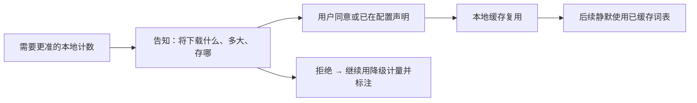

# Tokenizer 精准计量

> 对开源/本地友好模型给出更准的本地计数，且**用户知情、可拒绝、可配置才下载**。
> 现状对齐：2026-07-17。

## 用户怎么碰到

- Footer / 用量提示显示「用了多少 token」；
- 压缩、限长、计费心理预期依赖这个数字；
- 换到开源模型时，若只有启发式，数字会「看起来准但其实飘」。

用户需要：**知道数字从哪来**，以及**是否为精度付出了下载/磁盘成本**。

## 产品规则

| MUST | 禁止 |
|---|---|
| 计量来源可区分：接口返回 / 远端计数 / 本地词表 / 启发式 / 未知 | 把启发式标成「官方用量」 |
| 下载词表（如 tokenizer 资产）仅在用户配置或显式同意后 | 静默联网拉大文件 |
| CLI 有快捷路径完成「同意 / 下载 / 清理 / 状态」 | 只藏在深处配置、无反馈 |
| TUI/Web 有确认交互（知情同意） | 首次用模型就强塞下载阻断且无说明 |
| 未配置本地词表时优雅降级（启发式或未知） | 无词表就崩溃或伪造 Api |

## 人体工学（产品）

| 触点 | 期望 |
|---|---|
| **配置** | 用户点名的模型/仓库才进入「可下载」集合 |
| **CLI** | 一键查看缺口、下载、删除缓存、看当前 provenance |
| **TUI** | 首次需要下载时短确认；可「本会话跳过」 |
| **Web** | 可在设置/检视相关处管理缓存（与控制台合流） |

## BDD 意图示例

**场景：配置了才下载**
Given 用户档案未声明某开源模型的本地词表
When 选用该模型对话
Then 不自动下载词表；用量按降级规则显示且标明来源

**场景：知情同意后精准**
Given 用户通过 CLI 或 UI 同意下载该模型词表
When 词表就绪后再次对话
Then 本地计数可用且 UI 不再提示「约」类启发式（若规则如此）

**场景：拒绝仍可用**
Given 用户拒绝下载
When 继续使用该模型
Then 产品可用；仅计量精度降级

## 分阶段

| 阶段 | 用户可感知结果 |
|---|---|
| M1 诚实 provenance | 各面统一「精确 / 约 / ?」叙事 |
| M2 同意与 CLI | 下载/清理/状态闭环 |
| M3 配置驱动清单 | 仅声明模型参与精准本地计数 |
| M4 Web 管理 | 与控制台设置合流（可选） |

## 依赖与并行

- **可并行**于 TUI 视觉；结果文案被视觉主线消费。
- **不**阻塞 Cloud/Web；Web 可后接管理面。
- 与 [预设Providers.md](./预设Providers.md) 交错：新开源厂商常需要词表策略。

## 相关

- 压缩与上下文心智：[../architecture/压缩与上下文.md](../architecture/压缩与上下文.md)
- 总索引：[README.md](./README.md)
