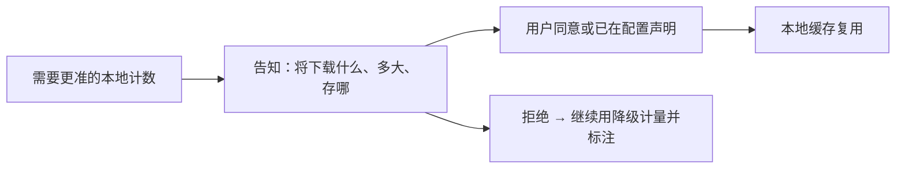

# Tokenizer 精准计量

> 对开源/本地友好模型给出更准的本地计数，且**用户知情、可拒绝、可配置才下载**。
> 现状对齐：2026-07-18。
> 用量 provenance 呈现已在 architecture；本文只留下载同意与管理面。

## 产品规则

| MUST | 禁止 |
|---|---|
| 下载词表仅在用户配置或显式同意后 | 静默联网拉大文件 |
| CLI 有快捷路径：同意 / 下载 / 清理 / 状态 | 只藏在深处配置、无反馈 |
| TUI/Web 有确认交互（知情同意） | 首次用模型就强塞下载阻断且无说明 |

## BDD 意图示例

**场景：知情同意后精准**
Given 用户通过 CLI 或 UI 同意下载该模型词表
When 词表就绪后再次对话
Then 本地计数可用且 UI 按规则不再提示「约」类启发式

**场景：拒绝仍可用**
Given 用户拒绝下载
When 继续使用该模型
Then 产品可用；仅计量精度降级

## 相关

- 现行用量心智：[../architecture/压缩与上下文.md](../architecture/压缩与上下文.md)
- 总索引：[README.md](./README.md)
