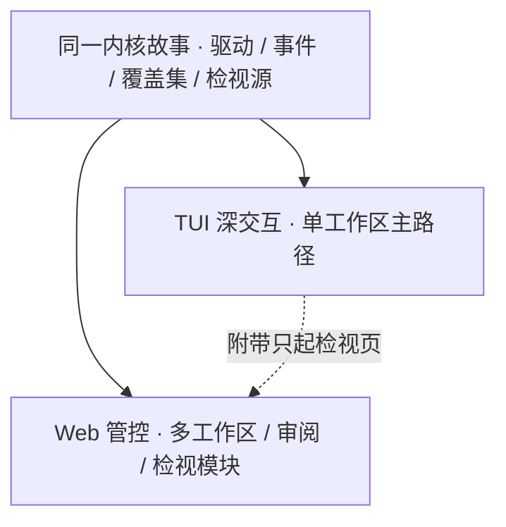

# Web 与 TUI 同源

> Web 控制台与 TUI 应用在**产品语义上同源**：同一会话事实、同一改道故事、同一能力开关与检视事实源；表现层可以不同。
> 现状对齐：2026-07-17。

## 用户怎么碰到

- 终端里开的会话，浏览器里应能接上同一故事；
- 在 Web 改的即时设置，回到 TUI 不应「各说各话」；
- TUI 附带只起检视页时，看到的应是同一出口流量事实源。

## 同源 vs 同貌

| 同源（MUST 方向） | 同貌（不要求） |
|---|---|
| 驱动命令与事件闭集语义 | 像素级布局一致 |
| 会话 / 队列 / 中止 / 分支 | 键位与快捷键完全一致 |
| 即时设置覆盖集 | 控件样式 |
| Inspect 事实源 | 图表主题 |
| Sub-agent / Loop 关键状态 | 信息密度（各面可裁剪） |

## 产品规则

| MUST | 禁止 |
|---|---|
| 两面描述同一会话时状态可对上 | 静默分叉出第二套会话语义 |
| 能力开闭（即时设置）共用事实 | Web 显示已关、TUI 仍当已开 |
| 检视与排障入口指向同一记录集 | 两面各抓各的、无法对照 |
| 未知事件可降级且两边规则一致 | 一面崩溃、一面假装成功 |

## BDD 意图示例

**场景：跨面接续**
Given 用户在 TUI 进行中的会话
When 在 Web 打开同一会话
Then 进度、队列与最近工具结果可理解且不矛盾

**场景：即时设置同源**
Given 用户在 Web 关闭了 DAP 覆盖
When 回到 TUI 查看状态并开启下一波次
Then TUI 呈现与 Web 一致的覆盖，且下一波次按关闭 DAP 装配

**场景：检视只起页**
Given TUI 以附带参数只起检视模块页
When 查看本进程出口记录
Then 与全日用 Web 检视模块看到同一事实源子集

## 分阶段

| 阶段 | 用户可感知结果 |
|---|---|
| M1 语义清单 | 明文列出「必须同源」的状态集合 |
| M2 会话与改道 | 跨面接续主路径 |
| M3 覆盖集与检视 | 即时设置 + Inspect 同源 |
| M4 编排类 | Sub-agent / Loop 状态同源 |

## 依赖

- 承载面：[Cloud-Agent与Web控制台.md](./Cloud-Agent与Web控制台.md)、[出口流量检视.md](./出口流量检视.md)
- 现行多 client：[../architecture/库与多客户端.md](../architecture/库与多客户端.md)、[../architecture/远程体验与线协议.md](../architecture/远程体验与线协议.md)
- 本文件是**跨主线约束**；落地后应迁入 architecture（多客户端 / 远程体验的强化章）

## 相关

- 总索引：[README.md](./README.md)
