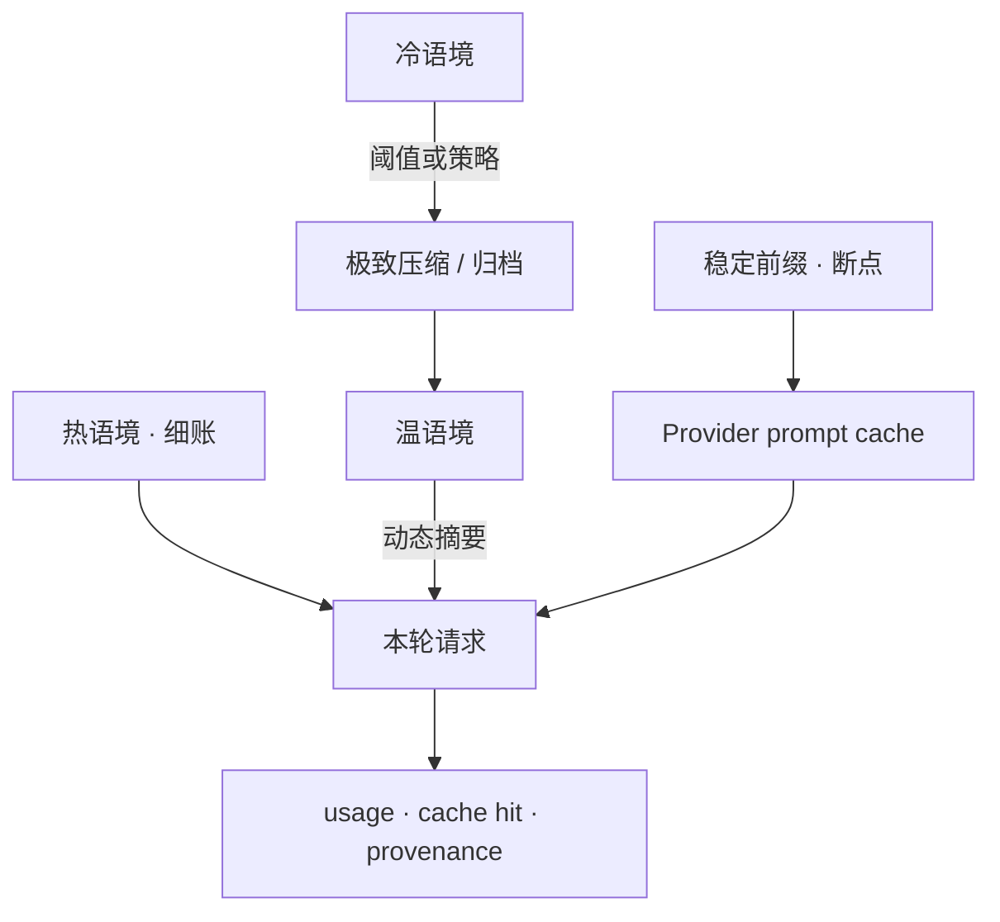

# 上下文缓存与极致压缩

> 在已落地「阈值 auto-compact + 诚实 provenance」之上，把 **provider prompt cache、动态压缩策略、工具/会话噪声压缩** 做成可感知、可度量的省 token / 降延迟能力。
> 现状对齐：2026-07-27。已兑现心智见 [../architecture/压缩与上下文.md](../architecture/压缩与上下文.md)；本文只留未兑现候选。

## 用户怎么碰到

- 长会话里系统提示、工具定义、项目说明几乎不变，却反复付全价输入；
- 工具结果（LSP/DAP/bash/MCP）噪声大，压缩时机要么太晚（撑爆）要么太狠（丢关键证据）；
- 想知道「这次请求吃到了多少 cache」「压缩裁了什么」，而不是黑盒省钱。
- **分叉**后仍希望吃到树干上的 cache：前提是别把「新书签 id」写进稿首或供应商 session 键（产品心智见 [../architecture/会话与持久化.md](../architecture/会话与持久化.md)）。

## 与已落地的切分

| 已落地（architecture） | 本文候选 |
|---|---|
| 约 80% 阈值触发自动压缩 | **动态**阈值 / 按段策略 / 可声明保留锚点 |
| 压缩生命周期事件 + provenance | **cache hit / 写入** 进入用量叙事与观测 |
| 词表配置 + CLI | **provider 级 prompt cache** 断点与 TTL 策略 |
| — | 工具结果分级压缩、会话分层（热/温/冷） |

## 产品目标

| 要 | 不要 |
|---|---|
| 稳定前缀可命中厂商 prompt cache（在兼容族支持时） | 假装所有网关都有同等 cache 语义 |
| 动态决定「何时压、压哪一层」；用户可感知策略档 | 静默乱删导致不可复现的「忘了刚说过的话」 |
| cache / 压缩效果可对照（usage + Langfuse） | 只报「感觉变快了」 |
| 与 Eval 回归集可验证「省 token 不损任务」 | 为省钱牺牲默认正确性且无闸 |

## 领域语言

| 概念 | 含义 |
|---|---|
| **稳定前缀** | 系统提示、工具 schema、长期项目说明等少变内容 |
| **Prompt cache** | 厂商侧对前缀的计费/延迟优惠（Anthropic `cache_control`；OpenAI-compat `prompt_cache_*` 等） |
| **断点** | 显式标记「此前可缓存」的边界 |
| **热 / 温 / 冷语境** | 近期细账 / 可摘要段 / 可归档或丢弃段 |
| **动态压缩** | 按窗口余量、工具噪声、任务阶段调整压缩激进程度 |
| **保留锚点** | 用户或产品规则声明「压缩时不可丢」的条目（如最近决策、未闭合工具） |

## 能力心智

## BDD 意图示例

**场景：稳定前缀可缓存**
Given 当前模型档案声明支持 prompt cache
When 连续多轮仅追加对话尾部
Then 用量侧可观察到 cache 读（或诚实标明网关未回报），且行为与未缓存时语义一致

**场景：不支持时诚实**
Given 预设/网关不支持或未透出 cache 字段
When 用户查看用量或观测
Then 不伪造 cache hit；策略可降级为仅本地 compact

**场景：动态压缩可感知**
Given 会话接近窗口且工具结果膨胀
When 触发动态策略（非仅固定 80% 一切）
Then 用户仍能看到压缩生命周期；关键锚点按规则保留

**场景：省钱不损任务（后置闸）**
Given Eval 回归集上开启激进缓存/压缩档
When 跑同一 Dataset
Then 任务成功率不低于约定阈值，同时 token / 延迟指标可对比

## 分阶段

| 阶段 | 用户可感知结果 |
|---|---|
| **M1 Cache 透出与诚实用量** | 兼容族透传/映射 cache 相关 usage；footer / 观测可区分「读到缓存」vs「未知」 |
| **M2 稳定前缀断点策略** | 系统+工具等稳定段按档案策略打断点；会话级 cache key 心智（不泄漏跨会话） |
| **M3 动态压缩档** | 保守 / 均衡 / 激进等可配置档；保留锚点；不仅固定百分比一刀 |
| **M4 工具结果分级压缩** | 大工具输出按类型摘要进语境（与 lspz/dapz「中间层压缩」同叙事） |
| **M5 与 Eval 闭环** | 缓存/压缩策略变更挂 [Agent-Eval与回归基准.md](./Agent-Eval与回归基准.md) 回归 |

## 依赖

| 关系 | 说明 |
|---|---|
| [../architecture/压缩与上下文.md](../architecture/压缩与上下文.md) | 现行 MUST；落地切片迁回该文 |
| [../architecture/多厂商模型.md](../architecture/多厂商模型.md) | 断点字段按 OpenAI-compat / Anthropic 方言开闭 |
| [预设Providers.md](./预设Providers.md) | 网关是否透出 cache；档案能力声明 |
| [Agent-Eval与回归基准.md](./Agent-Eval与回归基准.md) | 策略变更的可验证闸 |
| [LSP会话集成.md](./LSP会话集成.md) / [DAP调试集成.md](./DAP调试集成.md) | 工具侧「先进中间层再进模型」与本篇 M4 协同 |
| [Sub-Agent编排.md](./Sub-Agent编排.md) | 子 agent 回收摘要 vs 倾倒；共享压缩心智 |

## 支线与方向

| 支线 | 意向 |
|---|---|
| **会话分层存储** | 冷语境落盘可召回摘要，而非永久丢弃（产品叙事先于实现） |
| **手动「钉住」** | 用户标记某条消息/文件为压缩锚点 |
| **网关差异矩阵** | 预设文档列出 cache TTL / 最小前缀 / 是否支持显式断点 |
| **多模态体积闸** | 音视频附件与 cache/compact 的配额协同（挂多模态） |
| **子进程结果抽稀** | bash/MCP 超长 stdout 的流式截断 + 可展开本地全文（观测可对照） |

## 相关

- 现行压缩：[../architecture/压缩与上下文.md](../architecture/压缩与上下文.md)
- 观测用量对照：[../architecture/进程内观测.md](../architecture/进程内观测.md)
- 厂商 cache 一手入口：[OpenAI Prompt caching](https://developers.openai.com/api/docs/guides/prompt-caching) · [Anthropic Prompt caching](https://platform.claude.com/docs/en/build-with-claude/prompt-caching)
- 总索引：[README.md](./README.md)
