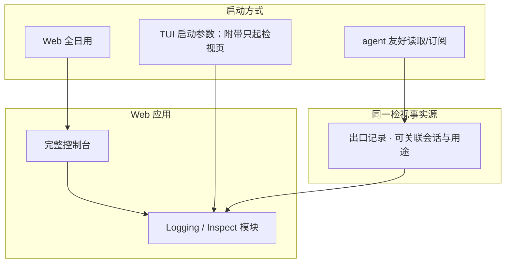

# 出口流量检视

> 自研 **Inspect（检视台）**：让 xylitol 相关出站流量可预览、可关联、对人类与 agent 都友好。
> **不采用外挂 MITM** 作为产品主路径。检视能力**融入 Web 应用**，并可供 TUI 附带启动。
> 现状对齐：2026-07-17。

## 用户怎么碰到

排障或审计时，用户想回答：

- 这一轮到底对上游发了什么、收回了什么？
- 是线路上的内容错了，还是本地理解/映射错了？
- 子进程（终端工具、外部工具进程）有没有在我不知情时对外请求？

理想体验：**打开检视台** → 按会话/时间线浏览 → 需要时交给 agent 结构化解读。

## 范围（已拍板）

| 层级 | 内容 | 产品承诺 |
|---|---|---|
| **A · 第一方出站** | xylitol 自身发起的 HTTP 等（模型、远程控制面、更新与下载、其它内置出站） | **必须**进检视事实源 |
| **B · 托管子进程出站** | 由本轮工具拉起的 bash / MCP 等子进程对外请求 | **要覆盖**；可作为增强波次，但方向上纳入「全部」叙事 |
| **非目标** | 劫持机器上无关进程、替代系统级抓包工具 | 不做「全球 MITM」 |

## 为什么是自研 Inspect，而不是 MITM

| 需求 | MITM 外挂 | 自研检视台 |
|---|---|---|
| 与一轮会话 / 工具调用关联 | 弱 | 强（领域相关） |
| 人类友好时间线 | 有，但是外来 UI | Web 内模块，产品一体 |
| agent 友好结构 | 弱（原始流量） | 一等公民（可二开导出/查询） |
| 「全部 xylitol 相关」承诺 | 依赖代理遵守度 | 第一方必记 + 子进程策略明确 |

结论：产品名是 **Inspect / 检视**，不是 MITM。

## 应用面形态（已拍板）

| 形态 | 说明 |
|---|---|
| **Web 全日用** | 控制台中的 Logging / Inspect 模块；与多工作区等能力并列 |
| **TUI 附带只起检视页** | 本地开 TUI 时可带参数，**只拉起检视模块页面**（不必进完整 Web 壳） |
| **agent 友好** | 同一事实源可被结构化消费（查询、过滤、摘要）；允许二开适配层 |

人类主预览面落在 **Web 检视模块**；TUI 主视线仍保持克制（详见视觉路线图），需要深潜时跳到检视台。

## 产品规则

| MUST | 禁止 |
|---|---|
| 显式开启检视（或等价调试档）才持续记录敏感载荷 | 默认把完整请求体永久明文甩到不可控处 |
| 记录可按会话 / 一轮 / 用途过滤 | 只有一大坨无法关联的原始字节 |
| 对模型流：能对照「线路所见」与「产品理解」 | 只给映射后结果、无法证伪通道错分 |
| A 范围缺记视为产品缺陷 | 用「去装个 mitmproxy」替代承诺 |
| B 范围策略透明（如何捕获、有何限制） | 假装已全捕获却静默漏子进程 |

## BDD 意图示例

**场景：第一方模型请求可预览**
Given 检视已开启
When 用户完成一轮模型调用
Then 在检视台能按该轮找到对应出站与响应流，并看到与产品理解的对照入口

**场景：TUI 附带只起检视页**
Given 用户以附带检视参数启动 TUI
When 需要查看本进程出口流量
Then 浏览器（或等价）打开**仅含检视模块**的页面，而无需进入完整多工作区控制台

**场景：agent 可读**
Given 检视事实源中有若干记录
When agent 按会话查询
Then 得到可解析的结构化结果，而非仅人类截图

**场景：子进程出站（B）**
Given 本轮工具启动了会访问网络的子进程且检视策略覆盖该类进程
When 子进程发出 HTTP
Then 检视台出现可关联到该工具调用的记录；若当前波次尚未覆盖，产品须明确降级说明而非静默丢失承诺

## 分阶段

| 阶段 | 用户可感知结果 |
|---|---|
| M0 进程内对照底座（准备） | 开发者可用本地时间线对照「线路所见 vs 产品理解」（排障配方）；**尚非**完整检视台 UI |
| M1 事实源 + A 覆盖 | 第一方出站可关联预览；agent 可读导出 |
| M2 Web 检视模块 | 控制台内 Logging/Inspect；人类时间线 |
| M3 TUI 附带只起页 | 参数启动「仅检视」托管页 |
| M4 B 子进程策略 | 明确捕获模型与限制；逐步提高覆盖 |
| M5 对照与减噪 | 模型流线路 vs 理解并排；默认折叠密钥与巨体 |
| M6 可选标准导出 | 显式开启时，同一时间线可导出到标准观测后端（与本地对照文件并存；默认关闭） |

## 底座准备（相对实现）

产品检视台依赖「能关联会话的第一方出站事实」。进程内时间线与本地对照记录是 **M1 之前可先夯实的底座**（实现侧见活跃 change `c1265` Phase A：排障配方 + 低频边界；**不**提前做 Web UI）。

前瞻：M6 的标准导出不得默认开启、不得破坏 TUI 终端；与 MITM 无关。

## 依赖

| 关系 | 说明 |
|---|---|
| **融入** [Cloud-Agent与Web控制台.md](./Cloud-Agent与Web控制台.md) | Inspect 是 Web 的一个模块；可独立托管页 |
| 协同排障 | 预设厂商、多模态、远程体验出问题时的第一现场 |
| 替代关系 | **取代**「外挂 MITM 作主路径」的旧意向 |
| 实现底座 | 进程内对照 / 可选标准导出 → llmanspec `c1265`（及后续 OTel change）；本文只保留产品意图 |

## 相关

- 远程体验心智：[../architecture/远程体验与线协议.md](../architecture/远程体验与线协议.md)
- 总索引：[README.md](./README.md)
