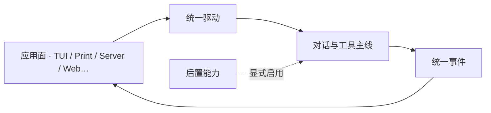

# 可扩展架构心智

> 与 pi 分道扬镳后：如何让多条主线并行而不把内核撕碎。纯产品/领域视角。
> 现状对齐：2026-07-17。

## 用户 / 嵌入方怎么碰到「架构」

多数用户不「碰到架构」。他们碰到的是：

- 换一种用法（终端 / 远程 / 将来 Web）体验仍像同一个 xylitol；
- 打开一项后置能力（MCP、LSP、检视、多模态…）时，**没开就不背成本**；
- 换模型厂商时，对话与工具故事不变。

嵌入方与二开方碰到的是：**稳定的领域缝**——会话、驱动、事件、工具、配置闸——而不是某一版界面实现。

## 领域语言（DDD 词汇）

| 概念 | 含义（产品） |
|---|---|
| **工作区** | 一块本地（或托管）代码与信任边界；TUI 常见「一会话主绑一工作区」 |
| **会话** | 可续、可分支的对话记忆与工具轨迹 |
| **一轮** | 用户一次意图到本轮收束（含插话/中止改道） |
| **驱动** | 各应用面共用的「跑 / 改道 / 命令」入口 |
| **统一事件** | 跨面有意义的生命周期闭集；各面自己渲染 |
| **后置能力** | 配置或会话内显式启用才装配；默认零成本 |
| **出口流量** | xylitol 及受其托管子进程对外发起的 HTTP 等；见 [出口流量检视.md](./出口流量检视.md) |

## 产品不变量（方向级 MUST）

| MUST | 禁止 |
|---|---|
| 多面共享同一条对话主线，只换「怎么看、怎么点」 | 为某一面另起一套对话语义 |
| 后置能力未启用时零装配成本（对齐 MCP 心智） | 「为了方便以后」默认常驻重服务 |
| 新厂商 / 新模态走开闭扩展，不改「会话真源」故事 | 为网关特判改写会话角色模型 |
| 跨面只承诺闭集事件与命令面 parity | 把厂商专名事件撒进所有 UI |
| 信任闸的是**项目本地资源是否加载** | 把信任做成工具弹窗审批平台 |

## 分道后的几大主线如何挂在同一内核

| 主线 | 挂在哪个领域缝 | 备注 |
|---|---|---|
| TUI 视觉 / 引擎质量 | 应用面渲染；不改驱动语义 | 表现层可大胆分叉 pi |
| Tokenizer 计量 | 模型用量呈现与知情同意 | 不伪造「API 已返回」 |
| 出口流量检视 | 观测域；事实源供 Web/agent | 融入 Web，不绑外挂 MITM |
| Cloud + Web | 多工作区控制面 + 同一驱动远程化 | 见对应路线图 |
| LSP / DAP / 多模态 / Computer Use | 后置能力；会话内启停 | 默认零成本；LSP∥DAP |
| 预设 Providers | 模型接入开闭 | Pre-1.0 交付范围仍受 architecture 约束 |
| Web / TUI 同源 | 跨面语义约束 | 见 [Web与TUI同源.md](./Web与TUI同源.md) |
| 运行时即时设置 | 会话覆盖、下一波次生效 | 后置能力开关盘 |
| Sub-agent / Loop | 编排与定时触发 | 可见、可中止、同源 |
| DAP（dapz） | 与 LSP 平行的调试后置 | 零成本默认 |

## BDD 意图示例（非可执行规格）

**场景：换应用面不换故事**
Given 用户在 TUI 完成一轮含工具调用的对话
When 同一会话在 Web 或远程薄端打开
Then 进度与改道语义可理解且同构，不要求像素一致

**场景：后置能力默认无感**
Given 用户未配置某后置能力
When 启动任意应用面
Then 不出现该能力的常驻进程或明显启动税

**场景：新厂商只扩接入**
Given 用户添加一个声明为兼容 API 的厂商档案
When 选用该模型对话
Then 会话、工具、事件故事与开箱厂商一致

## 理想 vs 方向张力

| 张力 | 产品取舍倾向 |
|---|---|
| 多面创新 vs 语义分裂 | 语义锁在驱动/事件；表现层自由 |
| 深度集成 vs 默认沉重 | 会话内启用 + 零成本默认 |
| 与上游（pi 等）对照 vs 自主演进 | 刻意差异台账；默认不为对齐回退决议 |
| 可观测 vs 隐私/噪音 | 检视显式打开；敏感默认折叠 |

## 主线 vs 后置

| | 内容 |
|---|---|
| **主线心智** | 单内核、多面、后置零成本、开闭扩厂商 |
| **后置于本文件** | 各能力路线图的具体里程碑 |

## 相关

- 今日产品分层：[../architecture/产品分层总览.md](../architecture/产品分层总览.md)
- 多 client：[../architecture/库与多客户端.md](../architecture/库与多客户端.md)
- 总索引：[README.md](./README.md)
