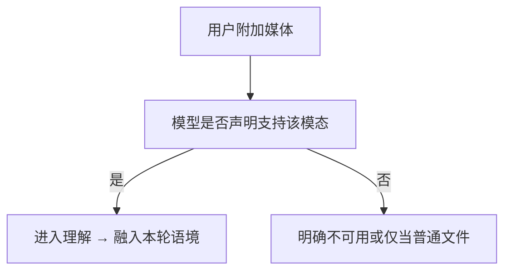

# 多模态理解

> 学习 kimi-code 一类多模态理解能力：在图像之外支持音频、视频等；**仅部分可配置模型**可用，常见于本地部署模型。
> 现状对齐：2026-07-17。

## 用户怎么碰到

- 把截图、录音、短视频丢进对话，希望模型「看懂/听懂」；
- 不是每个云厂商账号都支持这些模态；
- 本地大模型场景更常见「开了才有」。

## 产品规则

| MUST | 禁止 |
|---|---|
| 模态能力与**模型档案**绑定；不支持则清晰拒绝或降级 | 对不支持的模型假装已理解媒体 |
| 未配置多模态模型时零成本 | 默认拉起媒体管线 |
| 用户可感知：本模型支持哪些模态 | 静默丢附件 |
| 隐私敏感媒体有明示处理边界（本地/上传） | 默认外传用户未同意的媒体 |

## 能力地图（产品）

| 模态 | 方向 |
|---|---|
| 图像 | 已有心智上的延伸（按模型） |
| 音频 | 新增理解路径（按模型） |
| 视频 | 新增理解路径（按模型；成本与长度策略要产品化） |
| 其它 | 不预设全家桶；按档案扩展 |

## BDD 意图示例

**场景：支持的本地模型**
Given 用户配置的本地模型声明支持音频
When 附加一段音频并提问
Then 模型在本轮中基于音频内容回答（在实现就绪后）

**场景：不支持时诚实**
Given 当前模型不支持视频
When 用户附加视频
Then 产品明确提示不可用，不伪造「已观看」

**场景：未配置零成本**
Given 无多模态模型档案
When 日常纯文本对话
Then 无媒体理解管线常驻成本

## 分阶段

| 阶段 | 用户可感知结果 |
|---|---|
| M1 模型档案模态声明 | 配置侧能表达支持集 |
| M2 图像路径巩固 | 与现有附件故事一致 |
| M3 音频 | 可配置模型可用 |
| M4 视频 | 可配置模型可用 + 长度/采样产品规则 |
| M5 体验打磨 | TUI/Web 附件与进度表达 |

## 依赖

- 软依赖消息/附件领域扩展（合约波次另开）；**不**为模态改写「会话真源」基本故事。
- 可与 [预设Providers.md](./预设Providers.md) 交错（本地厂商档案）。

## 相关

- 总索引：[README.md](./README.md)
