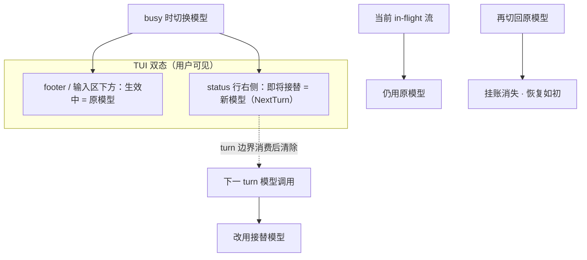

# 运行时即时设置

> 对话中调整能力 / 模型等：**下一生效边界**才换装配或下一拍请求，不必重启。
> 与已落地的 `/reload`（资源热重载）不同——见 [../architecture/配置与档案.md](../architecture/配置与档案.md)。
> 现状对齐：2026-07-22（调研收口；未兑现，勿当 architecture MUST）。

## 用户怎么碰到

- 本会话临时关 LSP / 开 DAP；换模型 / thinking 时 agent 还在跑；
- 不改磁盘长期配置（会话覆盖），或只改「接下来几拍」；
- **不用读文档**：界面同时能看出「此刻实际在用什么」与「下一拍将换成什么」；
- 切回原值 → 挂账消失，观感恢复如初。

## 关键词汇

| 词 | 含义 |
|---|---|
| **长期档案** | 磁盘配置 / profile；重启后仍在 |
| **会话覆盖** | 仅本会话（或明示更短寿命）的能力开关；**不**静默写回全局 |
| **in-flight** | 已发出、尚未结束的那一次模型流（当前 HTTP/SSE） |
| **turn** | 一次「问模型 →（可选）工具 → …」中的**下一次模型调用**边界 |
| **run** | 一次从用户开跑到 agent 真正 idle 的整段（可含多 turn + follow-up） |
| **波次** | 能力装配单元：通常对齐 **下一 turn**（模型调用装配边界）；能力开关与模型切换共用「当前不变、下一边界再生效」心智，但挂账文案可区分 |
| **生效中（active）** | 当前 in-flight / 本 turn 实际使用的值 |
| **即将接替（pending）** | 已接受、将在 **NextTurn** 起用的值；与 active 相同时 **不得** 再显示挂账 |

## 生效点（已钉）

| 设置类 | 生效点 | in-flight | 说明 |
|---|---|---|---|
| **模型 / thinking** | **NextTurn**（对齐 pi） | **保持旧值** | 当前流不换；工具结束后的下一次模型调用起用新值 |
| **主题等纯 UI** | Immediate | n/a | 立刻变色板；与模型流无关 |
| **能力覆盖**（LSP/DAP/MCP/…） | 下一装配波次（通常 NextTurn / 下一组合） | 不中途拆已开工承诺 | 与 `/reload` 分语义 |
| **`/trust`** | 写盘立刻；资源按新信任要 `/reload` | n/a | 挂账「待 reload」，不是 NextTurn 换模 |
| **`/reload`** | idle 热重载 | busy 拒绝 | ≠ 会话覆盖盘 |

## 产品规则

| MUST | 禁止 |
|---|---|
| 会话覆盖与长期档案可区分 | 静默改写全局配置 |
| 变更在约定边界才作用于请求/装配 | 暗示已改却仍按旧能力/旧模型跑完且 UI 不说明 |
| **双态可见**：有 pending 时，输入区下方（footer）显示 **生效中**；另有一处显示 **即将接替** | 只改 footer 成新模型、让用户以为当前句已换模 |
| pending == active（含用户切回原值）时 **清除挂账**，恢复如初 | 留下空的「即将接替」或幽灵 System 墙 |
| 可见 chrome 已表达成功时 **不** 再刷 muted System 确认行 | 成功换模/换主题再堆 `model → …` 上行 |
| 失败 / 拒绝 / 多行诊断仍可用 System | 把挂账做成 scrollback 永久墙 |
| 可启用 / 停用 / 屏蔽单项能力 | 只能杀进程才能切换 |
| 覆盖集在已开闸面可查；多面时同源 | 两面「已启用」不一致 |
| 未启用保持零成本 | 关 UI 仍占重资源 |
| **先 TUI 可用**；Web 随后对齐 | 因 Web 未开而阻塞 TUI 覆盖盘 |

### 模型切换 UI（TUI · 意图级）

| 区域 | 有 pending 时 | 无 pending / 切回原值后 |
|---|---|---|
| **输入框下方 footer** | 仍显示 **生效中** 模型（及 thinking） | 唯一真相：当前会话选中 |
| **busy status 行** | 左 `spinner + Working…`；右 dim `Next turn: {model}` | 仅左侧忙碌短词（或 idle 无 status） |
| **System 上行** | 成功路径 **不** 因换模追加 | — |

idle 且无 in-flight：切换可立刻把选中写成生效中（无挂账），footer 直接更新；仍 **不** 刷 System。

### `/model` 交互（与 pi 对齐的意图）

| 输入 | 行为 |
|---|---|
| `/model` | 打开列表（已有） |
| `/model <精确 id>` | 直设，不开列表 |
| `/model <非精确>` | 打开列表并预填 filter |
| Scope `all \| scoped` | **后置**（另切片；依赖 scoped 事实源） |

busy：允许接受换模（写入 pending / 或直设后若与 in-flight 不同则挂账）；**禁止**把 `/model …` 误当成 steer 文本。

### 反馈矩阵（命令面通用）

| 结果 | 反馈 |
|---|---|
| 立刻看得见且已生效（主题；idle 换模） | 零 System |
| 已接受、等 NextTurn | 挂账条 / 等价 chrome |
| 失败、拒绝、`/reload` 诊断 | System |
| 剪贴板等无 UI 副作用 | 短 System ack |

### 命令策略（实现友好 · 非插件市场）

新命令用**声明式元数据**（busy / apply / ack）+ 统一调度 + 执行体；策略可查、可测。禁止在 input 与 execute 两处各写一套 busy 特判墙。轻量 trait/`fn` 可有；**不做**扩展市场式注册表。

## 与后置能力

| 能力例 | 角色 |
|---|---|
| LSP / DAP | 会话内开闭；NextTurn/下一装配；挂账可复用同一套 pending chrome |
| Computer Use / 多模态 | 可临时屏蔽 |
| Sub-agent | 可禁止派生 |
| MCP 某服务器 | 可屏蔽单个 |
| 模型 / thinking | **首切片可感知**：NextTurn + 双态 UI（不必等 LSP 落地） |

## 分阶段（可认领切片）

| 阶段 | 用户可感知结果 | 备注 |
|---|---|---|
| **M0 模型/thinking NextTurn + 双态 chrome** | busy 换模：footer=生效中；Status trail=即将接替；切回/idle 收敛；无多余 System | **建议优先**；仅 agent-busy 画 trail；bang-only 不画 |
| **M1 TUI 覆盖盘 + 下一波次** | TUI 可改能力覆盖；确认下一波次生效；本波次不偷换装配 | 挂账 UI 复用 M0 |
| **M2 可观察覆盖集** | 用户能看见「当前覆盖 vs 长期档案」 | 与 M1 可同一 change 或紧随 |
| **M3 Web 同源** | Web 读写同一覆盖事实源 | 挂 [Web与TUI同源.md](./Web与TUI同源.md) M2；Web 壳后置 |
| **M4 挂接后置能力** | LSP/DAP/… 真实开闭进盘 | 各能力 roadmap 就绪后再接；盘本身不假装能力已交付 |

## 依赖与并行

- **约束**：[Web与TUI同源.md](./Web与TUI同源.md)（多面时）；**实现上 TUI 可先于 Web**。
- **被依赖**：LSP / DAP / Loop / Sub-agent 的「会话内开闭」叙事；M0 也被「换模可预期」依赖。
- **可并行**：Tokenizer、多模态 M1、TUI 视觉、检视独立页；pi Scope 模型 UI。

## 开放问题（仍开放）

- 覆盖默认是否**会话结束即丢**？（建议默认是；持久化需显式产品决定）
- 能力类已开工工具/LSP：中途拆与不拆的明示规则默认值？（建议默认不拆）

## 已关闭（原开放 → 调研结论）

| 题 | 结论 |
|---|---|
| 模型/thinking busy 生效点 | **NextTurn**（非整 run 结束才换） |
| 有 pending 时 footer 显示谁 | **生效中（原/in-flight）**；接替另处显示 |
| 再切回原模型 | pending 清除，UI 恢复如初 |
| 成功换模是否 System 上行 | **否**（chrome / 挂账已够） |
| 挂账字形 | agent-busy **status 同行右侧** Status trail；bang-only 不画；多 pending 单槽拼接（见 pending-runtime） |
| Bang busy | 仅 bang：**无** Next turn trail；footer 跟选中 |
| 多 pending 文案 | 均经 `/model`；trail 模型优先；禁止拼接 |
| Thinking 入口 | **仅** `/model` picker（槽内 Shift+Tab）；**移除**全局 cycle |
| 默认 thinking | 模型支持集 **最高** xylitol 档；UI 不暴露 provider 档名 |

## BDD 意图示例

**场景：NextTurn 换模且双态可见**
Given agent 正用模型 A 流式输出
When 用户将模型设为 B
Then 当前流仍按 A 完成
And footer（输入区下方）仍显示 A 为生效中
And 可见挂账表示 B 将于下一 turn 接替
And 下一 turn 的模型调用使用 B 且挂账清除

**场景：切回原模型恢复如初**
Given 生效中为 A 且 pending 为 B
When 用户再选回 A
Then 挂账消失
And 不额外留下 System 确认墙
And 后续 turn 继续用 A

**场景：下一波次能力关闭**
Given 本波次正在使用某后置能力（如 LSP）
When 用户关闭该能力的即时设置
Then 本波次不中途拆掉已开工承诺（或按明示规则）；**下一波次**不再装配该能力
And 用户能从挂账/覆盖可见面理解尚未对本波次生效

**场景：不写回全局**
Given 用户仅在本会话关闭某能力
When 查看长期档案 / 新开无关会话
Then 全局与其它会话不被静默改写

## 文档闭环（兑现后）

按 [../AGENTS.md](../AGENTS.md)：

1. 切片落地并归档后 → 把稳定 MUST/禁止迁入 `docs/architecture/`（建议：扩 [配置与档案.md](../architecture/配置与档案.md) 的「会话即时设置」段，或短文「运行时即时设置」；模型双态可链 TUI 相关 architecture / 保持 design 为形）
2. 本文删除已兑现段落；整篇无剩余候补则 **删文件** 并更新 [README.md](./README.md)
3. **禁止**未兑现前把上表写成 architecture 现行 MUST

## 实现接缝（认领时 · 非现行 MUST）

| 接 | 不接 |
|---|---|
| 会话选中 vs in-flight/active vs pending 三态可区分；turn 边界重读模型/thinking（对齐 pi `prepareNextTurn` 心智） | 只改 ModelManager / footer 却整 run 握死旧 Arc 且无挂账 |
| 会话覆盖事实源 → **下一波次**再装配 | 与 `/reload` 混成同一产品语义 |
| 开关盘只表达覆盖；真实能力仍走各能力零成本装配 | 盘上「已开」却未接线的假装交付 |
| 命令 `SlashMeta` + 统一反馈调度 | 为开关盘另造插件注册表；Settings/Plate 运行时改配置主路径 |
| 开闭心智：[../architecture/扩展与开闭.md](../architecture/扩展与开闭.md) | |

## 相关

- [Web与TUI同源.md](./Web与TUI同源.md)
- 现行配置与 `/reload`：[../architecture/配置与档案.md](../architecture/配置与档案.md)
- 开闭：[../architecture/扩展与开闭.md](../architecture/扩展与开闭.md)
- 插话续跑（队列 strip 同位参考）：[../architecture/插话续跑与中止.md](../architecture/插话续跑与中止.md)
- 总索引：[README.md](./README.md)
