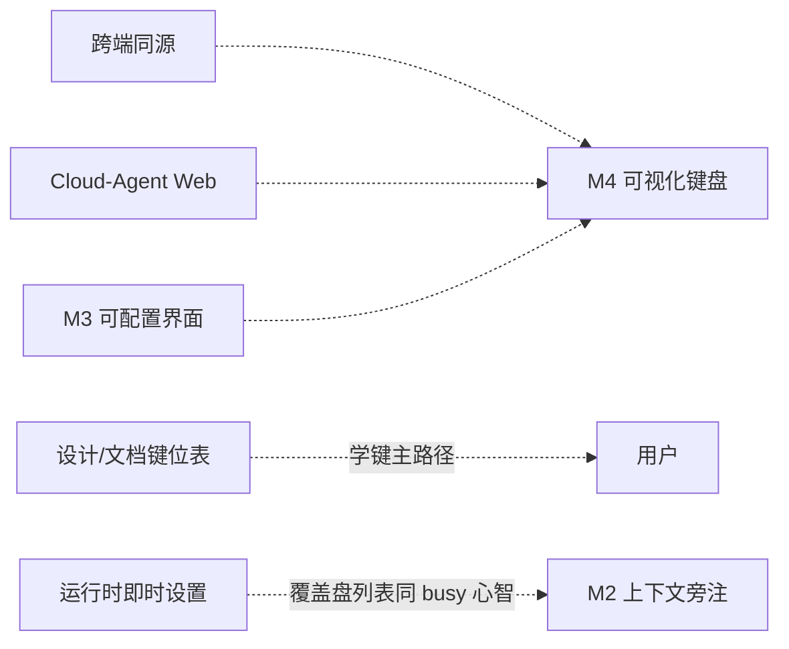

# 键位与命令发现

> 快捷键可发现性、可配置绑定；**可视化学习键盘延后**（挂 gpui / 调研底稿）。
> 现状对齐：2026-08-01。
> 跨端约束：[跨端同源.md](./跨端同源.md)。搁置 Web 壳：[Cloud-Agent与Web控制台.md](./Cloud-Agent与Web控制台.md)。
> 库调研（非产品 MUST）：[../research/keybinding-keyboard-visualizer-2026.md](../research/keybinding-keyboard-visualizer-2026.md)。

## 本文是什么 / 不是什么

| 是 | 不是 |
|---|---|
| 未兑现的键位学习 / 命令发现方向 | 已落地的 `KeybindingsManager` + `keybindings.json` 热重载（见代码与 `app-tui-input`） |
| 与聊天滚动、Provider 状态**尽量解耦**的列表入口意图（busy 即时列表已落地，落点以 specs 与 designing 模块为准） | 立刻交付 Command Plate（**本波明确延后**） |
| 可视化键盘的**挂靠点**与依赖 | 本仓先做 TTY 内嵌 WebView 键盘（见调研；等 gpui 端） |

## 用户怎么碰到

| 场景 | 痛点 | 要给的 |
|---|---|---|
| 学键 | 靠习惯 + 局部提示 | **主路径 = 文档 / gpui 学习页**；程序内保持旁注，不默认塞百科 slash |
| agent 忙碌时切模型 / 看主题 / 浏览会话列表 | 即时列表可开 | Resume **可浏览**、**不可 switch**（通知条说明） |
| busy 时误点切换会话 | 通知条拒绝 | 须等 turn 结束或 Esc 中止后再 switch |
| 改键 | 只能手改 JSON | 后期可配置 UI / gpui；短期 JSON 仍够用 |
| 模拟按键学习 | 无交互键盘图 | **延后**：gpui 端；见调研 |

现行拒绝文案与落点：见 [../architecture/TUI信息呈现与固定区词汇.md](../architecture/TUI信息呈现与固定区词汇.md)（通知条）与 [`designing/tui/modules/toast-notice/`](../../designing/tui/modules/toast-notice/intent.md)。

## 产品规则（候选）

| MUST（兑现时） | 禁止 |
|---|---|
| 旁注和弦跟 `KeybindingsManager` 实际绑定走 | footer / 静图顶栏堆完整键墙 |
| 公共能力发现路径跨端一套学习成本（同源） | 为 TUI 另造第二套公共故事，却把 gpui 专属键盘图写成公共 MUST |
| busy 门禁用单一表（现 `slash_allowances`）扩展，不平行 fork | 静默解冻产品 Ctrl+P Command Plate（本波不做；和弦已被 Resume `app.session.togglePath` 占用） |
| 列表打开不依赖 scrollback 内容 / LLM provider 是否已响应 | 把「改全局 YAML 档案」做成运行时 Settings stub |

## 分阶段（可认领切片）

| 阶段 | 用户可感知结果 | 备注 |
|---|---|---|
| **M1 程序内键位目录** | （可选）`/hotkeys` 列出当前生效绑定 | **本波不做 / 支线**；学键主路径是文档。若日后做：**勿用 `/help`**，优先 `/hotkeys`；仍禁 footer 墙 |
| **M2 上下文模式可读** | 树开/关等同和弦多义可扫读（旁注分组或模式灯） | 不强制改默认键；可随文档加强，不依赖 M1 |
| **M3 绑定可配置界面** | 列出 id、改和弦、写回 `keybindings.json`、暴露冲突 | ≠ 解冻 Settings 改 YAML；可先 Web |
| **M4 可视化学习键盘** | 标准键盘图：点/模拟按键 → 显示绑定 | **延后**；挂 Web；见 research |
| **— Command Plate** | — | **本波不做** |

## 依赖与并行

- **不阻塞**：TUI 视觉减噪、Eval、缓存主线。
- **学键主路径**：文档 / 日后 gpui 学习页；组件键写在 [`designing/tui/modules/`](../../designing/tui/modules/) 各模块 `draft.yaml` 的 `keys:`。**不**把程序内百科当默认交付。
- **刻意后置**：Command Plate；`/hotkeys`；TTY 内嵌 WebView 学键。

## BDD 意图示例（候选 · M1+）

**场景：busy 仍拒 reload**
Given agent busy
When 用户执行 `/reload`
Then 拒绝并给出可理解提示
And MUST NOT 开始热重载

## 支线与方向

| 支线 | 意向 |
|---|---|
| **`/hotkeys`（原 M1）** | 若用户明确要程序内目录再用；名称优先 `/hotkeys` 而非 `/help`；动态跟 manager |
| **默认键冲突审计** | 启动或 `/reload` 报告跨上下文同键 |
| **建议改键清单** | 见调研附录；投诉驱动 |
| **skill slash 进 editor catalog** | 补全与 GetCommands 对齐 |
| **Command Plate 重开** | 须先重分配 Ctrl+P |
| **导出默认目录 JSON** | 喂给学习页 / 文档生成 |

## 开放问题

1. M4 是否允许「浏览器打开本地静态页」作为 gpui 学习页前过渡？

## 相关

- 现行键位合约文：组件键写在 [`designing/tui/modules/`](../../designing/tui/modules/) 各模块 `draft.yaml` 的 `keys:`（无独立快捷键设计）
- 同源：`跨端同源.md`
- 即时设置（已迁 architecture；覆盖盘仍候选）：`运行时即时设置.md`
- 固定区词汇：`../architecture/TUI信息呈现与固定区词汇.md`
- 调研：`../research/keybinding-keyboard-visualizer-2026.md`
- 总索引：[README.md](./README.md)
