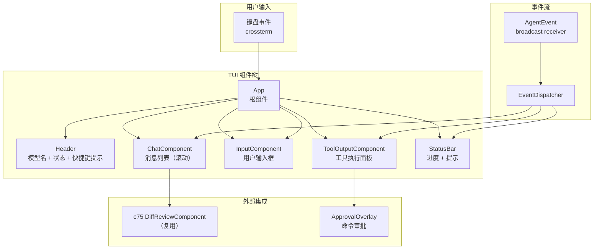
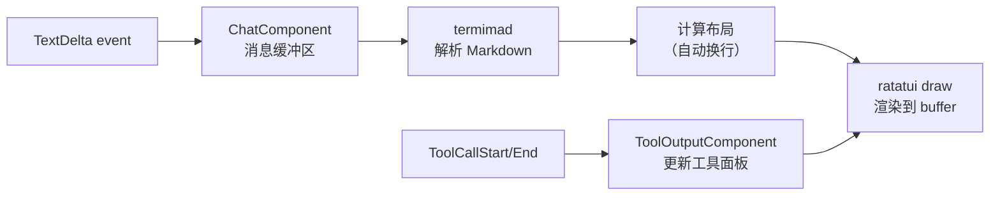

# c80-add-tui — Design

## Context

- PRD: §0.2（三种模式 Interactive）、§0.3（ratatui 对标 pi-tui）、§0.8.3（TUI 技术栈）
- 依赖关系见 proposal.md frontmatter（depends_on / blocks 为 SSOT）

## Goals / Non-Goals

### Goals

- 实现完整 TUI 交互模式（~25 ratatui 组件）
- 事件驱动：订阅 AgentEvent 流更新 UI
- 流式输出渲染
- 工具执行结果展示
- Diff 预览（复用 c75 组件）
- 命令审批流
- 会话/模型选择器
- 键盘快捷键系统
- Markdown 渲染（termimad）

### Non-Goals

- 不实现自定义图片协议（Kitty/iTerm2/Sixel，Phase 2）
- 不实现主题系统自定义（使用内置主题）
- 不实现分屏/多窗格
- 不实现 TUI 组件的自动测试（c88 VT100Backend 负责测试）

## Decisions

### Decision 1: TUI 架构——组件树与事件流



**选择**: 单根组件 `App` 管理子组件树。`EventDispatcher` 将 AgentEvent 路由到对应组件。crossterm 处理终端 I/O。

**组件分类**:
| 类别 | 组件 | 数量 |
|------|------|------|
| 布局 | App, Header, StatusBar | 3 |
| 对话 | ChatComponent, MessageBubble, MarkdownRenderer | 3 |
| 输入 | InputComponent, CompletionPopup | 2 |
| 工具 | ToolOutputComponent, ToolResultPanel | 2 |
| 评审 | DiffPreview, ApprovalOverlay, CommentEditor | 3 |
| 选择器 | SessionSelector, ModelSelector, ThemeSelector | 3 |
| 辅助 | ScrollIndicator, ProgressBar, HelpOverlay | 3 |
| 其他 | EditorComponent, SyntaxHighlighter | 2 |

### Decision 2: 渲染循环与事件处理

```mermaid
flowchart TD
    TICK["tick（250ms）"] --> RENDER["渲染所有组件<br/>ratatui::Terminal::draw"]

    RENDER --> SELECT{"tokio::select!"}

    SELECT -->|"AgentEvent"| DISPATCH["EventDispatcher<br/>路由到组件"]
    DISPATCH --> UPDATE["组件.update(event)<br/>标记 dirty"]
    UPDATE → RENDER

    SELECT →|"KeyEvent"| KEY_HANDLE["App.handle_key(event)"]
    KEY_HANDLE -->|"导航"| NAV["组件间焦点切换"]
    KEY_HANDLE -->|"输入"| TEXT["InputComponent 追加字符"]
    KEY_HANDLE -->|"快捷键"| SHORTCUT["执行快捷动作"]
    KEY_HANDLE → RENDER

    SELECT →|"tick"| RENDER

    style RENDER fill:#e8f5e9
```

**选择**: 250ms tick 驱动渲染 + 事件驱动更新。组件收到事件后标记 dirty，下次 tick 渲染。

**权衡**: tick 驱动比即时渲染更简单（无需处理部分渲染），但可能有 250ms 延迟。对于流式文本输出，250ms 的视觉延迟可接受。

### Decision 3: 流式输出渲染策略



**选择**: TextDelta 追加到当前消息缓冲区，termimad 实时解析 Markdown 并渲染。工具调用更新独立的工具面板。

**性能考虑**: 长消息的 Markdown 解析可能变慢。设置最大渲染长度（如 10000 字符），超出部分折叠。

### Decision 4: 键盘快捷键

| 键 | 功能 |
|---|---|
| `Enter` | 提交输入 |
| `Ctrl+C` | 中断当前执行 |
| `Ctrl+D` | 退出 TUI |
| `j/k` | 滚动消息 |
| `g/G` | 跳到顶部/底部 |
| `Tab` | 切换焦点（输入/消息/工具面板） |
| `?` | 显示帮助 |
| `Ctrl+L` | 清屏 |
| `Ctrl+R` | 切换 diff 预览 |
| `Ctrl+S` | 手动快照 |

**选择**: vim 风格导航 + Ctrl 组合键用于全局操作。避免与常用终端快捷键冲突。

## Risks / Trade-offs

| 风险 | 等级 | 缓解 |
|------|------|------|
| ~25 组件开发量大 | 高 | 参考 codex-rs codex-tui crate 实现；组件复用 ratatui widget |
| 终端兼容性问题（不同终端模拟器） | 中 | crossterm 处理跨平台；VT100Backend 测试验证 |
| 流式 Markdown 渲染性能 | 中 | 增量渲染 + 长消息折叠 |
| crossterm + ratatui 版本锁定 | 低 | Cargo.toml 锁定兼容版本 |

### 待确认问题

- 无
