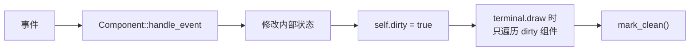
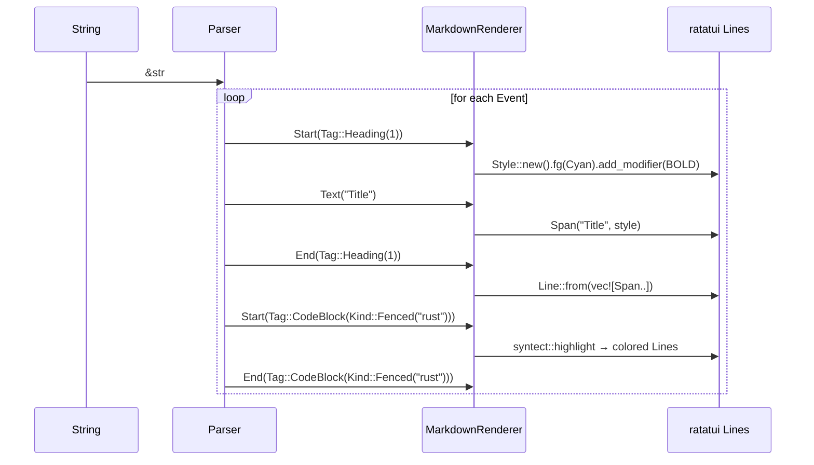
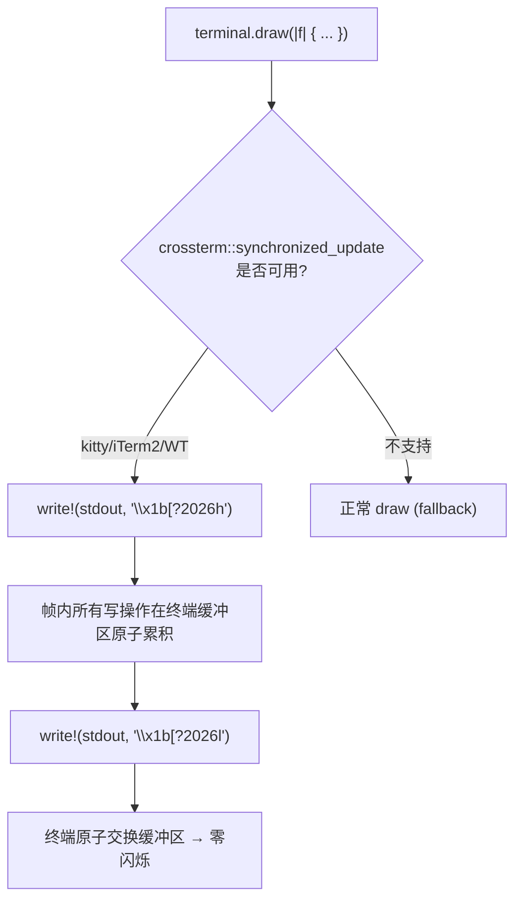

# c90-refactor-tui-core — Design

## 架构决策

### 1. Component Trait + Dirty Flag（vs 全量重绘）

**决策**：定义 `Component` trait，每个组件维护 `dirty: bool`。`App::render()` 只调用 dirty 组件的 render。事件处理后标记 dirty。



**原理**：chat 组件随会话增长内容越多，每帧全量 markdown 解析 + Line 构造的成本越高。脏标记使得只有即时变化的组件（接收 delta 时的 chat、帧切换时的 spinner）被重绘。

### 2. pulldown-cmark（vs termimad / 手写）

**决策**：用 `pulldown-cmark` 解析 markdown，手动映射到 ratatui Spans/Lines。

**原因**：
- `termimad` 虽已列入依赖但从未使用，其输出是格式化文本而非 ratatui widgets
- `pulldown-cmark` 是 Rust 生态标准 CommonMark 解析器，事件驱动（`Iterator<Item = Event>`），可逐事件映射到 Spans
- 代码块用 syntect 高亮（已有依赖）



### 3. tui-textarea（vs 手写 InputComponent）

**决策**：用 `tui-textarea 0.7` 替换手写的 285 行 `InputComponent`。

**原因**：
- 手写代码仅有单行支持、基本光标移动、↑/↓ 历史、Backspace/Delete
- tui-textarea 自带：多行编辑、word wrap、readline 全键绑定、undo/redo、yank/paste、bracketed paste（系统剪贴板）
- 可通过 `KeyBinding::Custom` 扩展 `/` 检测和 tab 补全

### 4. 同步输出防闪烁（CSI ?2026h/l）

**决策**：用 crossterm 的 `synchronized_update::BeginSynchronizedUpdate` / `EndSynchronizedUpdate` 包裹每帧渲染。



### 5. OverlayStack 路由（vs 分散 if-else）

**决策**：用栈管理所有覆层（help、selector、approval、diff preview）。

```rust
struct OverlayStack {
    layers: Vec<Box<dyn Component>>,
}

impl OverlayStack {
    fn push(&mut self, layer: Box<dyn Component>);
    fn pop(&mut self) -> Option<Box<dyn Component>>;
    fn route_key(&mut self, key: KeyEvent) -> bool {
        // 从顶到底路由，consumed=true 则停止传递
        self.layers.iter_mut().rev().any(|l| l.handle_key(key))
    }
    fn render_all(&self, frame: &mut Frame, area: Rect) {
        for layer in &self.layers {
            layer.render(frame, area);
        }
    }
}
```

**原理**：避免 `if help.is_active() { ... } else if approval.is_active() { ... }` 的分散条件判断。新增覆层只需 push 到栈，路由自动工作。

### 6. Elm-like Update 模式

```rust
impl App {
    fn update(&mut self, event: Event) -> Option<Action> {
        match event {
            Event::Agent(AgentEvent::TextDelta(t)) => {
                self.chat.append_delta(&t);
                self.chat.mark_dirty();
            }
            Event::Key(key) if self.overlays.is_empty() => {
                return self.handle_key(key);
            }
            Event::Key(key) => {
                self.overlays.route_key(key);
            }
            Event::Tick => {}
        }
        None
    }

    fn render(&mut self, frame: &mut Frame) {
        if self.chat.is_dirty() { self.chat.render(frame, area); }
        if self.input.is_dirty() { self.input.render(frame, area); }
        // ...
    }
}
```

## 不在此 Change 的范围

以下功能将在后续 change 中实现：

| 功能 | 归属 change |
|------|------------|
| 异步输入队列（agent 运行时排队） | c91 |
| /model /session /theme 切换 + 真实数据 | c91 |
| Ctrl+G 外部编辑器集成 | c91 |
| Ctrl+R 可搜索历史覆层 | c91 |
| 鼠标滚轮 + 点击焦点 | c91 |
| 焦点高亮视觉效果 | c91 |
| ApprovalOverlay 接入 agent 安全策略 | c92 |
| DiffPreview 接入 StepComplete 事件 | c92 |
| 折叠 Tool call 卡片（状态徽章） | c92 |
| 折叠 Thinking 块 | c92 |

## 向后兼容

- `run_tui()` 函数签名保持与旧版一致：`(ToolRegistry, AppConfig, ResolvedProfile, Arc<dyn SessionService>) -> Result<(), Box<dyn Error>>`
- `ui-tui` feature flag 不变
- `diff_review/` 模块不受影响
