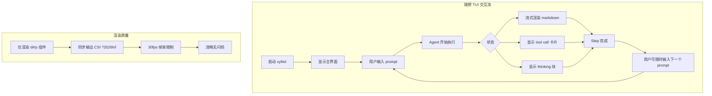
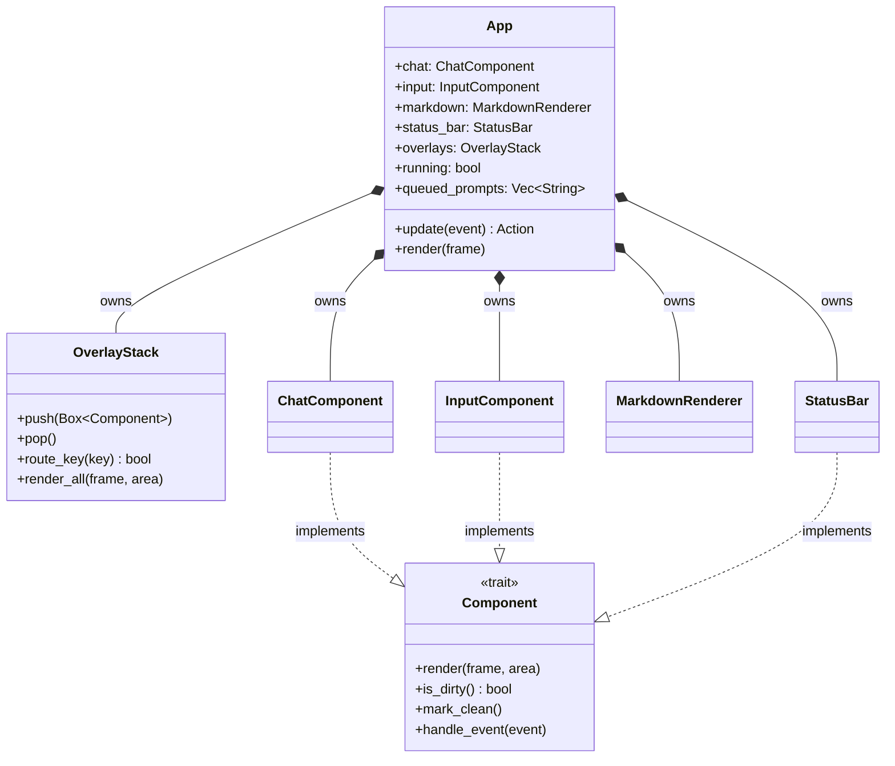
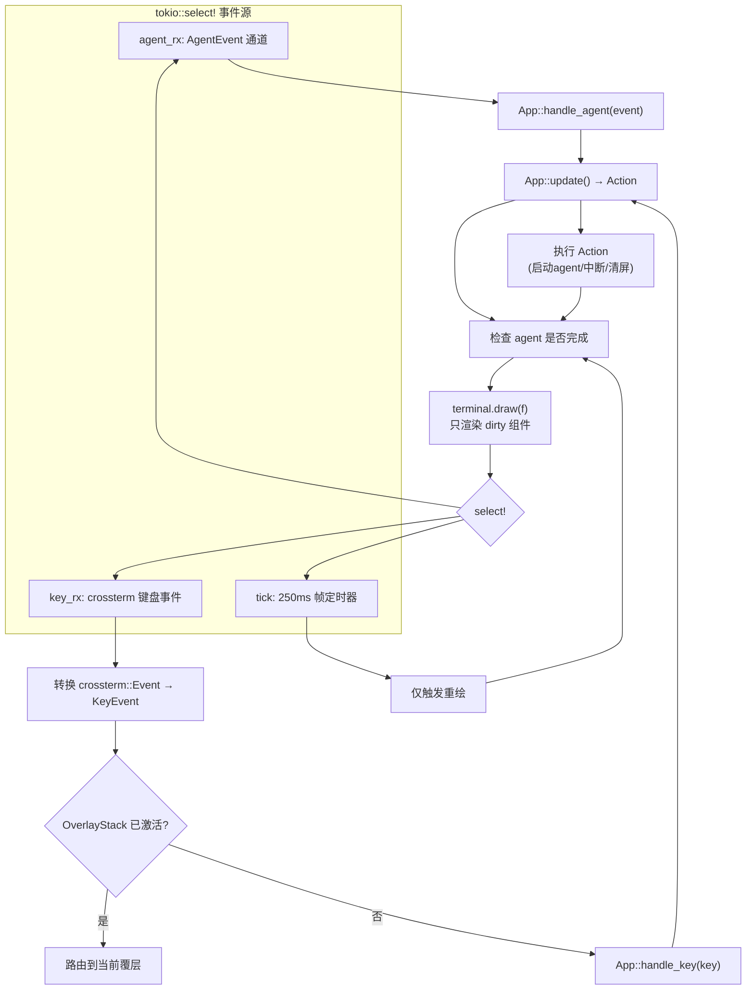
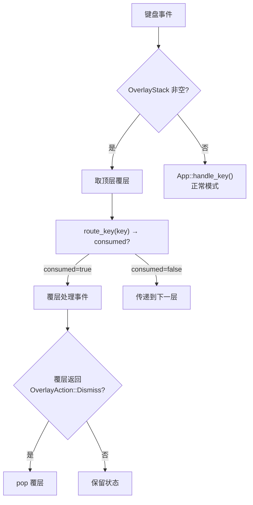

# c90-refactor-tui-core

## Why

当前 TUI 实现 (`src/interface/tui/`, 11 文件 ~2265 行) 是一次性提交 (9805c1d) 的产物，存在**架构性缺陷**：

- **无组件抽象**：各组件是 ad-hoc struct，无共享 trait、无 dirty flag，每次 `render()` 全量重绘
- **O(n²) 渲染**：每帧对所有消息重新解析 markdown → 重新构造 `Line` 对象
- **手写 Markdown**：`find()` 关键字匹配，不支持列表/链接/blockquote，代码块未闭合时不渲染
- **单行输入**：无 multi-line、无 readline 快捷键 (`Ctrl+K/U/W`)、无历史搜索
- **覆层未接入**：`ApprovalOverlay`/`DiffPreview` 实现了但从未被 App 调用
- **选择器是桩**：session/model/theme 均返回 `["default"]`
- **Session 硬编码**：无切换能力
- **无异步输入**：Agent 运行时输入被禁用
- **鼠标开启但不用**：`EnableMouseCapture` 调了但不处理事件
- **死依赖**：`termimad` 列入但从未 import

**`diff_review/` 模块 (815+843 行) 有良好结构和测试，保持不动。**

### 目标体验（参考 Claude Code / pi coding agent / codex）



## What Changes

### 架构概览



### 事件循环



### 渲染管线

```mermaid
flowchart LR
    A[State Change] --> B[标记对应 Component dirty]
    B --> C[terminal.draw 前]
    C --> D{"CSI ?2026h/l\n同步输出支持?"}
    D -->|"是"| E["BeginSynchronizedUpdate"]
    D -->|"否"| F["直接 draw"]
    E --> G["遍历组件\n跳过 clean 组件"]
    F --> G
    G --> H["每个 dirty 组件\nrender(frame, area)"]
    H --> I["标记 clean"]
    I --> J["EndSynchronizedUpdate" / "flush"]
    J --> K["完成"]
```

### 覆层路由



### 组件树与布局

```mermaid
block-beta
    columns 1
    block["App (root)"]
        block:header["Header (1 行)"]
        block:chat["ChatComponent (flex)"]
            block:msgs["Message 列表"]
            block:toolcards["Tool 卡片 (可折叠)"]
            block:think["Thinking 块 (可折叠)"]
        end
        block:input["InputComponent (3-15 行, auto-expand)"]
        block:status["StatusBar (1 行)"]
    end
    block:overlay["OverlayStack (z-order)"]
```

### 技术栈

| Crate | 用途 | 状态 |
|-------|------|------|
| `ratatui 0.29` | TUI 框架 | 已有 |
| `crossterm 0.28` | 终端后端 | 已有 |
| `syntect 5` | 代码语法高亮 | 已有 |
| `pulldown-cmark 0.12` | **新增** — CommonMark 解析 → ratatui Spans | 替换手写解析器 |
| `tui-textarea 0.7` | **新增** — 多行输入 + readline 快捷键 + undo/redo | 替换手写 InputComponent |
| ~~termimad 0.34~~ | **删除** — 从未被引用 | 移除死依赖 |

### 文件清单

**删除 (整个 `src/interface/tui/`)：**
- `mod.rs`, `app.rs`, `chat.rs`, `input.rs`, `markdown.rs`, `tool_output.rs`, `approval.rs`, `diff_preview.rs`, `help.rs`, `selectors.rs`, `status_bar.rs`, `event.rs`

**新建 (~16 文件)：**
```
src/interface/tui/
  mod.rs             模块根, 导出 run_tui()
  app.rs             App 结构体 + event loop + Layout
  component.rs       Component trait + OverlayStack
  event.rs           TuiEvent + AppAction 枚举
  chat.rs            ChatComponent: 消息列表, 流式文本, 滚动
  input.rs           InputComponent: 包裹 tui-textarea
  markdown.rs        MarkdownRenderer: pulldown-cmark → ratatui Lines
  status_bar.rs      StatusBar: 模型/token/cost/上下文
  overlays/
    mod.rs           覆层栈管理
    help.rs          键盘快捷键一览
    selector.rs      通用模糊选择器
  history.rs         持久化输入历史 (~/.xylitol/history)
  slash.rs           斜杠命令解析 + tab 补全
```

**修改：**
- `Cargo.toml` — 添加 `pulldown-cmark`, `tui-textarea`；从 `ui-tui` feature 移除 `termimad`

**保持不动：**
- `src/interface/diff_review/` — 完整保留
- `src/interface/mod.rs`, `print.rs`, `acp.rs` — 不动
- `src/agent/` — 不动

## Capabilities

- `ui-tui`: 重写后的完整 TUI 模式，含 Component trait、多行输入、异步输入队列、pulldown-cmark、读行快捷键、持久化历史、斜杠命令、鼠标支持、同步输出防闪烁

## Impact

- 新增 2 个依赖：`pulldown-cmark 0.12`, `tui-textarea 0.7`
- 删除 1 个死依赖：`termimad` (从未被引用)
- -> `ui-tui` feature gate 保持独立
- 不影响 `ui-review`、`infra-acp` 等其他 feature
