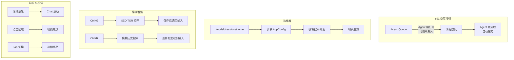
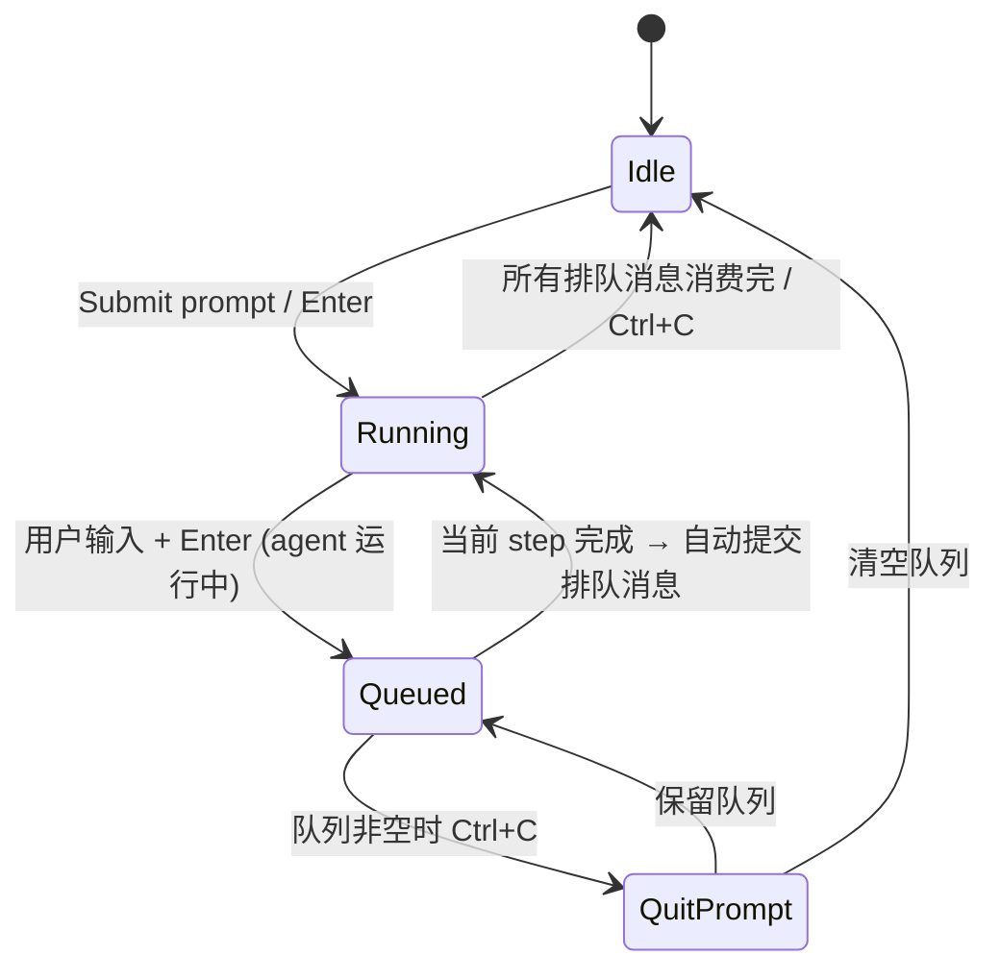
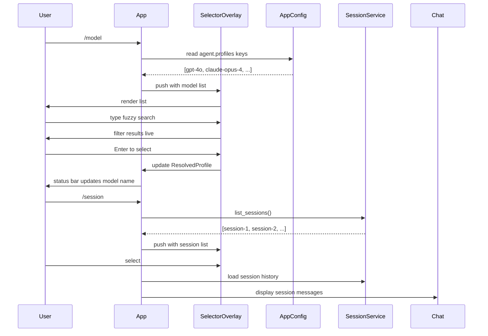

# c91-add-tui-interactive

## Why

c90 建立了 Core TUI 的基础架构（Component trait、markdown、输入、渲染管线），但缺少交互层的关键能力：

- Agent 运行时用户无法输入（输入被禁用）
- 切换模型/会话/主题需退出 TUI 修改配置
- 无模糊搜索、无外部编辑器集成
- 纯键盘操作缺少鼠标辅助
- 焦点切换无视觉反馈

## What Changes

### 1. 异步输入队列

### 2. 选择器 + 真实配置数据

### 3. 文件清单（相对于 c90 新增/修改）

**修改 `src/interface/tui/`：**
- `app.rs` — 异步队列逻辑、/model /session 路由、鼠标事件、焦点高亮
- `input.rs` — Ctrl+G 编辑器启动、Ctrl+R 历史搜索触发、斜杠命令路由
- `status_bar.rs` — 队列指示器 `[Q: N]`
- `overlays/selector.rs` — 接收真实 AppConfig 数据；模糊搜索

**新增：**
- `src/interface/tui/overlays/history_search.rs` — Ctrl+R 交互式历史搜索覆层

### 4. 按键补充

| 按键 | 动作 |
|------|------|
| 鼠标滚轮 | Chat 滚动 |
| 鼠标左键点击 | 切换焦点到点击区域 |
| Tab | 循环切换焦点 (Chat → Input → Status → ...) |
| `Ctrl+G` | 在 `$EDITOR` 中编辑当前输入 |
| `Ctrl+R`（输入模式） | 打开交互式历史搜索覆层 |
| `Ctrl+Up/Down` | 调整 Chat/Tool 区域大小 |

## Capabilities

- `ui-tui`: 异步输入队列、真实数据选择器、鼠标交互、焦点高亮、编辑器集成、历史搜索

## Impact

- 仅修改 `src/interface/tui/`（c90 已建好的文件）
- `diff_review/` 不受影响
- 无新增依赖
