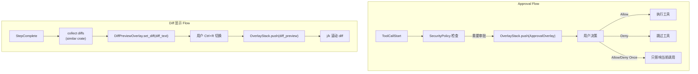
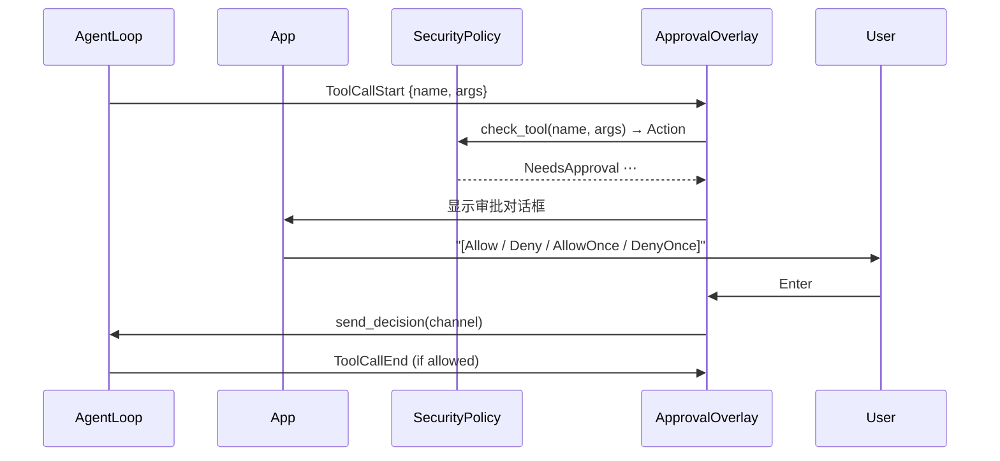
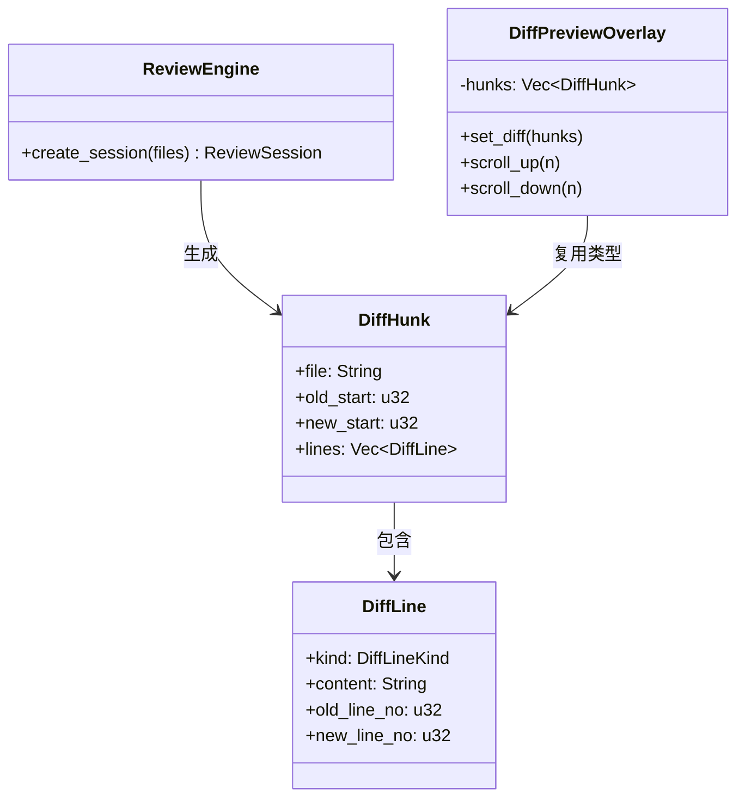

# c92-add-tui-approval-diff

## Why

c90 和 c91 建立了核心 TUI 和交互层，但还有两个重要的**工具执行相关**覆层未接入：

1. **ApprovalOverlay** — 代码已存在但从未被 App 调用。当安全策略标记某个工具需要审批时，用户应该看到 overlay 并决策
2. **DiffPreviewOverlay** — 同样存在但未接 StepComplete 事件。agent 修改文件后，用户应能通过 `Ctrl+R` 查看 diff

此外，`diff_review/` 模块已有完善的 `DiffHunk`/`DiffLine` 类型（815 行 + 测试），但当前 TUI 的 `diff_preview.rs` 里有自己重复的 `DiffKind` 枚举和渲染逻辑。c92 也负责消除这个重复。



## What Changes

### 1. ApprovalOverlay 接入



### 2. DiffPreview 接入 + 复用 diff_review 类型



核心变化：`diff_preview.rs` 不再定义自己的 `DiffKind`/`DiffLine`，改而引用 `diff_review::types::DiffHunk`。

### 3. 折叠工具调用卡片

chat 消息中的工具调用不再显示为纯文本 `[Tool: name — running...]`，而是渲染为可折叠卡片：

```
┌─ 🔧 read_file ────────────────── running ─┐
│ Arguments: path="/src/main.rs"             │
│ Status: [=====>       ] 45%               │
└───────────────────────────────────────────┘
(完成后折叠)
┌─ ✅ read_file ── 2.1s ────────────────────┐
└───────────────────────────────────────────┘
(Enter 展开查看结果)
```

### 4. 折叠 Thinking 块

检测 agent 输出的 reasoning/thinking 段（如 `<thinking>` 标记或模型原生思维链），默认折叠为：

```
┌─ 💭 Thinking... (Enter to expand) ────────┐
└───────────────────────────────────────────┘
```

展开后以 dim/italic 样式显示完整内容。

### 文件清单

**修改 `src/interface/tui/`：**
- `app.rs` — 接入 approval 事件路由、diff 事件路由
- `chat.rs` — 工具卡片渲染 + thinking 块检测/折叠
- `overlays/approval.rs` — 集成 diff 预览 + 安全策略决策发送
- `overlays/mod.rs` — 修改 diff_preview 引用

**修改 `src/interface/tui/diff_preview.rs`：**
- 从 `diff_review::types` 导入 `DiffHunk`/`DiffLine`/`DiffLineKind`
- 删除自己的 `DiffKind`/`DiffLine` 定义
- 对接 ReviewEngine 生成的 hunks 而不是解析原始 diff 文本

## Capabilities

- `ui-tui`: 工具审批流程、diff 预览、可折叠工具卡片、可折叠 thinking 块、diff_review 类型复用

## Impact

- 修改 `diff_preview.rs` 消除类型重复
- `diff_review/` 模块不被修改（只是被 TUI 引用）
- 无新增依赖
