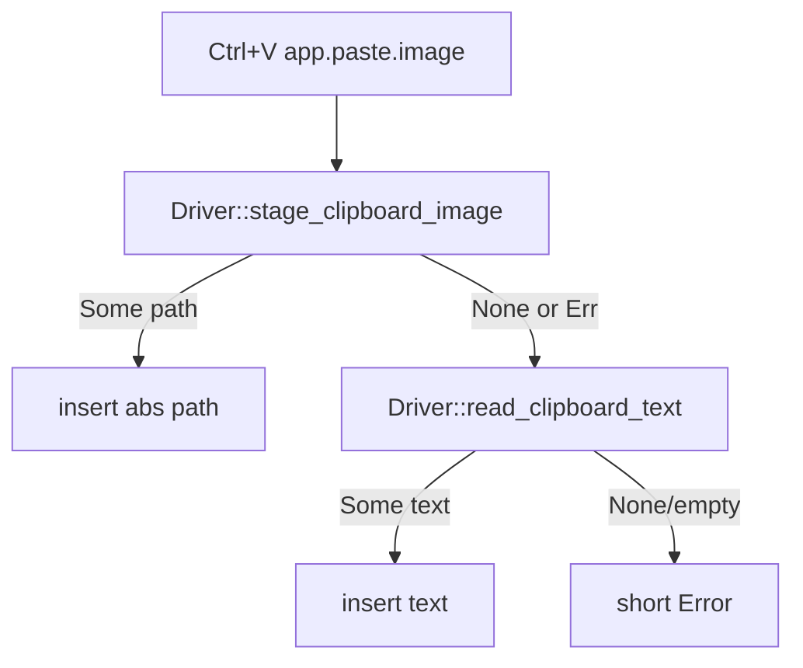

# Design — c1156

```mermaid
flowchart TD
  CV[Ctrl+V app.paste.image]
  IMG[Driver::stage_clipboard_image]
  PATH[insert abs path]
  TXT[Driver::read_clipboard_text]
  INS[insert text]
  ERR[short Error]
  CV --> IMG
  IMG -->|Some path| PATH
  IMG -->|None or Err| TXT
  TXT -->|Some text| INS
  TXT -->|None/empty| ERR
```

pi：`catch` 后静默；我们保留「皆空 → Error」便于 harness/排障。
