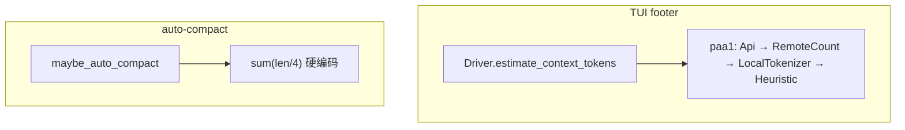
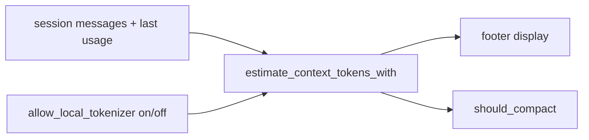

# Design: c1420 compact ↔ footer 同源估计 + LocalTokenizer 闸

## 现状分叉



Cut-point / `tokens_before` 仍大量用 entry 级 `chars/4`（`cut_detector::estimate_tokens_entry`）。本 change **优先对齐触发阈值**（`maybe_auto_compact` 的 `token_estimate`）；切点内部是否全面换尺子可分波：若换切点尺度但阈值仍混用会更乱，tasks 里标为「同波若成本低则一并；否则保留 heuristic 切点 + 注明偏差」。

## 目标形状



共享约束：

| 项 | 规则 |
|---|---|
| 优先级 | 仍 paa1；RemoteCount 默认关（paa5）不变 |
| LocalTokenizer | **仅** `on` 时注入 `tokenizer_estimate`；默认 `off` |
| Api 锚点 | paa2；本机 openai-compat 已实测有 `usage` |
| 不做 | single-flight IPC、every-N、idle |

## 配置草案

```yaml
# 顶层或 token_estimate: 下（实现时钉一处，避免双键）
token_estimate:
  local_tokenizer: off   # on | off；默认 off
```

- 非法值 → 加载失败或回退 `off`（实现钉死一种；倾向硬失败更清晰）。
- 不引入 `auto` / `every_n` / `idle`。

## 前置阻塞：usage 未落盘

链路已通到 ReAct，在持久化处断：

`provider stream usage` → `AiBridgeChunk::Done` → `XyChunk::Done` → **`react` 丢弃** → session `AssistantMessage.usage` 恒缺 → estimate 永不 Api。

本 change 必须先修落盘，否则「对齐 footer / 默认关 LocalTokenizer」后多数会话只会 Heuristic，阈值仍粗。

## 安全偏好

Compact 侧：低估危险。同源后若落到 Heuristic，继续 chars/4（偏粗）；有 Api 则跟厂商。开 local 时用词表。不在本 change 引入「人为高估系数」。

## 切点尺子（本波决策）

auto-compact **阈值**已与 footer 同源；`cut_detector` / `tokens_before` **仍用** entry 级 chars/4 heuristic（成本低、切点算法未改）。后续若要切点也换尺子，另开 change。

## 非目标再钉

- Footer async / generation 丢旧结果（进程内已有）够用；**不做**跨进程 single-flight。
- 不改 TUI 下载 UI。
