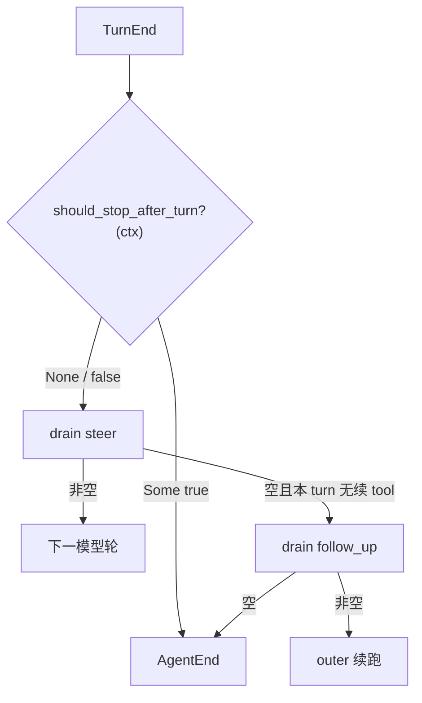

# Design: c1430 should_stop_after_turn（对齐 pi）

## 已决议

| 项 | 钉死 |
|---|---|
| 默认步数闸 | **不**注册；删除 `max_iterations`（配置 + loop），无 shim |
| 事件 | 仅 `TurnEnd` → `AgentEnd`；**不**新增 `RunStopped` / 专用 Error |
| follow-up / steer | stop 后 **严格跳过** drain（pi） |
| 钩子形状 | **单槽** `Option`，非 Vec 链 |

## pi 对照（老师）

```text
turn_end
  → prepareNextTurn?     // 本 change 不做
  → shouldStopAfterTurn?(ctx) → true → agent_end；return
  → else getSteeringMessages → …
  →（内层无续）getFollowUpMessages → …
  → agent_end
```

- 单可选回调；不得 throw；不改 assistant stopReason；不 abort 流/工具。
- 无 stop-reason 生命周期事件。

## xylitol 目标形状



`ctx`（对齐 pi [`ShouldStopAfterTurnContext`](https://github.com/badlogic/pi-mono)）：

| xylitol | pi |
|---|---|
| `assistant` | `message` |
| `tool_results` | `toolResults` |
| `history` | `context` 消息视图 |
| `new_messages` | `newMessages`（本 `run` 增量；不含 `seeded_history`） |
| `turn_index` | （xylitol 附加） |

`new_messages` MUST 在钩子调用时反映本 `run` 已写入的消息（含初始 prompt），以便嵌入方按 pi 语义决定停闸。

## 配置迁移

一次性删除：

- `agents.profiles.*.max_iterations`
- `AgentBuilder::max_iterations` / `AgentCapabilities` 字段与 accessor
- `configs/config.schema.json` 对应属性
- 文档示例中的 `max_iterations: 50`

未知字段策略（实现钉一处）：

- **倾向**：`#[serde(deny_unknown_fields)]` 若 profile 已 deny → 写了 `max_iterations` 则加载失败（强迫改配置）。
- 若 profile 目前忽略未知字段 → 本 change 改为对 **已删字段名** 显式拒绝，或接受静默忽略并在 doctor/警告中提示；**禁止**再读入生效。

## 与 ar8 的关系

`ar8`「将结束前 drain follow_up」仍成立，但 **前提是未因 `should_stop_after_turn` 提前 `AgentEnd`**。stop 路径 MUST NOT 消费 follow_up（条目可留在队列供后续 run / UI，与 abort 保留 follow_up 可并存——实现时与现队列语义对齐，不在 stop 时 clear）。

## 不做

- 默认再挂步数策略
- `XyHookBus` 脚本镜像
- Goal / compact 自动闭环
