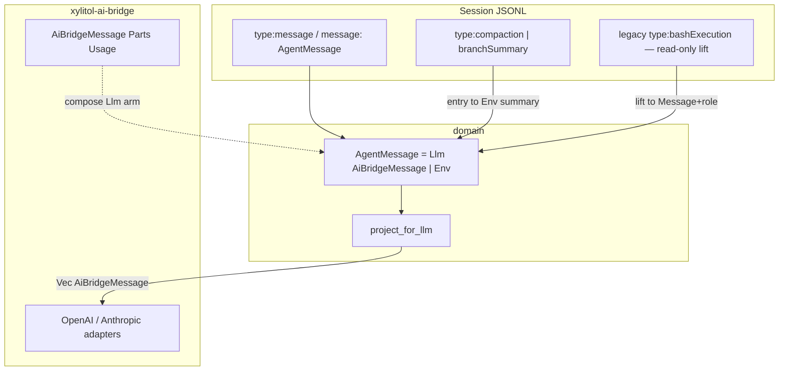

# Design: c1210 组合 bridge LLM + bash 嵌 message

## 对齐 pi 的目标形状

## 关键权衡

| 决策 | 选择 | 理由 |
|---|---|---|
| LLM 叶 SSOT | bridge DTO | 与 pi-ai / 业务组合一致；消孪生 |
| domain→bridge | **仅 DTO** | 仍禁 HTTP/SDK；改写 dm6/pab4/AGENTS §F |
| bash 落盘 | 嵌在 `type:message` | 对齐 pi；compaction/branch 仍顶层 |
| 旧 session | 读提升，不强制改写磁盘 | 降低迁移风险 |
| map.rs | 删叶消息孪生；chunk/provenance 若仍双份可保留薄 map | 缝税只剩真正边界差 |

## 与 as45 / ReAct

`as45` 要求经 store 上下文播种 history。实现 MUST 用统一 `session_entry_to_context_messages`（命名可等价）：Message 原样；compaction/branch→Env；旧顶层 bash→Env bash；再 `project_for_llm`。禁止只 `filter_map(as_agent_message)` 丢 bang/摘要。

## 风险

- serde 形状：`AiBridgeMessage` 与旧 `LlmMessage` JSON 须保持 wire 兼容（role/content 键）；回归靠 dm1/dm4/dm6 roundtrip。
- `la2`「domain 零 crate 内依赖」仍成立；新增的是 **workspace 包 DTO 依赖**，须在 la25/AGENTS 写清边界。
