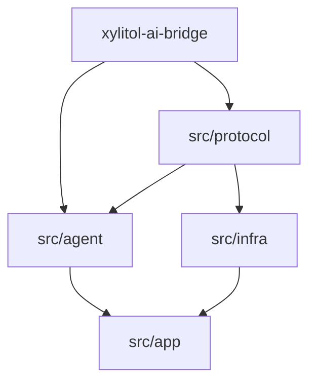

# Design: c1220 消 domain + protocol 收拢（方案 B）

## 目标依赖（单 crate）



箭头 = Rust `use` 允许方向：

- `agent` / `infra` 都依赖 `protocol`。
- `agent` ↛ `infra`；`infra` ↛ `agent`。
- `protocol` MUST NOT 依赖 `agent` / `infra` 实现（MAY 依赖 `xylitol_ai_bridge::dto`）。

### 为何共享类型不进 `agent/`

ports / wire 投影需要 `AgentMessage` / `XyEvent`；若它们物理在 `agent/` 而 ports 在 `protocol/`，会形成 `agent`↔`protocol` 环。pi 无此问题（app 可依赖 agent-core）。xylitol 坚持 `infra`↛`agent`，故共享类型落在 **`protocol` 根模块**（方案 B），由 agent 再导出并写投影。

## 方案 B：`wire/` + `ports/`，类型在 protocol 根

**不设** `vocab/` / `types/` 第三子树——避免再抬一个类型桶品牌。

```text
src/protocol/
  mod.rs
  wire/                      # client ↔ core 线协议
    mod.rs
    command.rs
    event.rs                 # wire Event（≠ XyEvent）
    transport.rs
  ports/                     # agent ↔ infra 可替换契约（原 runtime_protocol）
    mod.rs
    model.rs                 # XyModel 入参 Vec<AiBridgeMessage>
    tool.rs / session.rs / event.rs / bash.rs / …
  message.rs                 # AgentMessage / Env / AgentPart…
  lifecycle.rs               # XyEvent（钉死）
  session.rs                 # SessionEntry / SessionHeader…（原 session_types）
  types.rs                   # XyChunk / XyToolSchema / Thinking*（原 domain/types 流式相关）
  model_config.rs            # XyModelConfig / Kind（若 port 引用）
  error.rs                   # XyError / XyToolError
  resource.rs                # AgentsFile / SkillInfo…（跟 XyResourceLoader）
  source_info.rs             # 若仍需要
```

**纪律**

- `wire/` MUST NOT 依赖 `ports/`；MAY 依赖根上共享类型（如 `XyEvent::to_wire_event`）。
- `ports/` MAY 依赖根上共享类型 + bridge DTO；MUST NOT 依赖 `wire/`。
- 根上共享类型 MUST NOT 依赖 `ports/` / `wire/` / `agent` / `infra`；MAY 依赖 bridge DTO。
- **进 protocol 根的门槛** = 出现在 port 或 wire 签名（或跨 agent/infra 共享）。纯 agent 内部状态留在 `agent/`。
- **禁止**再建 `src/domain/` 或 `vocab/`/`types/` 第三顶栏。

## 语义拥有 vs 物理落点（已钉）

| 概念 | 语义拥有 | 物理路径 |
|---|---|---|
| `AgentMessage` / `Env` | agent 再导出 + session 语义 | `protocol/message.rs` |
| `project_for_llm` | **agent** | `agent/llm_project.rs` |
| `SessionEntry`… | agent session 编排；infra IO | `protocol/session.rs` |
| **`XyEvent`** | agent/Driver 生产 | **`protocol/lifecycle.rs`** |
| `XyEventSink` | port | `protocol/ports/event.rs` |
| wire `Event` / `Command` | 多客户端 | `protocol/wire/` |
| `XyChunk` / ToolSchema | port 签名 | `protocol/types.rs` |
| `XyModel` 入参 | LLM DTO only | `Vec<AiBridgeMessage>` |

## 类型落点总表

| 今日 `domain/` | 目标 |
|---|---|
| `message` | `protocol/message.rs`；agent `pub use` |
| `llm_project` | **`agent/llm_project.rs`** |
| `session_types` | `protocol/session.rs` |
| `lifecycle` | **`protocol/lifecycle.rs`** |
| `types` | `protocol/types.rs`（可再拆，仍在根或同文件） |
| `model` | `protocol/model_config.rs`；registry 逻辑在 `agent/model` |
| `error` | `protocol/error.rs` |
| `resource_types` / `source_info` | `protocol/resource.rs` / `source_info.rs` |
| `compaction_config` | `agent/compaction` |
| `tool_result_quiet` / `text` | `agent/` |

## `XyModel` 边界

```text
今日: generate_stream(Vec<AgentMessage>, …)
目标: generate_stream(Vec<AiBridgeMessage>, …)
```

投影 MUST 在 agent；infra MUST NOT 再对 `AgentMessage` 做 Env 折叠主路径。

## 与 pi

| pi | xylitol c1220 |
|---|---|
| `pi-ai` 只吃 `Message[]` | `XyModel` 只吃 bridge DTO |
| 消息/事件在 agent-core；app→core | 语义同；物理在 `protocol` 根因 `infra`↛`agent` |
| 无统一 protocol | `protocol/{wire,ports}` + 根共享类型 |

## 风险

- 全仓 import 替换面大；波次：wire/ports 就位 → `XyModel` → 迁类型 → 删 `domain/` / `runtime_protocol/`。
- 调用可继续 `crate::agent::XyEvent`（re-export）与 `crate::protocol::XyEvent` 同型。
