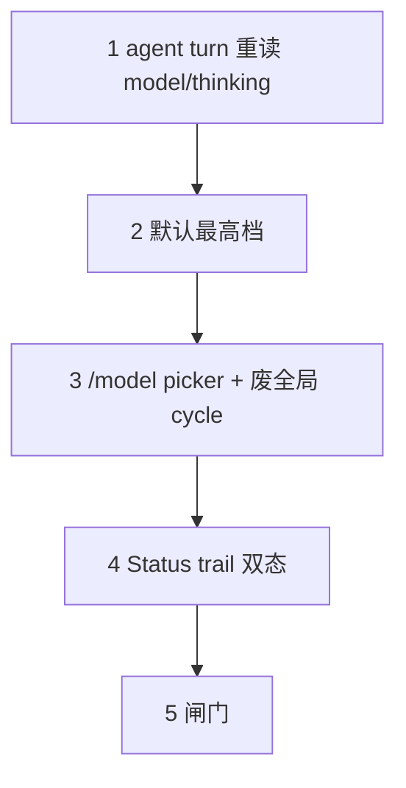

# c1470 Design（实现要点）

## 依赖序



## Active / selected

| 符号 | 含义 |
|---|---|
| selected | ModelManager / session 当前选中 |
| active | 本 agent run **当前 in-flight 或本 turn 已绑定**的 model+thinking |

TUI footer 绑 active；trail 仅 `selected ≠ active` 且 agent-busy。

## Turn 边界

在 `TurnStart` 后、下一次 `generate_stream` 前刷新绑定（工具批之后的下一拍）。Follow-up 外环新 turn 同样刷新。run 启动首 turn 用 selected。

## Picker wide/narrow

用 ANSI 显示宽估算焦点模型 `levels` 铺开是否适配内容宽；不可调模型等级区 `—`。

## Status 行

```
[lead: spinner + Working] ………… [trail: Next turn: …]
```

lead 必须包在同一节点，禁止 flex `space-between` 拆 spinner 与短词。

## 视觉 SSOT

已定形，实现勿偏离：

- `design/models-picker.md`
- `design/pending-runtime.md`
- `design/status.md`
