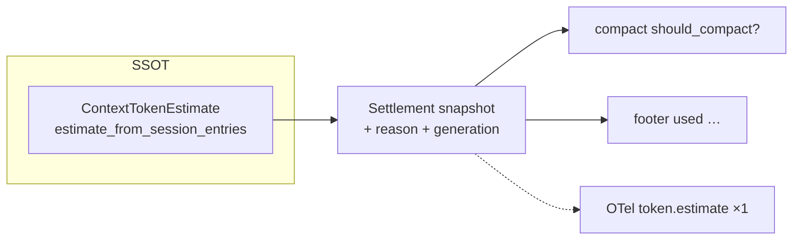
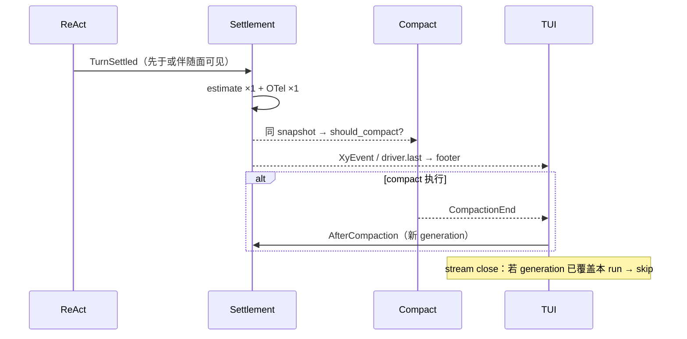

# Design: 上下文 token settlement 合流

## 深挖结论（问题清单）

### 现象与调用叠峰

```text
TurnEnd yield
  ├─ TUI: request_footer_token_refresh  ──► estimate #2（常仍有 turn parent）
  └─ Agent: try_turn_end_compaction
        └─ maybe_auto_compact → estimate_from_session_entries ──► estimate #1 + emit
AgentEnd → turn.finish → clear parent
stream close → footer refresh ──► estimate #3（独立根）
```

同秒三发、同 `tokens`/`provenance`；#3 因 otel13「无 turn → MAY random 根」变成 Langfuse 列表里的「单独一条」。

### 必须正视的边角（不是简单「删两次 refresh」）

| # | 风险 | 说明 | 设计约束 |
|---|---|---|---|
| P1 | **顺序倒置** | 现实现 `yield TurnEnd` **早于** compact 预检 estimate；TUI 可能在 snapshot 写出前就 kick | Settlement 必须在面消费之前就绪：要么 **先 settle 再 TurnEnd**，要么 **新事件携带 estimate**（见决策） |
| P2 | **Compact 突变上下文** | threshold/overflow **实际跑完**后 leaf 变了；预检 snapshot 立即过期 | `CompactionEnd`（成功/改写 leaf）→ **新** settlement；这不是重复，是失效 |
| P3 | **Overflow / multi-TurnEnd** | `will_retry` / 多轮 ReAct / steer 会多次 TurnEnd | 每次 **真实收尾迭代** 可各 settle 一次；禁止同一次迭代内 Agent+TUI+stream 三刷 |
| P4 | **Mid-turn usage** | `MessageEnd`+usage 节流刷新与收尾不同义 | 保留 `MidTurnUsage` 路径；与 `TurnSettled` 分 reason；勿与 stream close 合并误删 |
| P5 | **分层** | `agent` ↛ `app/tui`；不能直接写 HostSession | 经 `XyEvent` 和/或 `XyDriver` 只读 seam 传递 snapshot |
| P6 | **emit 绑死入口** | 任意 `estimate_*` 都 `emit_token_estimate_obs` | 静默算 vs settlement 显式 emit；idle 换叶等仍可 estimate，观测策略见 otel |
| P7 | **Harness 合约** | `c1730_turn_end` / `c1035_stream_closed` 假定 TurnEnd 与 stream close **各自**能刷 footer | 改测：TurnEnd（或 settlement 事件）刷新；stream close 在已有 settlement 时 **不再**二次 estimate |
| P8 | **Print / Remote** | Print 无 footer；Remote driver 仍有 `estimate_context_tokens` | Settlement 放 protocol/driver 层，面可选消费；勿只改 TUI host |
| P9 | **独立根仍合法的场景** | 换叶、resume、idle slash、无 turn 的手动估 | otel13 收窄为：这些 MAY 独立根；**刚结束的 turn 之 footer 兜底** MUST NOT 仅为 UI 再开独立根 |

### 业务模型（应有）



合约原文已要求同源（c2/c16）；本 change 把「同源函数」升级为「同源 **一次结果**」。

## 决策

| 项 | 选择 | 理由 |
|---|---|---|
| 算数 SSOT | 保持 `estimate_from_session_entries` / bridge accounting | 禁止第二套尺子 |
| 传递方式 | **优先** `XyEvent` 携带 settlement（新变体或扩展既有生命周期事件）+ driver 可缓存 `last_settlement` 供只读 | 解决 P1/P5；面与 compact 都能看见；避免仅 mutex 隐式耦合 |
| TurnEnd 时机 | **先 settle（含 emit）再对外可见**；若事件与 TurnEnd 分离，TurnEnd **不再**单独触发 TUI estimate | 消灭 #1+#2 |
| stream close | 若本 run 已应用 `TurnSettled`（或等价 generation）→ **跳过** estimate；仅无 settlement 时 fallback 一次 | 消灭 #3 独立根 |
| CompactionEnd | **失效** → 新 settlement（可仍挂 session；若仍在 turn 内则挂 turn） | 正确性优先于「整 run 只估一次」 |
| Mid-turn | 保留节流；reason=`MidTurnUsage`；可 emit 或不 emit（实现选：建议 mid-turn **可不打** OTel，或打但与收尾区分属性） | 降噪；收尾才是排障主信号 |
| emit | `emit_obs: bool` 或 `settle_and_record()` 与 `estimate_quiet()` 分口 | P6 |
| CacheHint | **不做**消费桩；在 reason 枚举 / settlement 模块用注释标明扩展点 | 用户明确要求 |

### 推荐事件形状（实现可微调命名）

```rust
// protocol — 示意
XyEvent::ContextTokenSettlement {
    estimate: ContextTokenEstimate, // 或可序列化 DTO
    reason: ContextTokenSettlementReason, // TurnSettled | AfterCompaction | MidTurnUsage | LeafChanged | …
}
```

备选（更小 diff）：扩展 `TurnEnd { turn_index, context_tokens: Option<…> }`，另用 CompactionEnd 后 driver 再 settle。
**倾向独立 settlement 事件**：CompactionEnd / 换叶 / mid-turn 不硬塞进 TurnEnd。

### InvalidationReason（扩展约定，注释级）

```text
TurnSettled       — 本 change 主路径
AfterCompaction   — CompactionEnd 后
MidTurnUsage      — MessageEnd+usage 节流
LeafChanged       — tree travel / resume / import
ManualRefresh     — 显式 slash / 测试
// 未来（勿预建 UI）：
// CachePolicyChanged / ProviderHintStale — 缓存失效提示依赖「同一 settlement 失效→重算」；
// 新 reason 只加枚举 + invalidate 映射，消费者（footer/compact/hint）订阅 snapshot，勿再直调 estimate 打点。
```

## 目标时序



## 测试 seam

| Seam | 覆盖 |
|---|---|
| CollectingReporter（agent/compaction 或 settlement helper） | 单次 TurnSettled → `token.estimate` **恰好 1**；无第二独立根 |
| TUI harness | TurnEnd（或 settlement 事件）后 footer 更新；随后 stream close **不**增加 estimate 调用次数（ScriptedDriver 计数或 spy） |
| Compact 单测 | `maybe_auto_compact` 消费传入/共享 snapshot，不二次静默+emit（或只 quiet 算） |
| 回归 | CompactionEnd 后 footer 仍更新（新 settlement） |

可执行 GWT：更新 `app-tui-chrome` / `infra-otel` 场景措辞；重逻辑以 harness + CollectingReporter 为主（对齐 otel18 策略）。

## 非目标

- CacheHint / 缓存失效 UI 或消费桩
- 改 reserve 公式、provenance 优先级
- 强制 mid-turn 也「整 run 只估一次」
- 删除 otel13 对 **真·无 turn** 闲置路径的独立根许可

## 实现落点（指引，非文件钉死）

- `agent/compaction`：quiet estimate + settlement record/emit
- `agent/runtime/react`：收尾顺序与事件
- `protocol/lifecycle`：事件变体（若采用）
- `app/core/driver`：`last_settlement` 只读可选
- `app/tui/host` + `effects`：刷新策略
- `infra-otel` / `app-tui-chrome` / `domain-compaction` live specs
