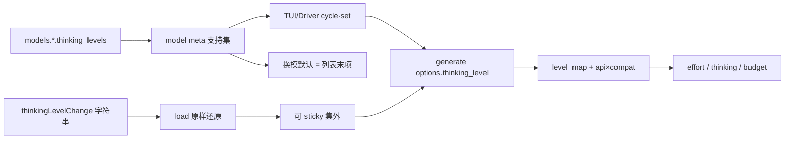

# Design：配置声明的 thinking levels + resume 无损

## 决策（已与用户对齐）

| 项 | 选择 |
|---|---|
| 未配置列表 | 仅 `off` / 不可调（取消 STANDARD） |
| 档名空间 | **配置声明字符串**；不维护全球超集枚举；catalog 建议后置 c1980 |
| resume | 末次落盘字符串原样还原；禁止静默 clamp 写回；允许 sticky out-of-set |
| 调研 | 已完成：`docs/research/thinking-levels-per-vendor-2026.md` |

## 架构

## 行为细则

### 配置

- `thinking_levels`：有序字符串列表；空/缺省 + thinking 可开 → `[off]`。
- 结构非法（空串、仅空白）→ 加载失败；**不再**因「不是旧枚举成员」失败。
- `thinking_level_map`：键为档名字符串；未知键相对**声明列表**校验（键 ∉ 列表 → 失败，或文档化为警告——实现取严格失败以早暴露笔误）。
- `off`：约定为关 thinking；map 中 `off: null` 与省略 effort 等价。

### 换模 / 首次装配

- 可调（支持集含非 off）：默认 = **列表末项**。
- Settings.default_thinking_level：仅会话首次且 ∈ 支持集时采用；换模路径忽略（保持「不得覆盖末项策略」）。
- 精确 `/model <id>`：同上末项（可调）或 off。

### set / cycle

- `set`：目标 ∉ 支持集 → 拒绝，当前值不变（含 sticky 仍不变）。
- `cycle`：仅在支持集内循环；若当前 sticky 集外，第一次 cycle 落入支持集约定起点（建议末项或首个非 off——实现钉死并测）并落盘。

### Resume 无损

1. `build_session_context` / Driver 装载：取分支末次 `thinkingLevelChange` 字符串；无条目时用 `off`（替换今日字面默认 `medium`，与「无 STANDARD」一致——**行为变更**，tasks 覆盖）。
2. **禁止** load 路径因为「∉ 支持集」改写文件或自动 append clamp 条目。
3. sticky：内存持有集外字符串；generate 仍传入该字符串；UI 可提示「当前档不在模型列表」。
4. 推理内容：既有全量 signature 回放；改档位实现不得剥离 tool 多轮所需 CoT 字段。

### Bridge

- 继续字符串 resolve；OpenAI 路径无 map 时 effort≈档名；Anthropic 无 map 时仅对可解析预算档发 budget（自由串须靠 map 给数字，否则显式失败或 Omit——实现选 **缺 map 的非 off 自由串 → 配置/请求错误可观测**，禁止默默当 medium budget）。
- DeepSeek dialect 保持现有 `thinking.type` / 拒 `budget_tokens` 等 quirks。

### 与封闭枚举

- 产品合约不再要求「domain 覆盖 off…max 超集」。
- 实现可阶段性保留枚举作 palette/边框辅助，但 **解析与校验以字符串列表为准**；迁移不写进 spec 路径 MUST。

## 风险

- Breaking：旧配置靠 STANDARD 五档的用户需补 YAML 列表。
- 无全序：末项默认需在文档与示例配置写清（DeepSeek 示例 `[off, high, max]` → 默认 max）。
- sticky 集外：须有可见提示，避免用户以为仍在合法 UI 档。

## 测试边界（已确认）

1. 配置解析 → meta（runtime-config / model-registry BDD）
2. set 拒绝 / 换模末项 / resume 还原与不写回（registry + session）
3. bridge 组装（package-ai-bridge 单测/BDD，不新开真网关缝）
4. TUI `/model` 展示声明档（app-tui 既有路径）
5. 调研附件（本 design 依赖的 research 文档）
