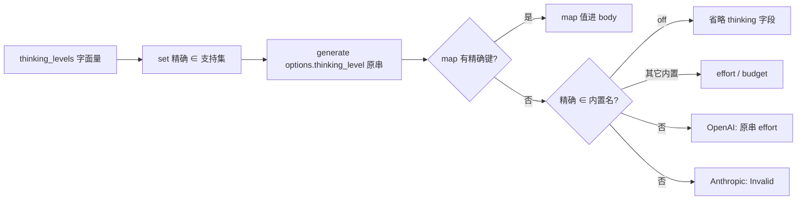

# Design：精确 opaque thinking 档名

## 决策

| 项 | 选择 |
|---|---|
| 产品 / set / map 键 | 精确字符串（c1970 已是） |
| Bridge known-name 回退 | **改为精确**；取消 trim + ASCII casefold |
| 关档 | 仅精确 `off` |
| 加载期归一 | **不做**（方案 B 另议） |

## 行为

## 测试边界（seam）

1. `xylitol_ai_bridge::resolve_thinking_for_request` — `HIGH` / ` high ` 不再当 `high`；精确 `high` 仍走内置。
2. `ModelManager::set_thinking_level` — 声明 `high` 时拒 `HIGH`。
3. `thinking_levels_are_adjustable` — 仅 `[OFF]` 视为不可调？**否**：`OFF` ≠ `off`，若有人声明字面 `OFF` 则视为可调档名（精确 opaque）；仅精确 `off` 不算可调贡献。
4. 既有 freeform / map 键精确失败用例保持。
